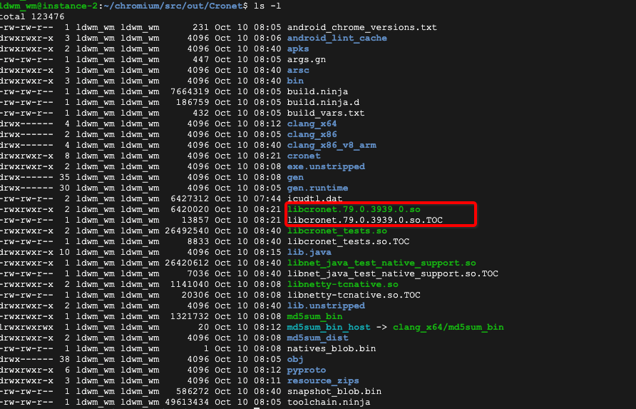
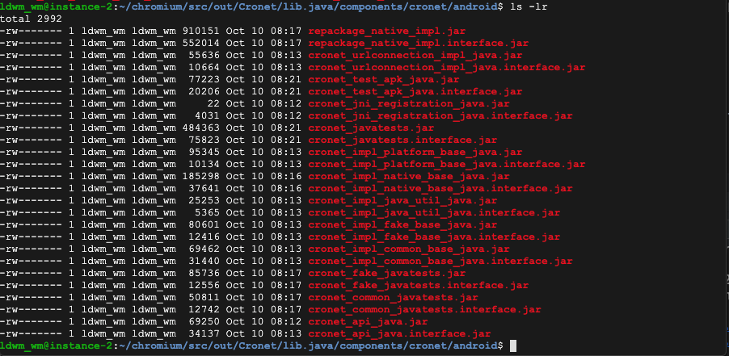
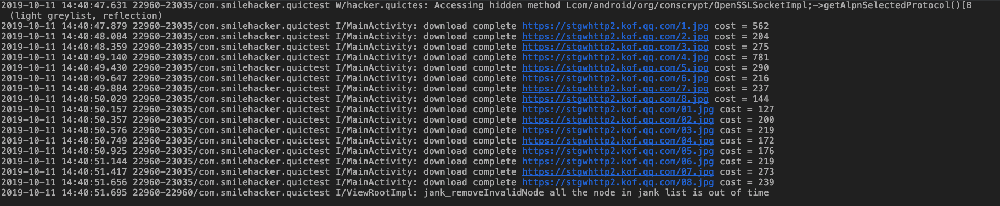
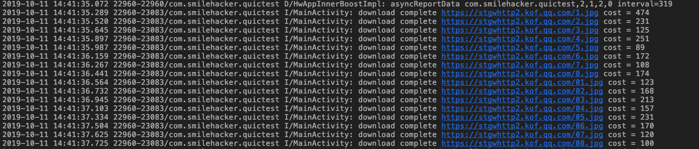
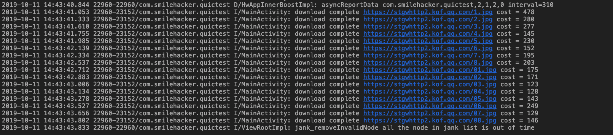
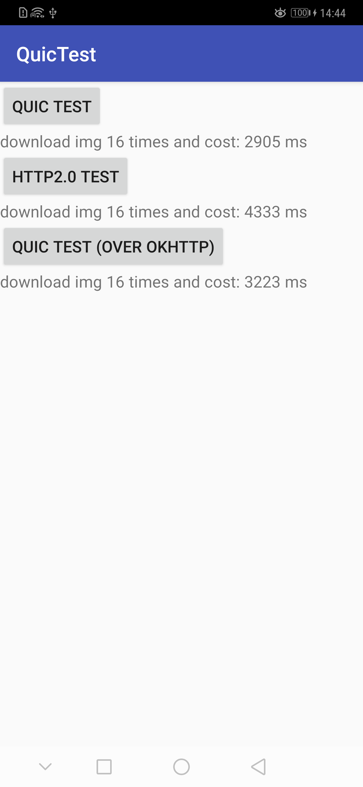
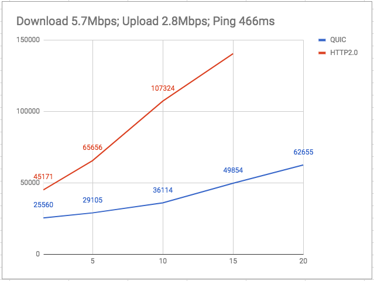
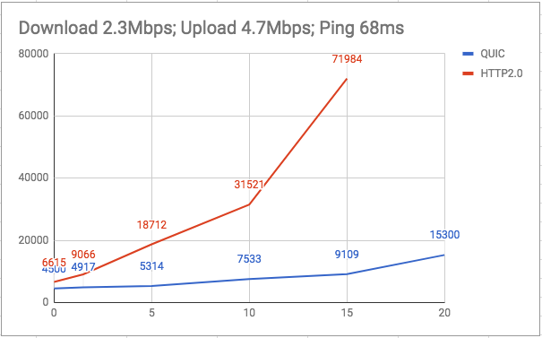
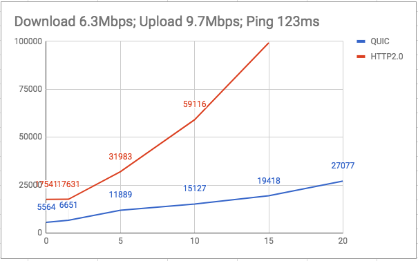

# 编译Cronet及其在Android中的使用\

之前在看HTTP3.0-QUIK协议，了解到它的强大后迫不及待的想体验一下QUIC协议在Android上的应用，一番搜索之后发现Cronet库支持QUIC协议，所以打算使用它来进行QUIC协议的使用。

### Cronet介绍
Cronet是作为库提供给Android应用程序的**Chromium**网络堆栈， Cronet利用多种技术来减少延迟并提高应用程序需要工作的网络请求的吞吐量。

Cronet Library每天处理数百万人使用的应用程序请求，例如YouTube，Google App，Google Photos和Maps - Navigation＆Transit。


Cronet具有以下特点：

1. Protocol support

	Cronet本身支持HTTP，HTTP / 2和QUIC协议。
2. Request prioritization

	该库允许您为请求设置优先级标记。服务器可以使用优先级标记来确定处理请求的顺序。
3. Resource caching

	Cronet可以使用内存或磁盘缓存来存储在网络请求中检索到的资源。后续请求将自动从缓存中提供。
4. Asynchronous requests

	默认情况下，使用Cronet Library发出的网络请求是异步的。在等待请求返回时，不会阻止您的工作线程。
	
5. Data compression

	Cronet使用Brotli压缩数据格式支持数据压缩。
	
### Cronet编译
网上有一些别人编好的现成的CRONET库[CRONET库](https://github.com/lizhangqu/cronet)，在MAVEN上也能找到相关的库[maven](https://mvnrepository.com/artifact/org.chromium.net)，android 官方也提供了直接使用Cronet的方式。
```
dependencies {
	implementation 'com.google.android.gms:play-services-cronet:16.0.0'
}
```
但是为了体验一下整个编译过程，而且后期后可能会对源码做出修改和剪裁，所以打算手动编译一遍。

首先需要安装了ubantu的linux机器(因为手上只有mac,所以用之前搭的谷歌云，结果由于对硬件要求比较高，变成了收费模式，瞬间把赠送的金额用完了，心疼😭),机器要求如下：

* A **64-bit** Intel machine with at least **8GB** of RAM. More than 16GB is highly recommended.
	
* At least **100GB** of free disk space.
	
* You must have **Git** and **Python v2** installed already.
	
* Most development is done on **Ubuntu** (currently **16.04**, Xenial Xerus). 

#### 安装设置**depot_tools**

```
git clone https://chromium.googlesource.com/chromium/tools/depot_tools.git
```

设置环境变量

```
export PATH="$PATH:depot_tools的path"
```


#### **拉取代码**

```
mkdir ~/chromium && cd ~/chromium
```
```
fetch --nohooks android
```
这里可能要花很长时间因为包很大的(还好我用的是谷歌云海外机器，网速峰值能达到60M 均值也在30M左右，羡慕)。


#### 依赖下载


当下载结束后会产生一个隐藏文件 .gclient 和 一个src的文件夹，

```
cd src
```

然后设置目标平台为Android

```
echo "target_os = [ 'android' ]" >> ../.gclient
```

然后下载Android相关依赖

```
gclient sync
```
当代码同步结束后

```
build/install-build-deps-android.sh
```

当install-build-deps至少执行一次成功之后，执行

```
gclient runhooks
```

#### 编译

当以上所有执行成功之后我们开始真正的编译工作。

由于整个Chromium的代码C++编写，同时是使用ninja作为编译工具

我们首先使用 `gn` 生成ninja 文件

```
./components/cronet/tools/cr_cronet.py gn --out_dir=out/Cronet
```

这样生成一个`out/Cronet`文件夹，里面包含gn所需要的文件，如果不指定 `--out_dir=out/Cronet`，则默认生成`out/Debug` 文件夹；若果添加`--x86`选项则会生成X86架构的库，输出文件夹在`out/Debug-x86`

以上默认是debug模式的库，如果要生成release的库则应该如下：

```
./components/cronet/tools/cr_cronet.py gn --release
```

会生成`out/Release`文件夹

然后使用ninja进行编译

```
ninja -C out/Cronet cronet_package
```
其中out/Cronet 是生成的相应的问题夹，比如release模式下则为ninja -C out/Release cronet_package

#### 编译

编译成功后会产生相应的so和jar文件




我们主要使用的是**libcronet.xxx.xx.so**和**cronet\_api.jar**,**cronet\_imple\_common\_base\_java.jar**,**cronet\_imple\_native\_base\_java.jar**


### Cronet使用


#### 1. 创建和配置CronetEngine的实例

```
val myBuilder = CronetEngine.Builder(context)
val cronetEngine: CronetEngine = myBuilder.build()
```

#### 2. 实现请求回调

```
class MyUrlRequestCallback : UrlRequest.Callback() {
	
	override fun onResponseStarted(request: UrlRequest?, info: UrlResponseInfo?) {
  		val httpStatusCode = info?.httpStatusCode
  		if (httpStatusCode == 200) {
    		// The request was fulfilled. Start reading the response.
    		request?.read(myBuffer)
  		} else if (httpStatusCode == 503) {
    		// The service is unavailable. You should still check if the 		request
    		// contains some data.
    		request?.read(myBuffer)
  		}
  		responseHeaders = info?.allHeaders
	}

	override fun onReadCompleted(request: UrlRequest?, info: 		UrlResponseInfo?, byteBuffer: ByteBuffer?) {
  		// The response body is available, process byteBuffer.
 		 ...

  		// Continue reading the response body by reusing the same buffer
  		// until the response has been completed.
  		byteBuffer?.clear()
  		request?.read(myBuffer)
	}

	override fun onFailed(p0: UrlRequest?, p1: UrlResponseInfo?, p2: CronetException?) {
            TODO("not implemented") //To change body of created functions use File | Settings | File Templates.
        }

	override fun onSucceeded(p0: UrlRequest?, p1: UrlResponseInfo?) {
            TODO("not implemented") //To change body of created functions use File | Settings | File Templates.
        }

	override fun onRedirectReceived(request: UrlRequest?, info: 		UrlResponseInfo?, newLocationUrl: String?) {
  		// Determine whether you want to follow the redirect.
  		...

  		if (shouldFollow) {
      		request?.followRedirect()
  		} else {
     		request?.cancel()
  		}
	}

```

#### 3. 创建请求

```
val executor: Executor = Executors.newSingleThreadExecutor()

val requestBuilder = cronetEngine.newUrlRequestBuilder(
        "https://www.example.com",
        MyUrlRequestCallback(),
        executor
)

val request: UrlRequest = requestBuilder.build()

request.start()

```

### 结合OKHTTP使用

我们可以拦截OkHTTP的请求然后将请求交给Cronet来执行请求

```
class QUICInterceptor: Interceptor {
	if (!QUICDroid.enable) {
       return chain.proceed(chain.request())
    }
   
   val req = chain.request()

   val url = req.url().url()

   // covert okhttp request to cornet request
   val connection = QUICDroid.engine.openConnection(url) as HttpURLConnection
   ......
}
```

###QUIC协议数据对比

为了验证QUIC协议比HTTP2.0性能更好，我分别使用**Cronet开启QUIC协议** VS **使用http2.0** 来下载同样的16张图片，由于QUIC协议必须服务端也支持，所以目前使用的图片是同时提供QUIC和HTTP2.0支持的腾讯云CDN图片进行下载测试。

```
    private val IMGS = arrayOf(
        "https://stgwhttp2.kof.qq.com/1.jpg",
        "https://stgwhttp2.kof.qq.com/2.jpg",
        "https://stgwhttp2.kof.qq.com/3.jpg",
        "https://stgwhttp2.kof.qq.com/4.jpg",
        "https://stgwhttp2.kof.qq.com/5.jpg",
        "https://stgwhttp2.kof.qq.com/6.jpg",
        "https://stgwhttp2.kof.qq.com/7.jpg",
        "https://stgwhttp2.kof.qq.com/8.jpg",
        "https://stgwhttp2.kof.qq.com/01.jpg",
        "https://stgwhttp2.kof.qq.com/02.jpg",
        "https://stgwhttp2.kof.qq.com/03.jpg",
        "https://stgwhttp2.kof.qq.com/04.jpg",
        "https://stgwhttp2.kof.qq.com/05.jpg",
        "https://stgwhttp2.kof.qq.com/06.jpg",
        "https://stgwhttp2.kof.qq.com/07.jpg",
        "https://stgwhttp2.kof.qq.com/08.jpg"
    )
```
使用OKhttp进行http2.0下载测试：




使用QUIC进行下载测试：

首先我们要开启QUIC协议

```
CronetEngine.Builder(applicationContext)
            .enableQuic(true)
            .build()
```



为了避免OKHttp本身优化的问题，我们为QUIC提供了hook OKHttp用的Interceptor，此数数据均为QUIC over OKHttp的测试结果



最终对比数据为：



可以看到不管是HTTP2.0还是QUIC在首次建立连接耗时都比较长，之后经过keep-alive,多路复用之后，后面的图片下载速度有所提高；总体上采用QUIC协议会比HTTP2.0性能更好。


以上测试均为在联通4G模式下的测试，网络状况比较好，对于弱网和高延迟的网络没有做实际测试，从网上找了一份测试数据如下：

BatWifi-Guest （公共Wifi）

此为高延时的网络情况

(Download 5.7Mbps; Upload 2.8Mbps; Ping 466ms (delay 200ms))




Dtac@地铁

较为正常的4G网络

(Download 2.3Mbps; Upload 4.7Mbps; Ping 68ms)




True@地铁

延时稍高的4G网络

(Download 6.3Mbps; Upload 9.7Mbps; Ping 123ms）




当丢包率达到20%以后，HTTP2.0基本处于超时状态，无法完成测试。

从数据中可以看到，QUIC和HTTP2.0均会明显受到丢包率和延时影响，但两者对HTTP的影响程度远大于QUIC。QUIC总体性能优于HTTP，且在高丢包高延时下都能有不错的表现，而HTTP则在15%以上丢包情况下基本处于不可用状态。

从测试结果来看，QUIC拥有比HTTP2.0更好的网络性能，特别是在弱网（高延时、高丢包）下。但因为其基于UDP，因此在不同ISP及不同时段下表现并不稳定，比如在夜间网络高峰期，中国电信对UDP有限制，QUIC表现不如HTTP，而联通则相差不大，需要在不同国家做更多对比测试，线上也需要有实时监控与动态切换策略。