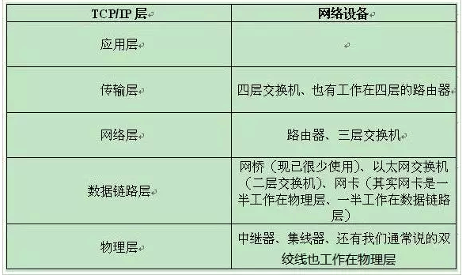
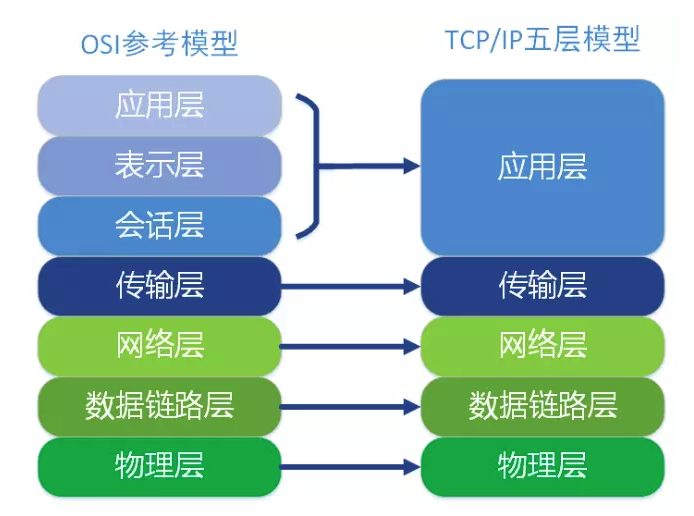
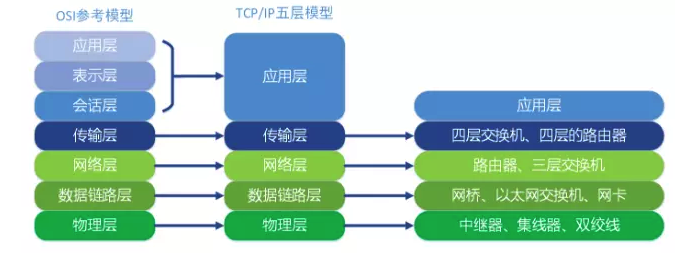
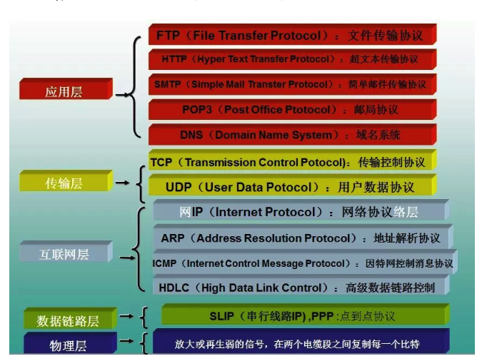

# HTTP版本变迁

# OSI模型
了解HTTP之前，我们先回忆一下网络OSI模型和TCP模型

OSI:


TCP/IP:




对应关系：




对应的协议：


HTTP（超文本传输协议，HyperText Transfer Protocol)是建立在TCP协议之上的一种应用层网络协议。默认使用80端口，建立之初目的是为了将超文本标记语言(HTML)文档从Web服务器传送到客户端的浏览器。 **互联网通信发展史其实是人类与RTT-Round Trip Time斗争的历史。**

HTTP版本对比：

功能  |HTTP 1.0  | HTTP 1.1 |SPDY:HTTP 1.x（SPDY位于HTTP之下，TCP和SSL之上）| HTTP 2.0 | HTTP 3.0 QUIC（Quick UDP Internet Connections)
----------|------------- | ------------- |-----------|--------|---------
 **缓存处理** |  If-Modified-Since,Expires | 新增 Entity tag，If-Unmodified-Since, If-Match, If-None-Match
 **范围请求**||引入range头域，支持断点续传|||
 **错误通知的管理** |   | 新增24个状态码| |
 **Host头处理** |每个服务器绑定一个ip|支持host头域：可以将请求发往同一台服务器上的不同网站(虚拟机的兴起)||
 **长连接**|每次创建tcp|默认开启keep-alive;||
 **多路复用**|一次请求-响应，建立一个连接，用完关闭；每一个请求都要建立一个连接；|引入pipelining:同一个TCP连接中，客户端可以同时发送多个请求。(但是请求按顺序的)|多个请求stream共享一个tcp连接的方式，解决了HOL blocking的问题，降低了延迟同时提高了带宽的利用率。|多个请求可同时在一个连接上并行执行。某个请求任务耗时严重，不会影响到其它连接的正常执行|对线头阻塞(HOL)问题的解决更为彻底。基于TCP的HTTP/2，尽管从逻辑上来说，不同的流之间相互独立，不会相互影响，但在实际传输方面，数据还是要一帧一帧的发送和接收，一旦某一个流的数据有丢包，则同样会阻塞在它之后传输的其它与它毫不相干的流的数据的传输。而基于UDP的QUIC协议则可以更为彻底地解决这样的问题，让不同的流之间真正的实现相互独立传输，互不干扰。
 **header压缩**|||压缩头减少数据；采用DEFLATE算法|采用HPACK算法
 **请求优先级**|||SPDY允许给每个request设置优先级，确保资源优先加载|支持
 **服务端推送**|||服务端推送能把客户端所需要的资源伴随着index.html一起发送到客户端，省去了客户端重复请求的步骤 | 支持
 **HTTPS** |||基于HTTPS的加密协议传输，大大提高了传输数据的可靠性 （强制使用）|支持明文 HTTP 传输 也支持加密传输
 **二进制**|基于文本解析|基于文本解析|基于文本解析|基于二进制解析，更健壮
 **底层通讯协议**|TCP| TCP |SSL| TCP/SSL|UDP
 **连接迁移**|基于TCP的协议，由于切换网络之后，IP会改变，因而之前的连接不可能继续保持|同前|同前|同前|基于UDP的QUIC协议，则可以内建与TCP中不同的连接标识方法，从而在网络完成切换之后，恢复之前与服务器的连接。
  
  
# HTTP3.0-over-QUIC

Quic 相比现在广泛应用的 http2+tcp+tls 协议有如下优势：

1. 减少了 TCP 三次握手及 TLS 握手时间。
2. 改进的拥塞控制。
3. 避免队头阻塞的多路复用。
4. 连接迁移。
5. 前向冗余纠错。

### 为什么需要QUIC?
* **中间设备的僵化**

	可能是 TCP 协议使用得太久，也非常可靠。所以我们很多中间设备，包括防火墙、NAT 网关，整流器等出现了一些约定俗成的动作。

	比如有些防火墙只允许通过 80 和 443，不放通其他端口。NAT 网关在转换网络地址时重写传输层的头部，有可能导致双方无法使用新的传输格式。整流器和中间代理有时候出于安全的需要，会删除一些它们不认识的选项字段。

	TCP 协议本来是支持端口、选项及特性的增加和修改。但是由于 TCP 协议和知名端口及选项使用的历史太悠久，中间设备已经依赖于这些潜规则，所以对这些内容的修改很容易遭到中间环节的干扰而失败。
* **依赖于操作系统的实现导致协议僵化**

	TCP 是由操作系统在内核西方栈层面实现的，应用程序只能使用，不能直接修改。虽然应用程序的更新迭代非常快速和简单。但是 TCP 的迭代却非常缓慢，原因就是操作系统升级很麻烦。

	现在移动终端更加流行，但是移动端部分用户的操作系统升级依然可能滞后数年时间。PC 端的系统升级滞后得更加严重，windows xp 现在还有大量用户在使用，尽管它已经存在快 20 年。

	服务端系统不依赖用户升级，但是由于操作系统升级涉及到底层软件和运行库的更新，所以也比较保守和缓慢。

	这也就意味着即使 TCP 有比较好的特性更新，也很难快速推广。比如 TCP Fast Open。它虽然 2013 年就被提出了，但是 Windows 很多系统版本依然不支持它。

* **建立连接的握手延迟大**

	不管是 HTTP1.0/1.1 还是 HTTPS，HTTP2，都使用了 TCP 进行传输。HTTPS 和 HTTP2 还需要使用 TLS 协议来进行安全传输。这就出现了两个握手延迟：

	1. TCP 三次握手导致的 TCP 连接建立的延迟。

	2. TLS 完全握手需要至少 2 个 RTT 才能建立，简化握手需要 1 个 RTT 的握手延迟。

	对于很多短连接场景，这样的握手延迟影响很大，且无法消除。
	
* **队头阻塞**

	队头阻塞主要是 TCP 协议的可靠性机制引入的。TCP 使用序列号来标识数据的顺序，数据必须按照顺序处理，如果前面的数据丢失，后面的数据就算到达了也不会通知应用层来处理。

	另外 TLS 协议层面也有一个队头阻塞，因为 TLS 协议都是按照 record 来处理数据的，如果一个 record 中丢失了数据，也会导致整个 record 无法正确处理。
	
	所以 QUIC 协议选择了 UDP，因为 UDP 本身没有连接的概念，不需要三次握手，优化了连接建立的握手延迟，同时在应用程序层面实现了 TCP 的可靠性，TLS 的安全性和 HTTP2 的并发性，只需要用户端和服务端的应用程序支持 QUIC 协议，完全避开了操作系统和中间设备的限制。
	
### QUIC的改进
* **连接建立延时低**
 
 0RTT 建连可以说是 QUIC 相比 HTTP2 最大的性能优势。那什么是 0RTT 建连呢？这里面有两层含义：
 	
 1. 传输层 0RTT 就能建立连接。
 2. 加密层 0RTT 就能建立加密连接。


 


* **改进的拥塞控制**

	TCP 的拥塞控制实际上包含了四个算法：`慢启动`，`拥塞避免`，`快速重传`，`快速恢复`。
 QUIC 协议当前默认使用了 TCP 协议的 Cubic 拥塞控制算法 [6]，同时也支持 CubicBytes, Reno, RenoBytes, BBR, PCC 等拥塞控制算法。
 
 	* 可插拔
 	* 单调递增的 Packet Number
 	
 		TCP 为了保证可靠性，使用了基于字节序号的 Sequence Number 及 Ack 来确认消息的有序到达。<br>
 		
 		QUIC 同样是一个可靠的协议，它使用 Packet Number 代替了 TCP 的 sequence number，并且每个 Packet Number 都严格递增，也就是说就算 Packet N 丢失了，重传的 Packet N 的 Packet Number 已经不是 N，而是一个比 N 大的值。而 TCP 呢，重传 segment 的 sequence number 和原始的 segment 的 Sequence Number 保持不变，也正是由于这个特性，引入了 Tcp 重传的歧义问题。
	
   * 不允许 Reneging
   
   		什么叫 Reneging 呢？就是接收方丢弃已经接收并且上报给 SACK 选项的内容 [8]。TCP 协议不鼓励这种行为，但是协议层面允许这样的行为。主要是考虑到服务器资源有限，比如 Buffer 溢出，内存不够等情况。
		Reneging 对数据重传会产生很大的干扰。因为 Sack 都已经表明接收到了，但是接收端事实上丢弃了该数据。
		QUIC 在协议层面禁止 Reneging，一个 Packet 只要被 Ack，就认为它一定被正确接收，减少了这种干扰。
   * 更多的 Ack 块
   * Ack Delay 时间
* **基于 stream 和 connecton 级别的流量控制**
	
	QUIC 的流量控制 [22] 类似 HTTP2，即在 Connection 和 Stream 级别提供了两种流量控制。为什么需要两类流量控制呢？主要是因为 QUIC 支持多路复用。
	
	1. Stream 可以认为就是一条 HTTP 请求。
	2. Connection 可以类比一条 TCP 连接。多路复用意味着在一条 Connetion 上会同时存在多条 Stream。既需要对单个 Stream 进行控制，又需要针对所有 Stream 进行总体控制。
	
	QUIC 实现流量控制的原理比较简单：
	
	通过 window_update 帧告诉对端自己可以接收的字节数，这样发送方就不会发送超过这个数量的数据。

	通过 BlockFrame 告诉对端由于流量控制被阻塞了，无法发送数据。
	
* **没有队头阻塞的多路复用**
	
	1. QUIC 最基本的传输单元是 Packet，不会超过 MTU 的大小，整个加密和认证过程都是基于 Packet 的，不会跨越多个 Packet。这样就能避免 TLS 协议存在的队头阻塞。
	2. Stream 之间相互独立，比如 Stream2 丢了一个 Pakcet，不会影响 Stream3 和 Stream4。不存在 TCP 队头阻塞。
	
	当然，并不是所有的 QUIC 数据都不会受到队头阻塞的影响，比如 QUIC 当前也是使用 Hpack 压缩算法 [10]，由于算法的限制，丢失一个头部数据时，可能遇到队头阻塞。
	
* **加密认证的报文**

	TCP 协议头部没有经过任何加密和认证，所以在传输过程中很容易被中间网络设备篡改，注入和窃听。比如修改序列号、滑动窗口。这些行为有可能是出于性能优化，也有可能是主动攻击。

	但是 QUIC 的 packet 可以说是武装到了牙齿。除了个别报文比如 PUBLIC_RESET 和 CHLO，所有报文头部都是经过认证的，报文 Body 都是经过加密的。
	
* **连接迁移**
	
	一条 TCP 连接 [17] 是由四元组标识的（源 IP，源端口，目的 IP，目的端口）。什么叫连接迁移呢？就是当其中任何一个元素发生变化时，这条连接依然维持着，能够保持业务逻辑不中断。当然这里面主要关注的是客户端的变化，因为客户端不可控并且网络环境经常发生变化，而服务端的 IP 和端口一般都是固定的。

	比如大家使用手机在 WIFI 和 4G 移动网络切换时，客户端的 IP 肯定会发生变化，需要重新建立和服务端的 TCP 连接。

	又比如大家使用公共 NAT 出口时，有些连接竞争时需要重新绑定端口，导致客户端的端口发生变化，同样需要重新建立 TCP 连接。


	那 QUIC 是如何做到连接迁移呢？很简单，任何一条 QUIC 连接不再以 IP 及端口四元组标识，而是以一个 64 位的随机数作为 ID 来标识，这样就算 IP 或者端口发生变化时，只要 ID 不变，这条连接依然维持着，上层业务逻辑感知不到变化，不会中断，也就不需要重连。

	由于这个 ID 是客户端随机产生的，并且长度有 64 位，所以冲突概率非常低。

* **证书压缩**
* **前向冗余纠错**

	QUIC协议的每个数据包除了本身的数据以外，会带有其他数据包的部分数据，在少量丢包的情况下，可以使用其他数据包的冗余数据完成数据组装而无需重传，从而提高数据的传输速度。具体实现类似于RAID5，将N个包的校验和（异或）建立一个单独的数据包发送，这样如果在这N个包中丢了一个包可以直接恢复出来。
	
### QUIC现状

目前QUIC还没有正式定稿，但是目前已经有不少公司使用了HTTP QUIC，大多还没有全线使用，只是局部使用,并且还会向下兼容http2.0;同时在运营商层面有部分会限制UDP的贷款从而导致QUIC表现不是特别满意。

[Uber 使用 QUIC（HTTP/3 协议）协议来提升其应用性能](https://juejin.im/entry/5ce3d11b6fb9a07ecd3d3117)

[QUIC 在微博中的落地思考](https://www.infoq.cn/article/2018/03/weibo-quic)

[QQ 空间已在生产环境中使用 QUIC 协议](https://www.infoq.cn/article/2017/10/qzone-quic-practise)

[使用 LiteSpeed 轻松为网站开启 HTTP/3 实践](https://www.mf8.biz/use-http-3/)

[Web服务器快速启用QUIC协议](https://my.oschina.net/u/347901/blog/1647385)
	

# HTTP与HTTPS

功能  |HTTP   | HTTPS |
----------|------------- | ------------- 
概念  |是互联网上应用最为广泛的一种网络协议，是一个客户端和服务器端请求和应答的标准（TCP），用于从WWW服务器传输超文本到本地浏览器的传输协议，它可以使浏览器更加高效，使网络传输减少  | 是以安全为目标的HTTP通道，简单讲是HTTP的安全版，即HTTP下加入SSL层，HTTPS的安全基础是SSL |
作用|数据传输|一种是建立一个信息安全通道，来保证数据传输的安全；另一种就是确认网站的真实性。|
协议|基于tcp|基于TSL在tcp之上|
报文|明文|密文|
证书|不需要|CA申请或者自颁发（自己颁发的证书需要客户端验证通过，才可以继续访问）|
端口|80|443|
加密方式|无|握手非对称，报文对称|

### HTTPS通信过程

#### 概念

##### 对称加密

	即通信的双方都使用同一个秘钥进行加解密

##### 非对称加密

	私钥 + 公钥= 密钥对
	即用私钥加密的数据,只有对应的公钥才能解密,用公钥加密的数据,只有对应的私钥才能解密
	其实这个很容易理解,因为通信双方的手里都有一套自己的密钥对,通信之前双方会先把自己的公钥都先发给对方
	然后对方再拿着这个公钥来加密数据响应给对方,等到到了对方那里,对方再用自己的私钥进行解密,就这么简单

##### 证书
假设,此时在客户端和服务器之间存在一个中间人,这个中间人只需要把原本双方通信互发的公钥,换成自己的公钥,这样中间人就可以轻松解密通信双方所发送的所有数据，为解决上述中间人问题,于是后来就出现了证书,简单来讲就是找了一个大家公认的中介,来证明我就是我,你就是你的问题,防止中间被篡改。

	证书中就包括个人的基本信息和最重要的公钥

##### 数字签名

乍一眼看去,上面的方案貌似还不错,但证书在传输的过程中如果被篡改了呢,所以后来就又出现了数字签名

	简单来讲,就是将公钥和个人信息(证书)用一个Hash算法生成一个消息摘要
	这个Hash算法有个极好的特性,只要输入数据有一点点变化,那生成的消息摘要就会有巨变,能有效防止别人篡改数据
	
##### CA

但这还是有个问题,如果中间人直接把整个原始信息依然可以伪造消息摘要
所以就出现了CA
	
这时CA再用它的私钥对消息摘要加密,形成签名,并把原始信息和数据签名进行合并,即所谓的`数字证书`
	
这样,当别人把他的证书发过来的时候,我再用同样的Hash算法,再次生成消息摘要
然后用CA的公钥对数字签名解密,得到CA创建的消息摘要,两者一比,就知道中间有没有被人篡改了


#### 过程


	-> 客户端向服务端发送请求    
   		-> 服务端返回数字证书 
			-> 客户端用自己的CA[主流的CA机构证书一般都内置在各个主流浏览器中]公钥去解密证书,如果证书有问题会提示风险 
	    		-> 如果证书没问题客户端会生成一个对称加密的随机秘钥然后再和刚刚解密的服务器端的公钥对数据进行加密,然后发送给服务器端 
		  			-> 服务器端收到以后会用自己的私钥对客户端发来的对称秘钥进行解密 
						-> 之后双方就拿着这个对称加密秘钥来进行正常的通信
						

#### 在Android的应用

一个典型的例子

```
URL url = new URL("https://google.com");  
HttpsURLConnection urlConnection = url.openConnection();  
InputStream in = urlConnection.getInputStream(); 
```

此时使用的是默认的`SSLSocketFactory`，与下段代码使用的`SSLContext`是一致的

```
private synchronized SSLSocketFactory getDefaultSSLSocketFactory() {  
  try {
    SSLContext sslContext = SSLContext.getInstance("TLS");
    sslContext.init(null, null, null);
    return defaultSslSocketFactory = sslContext.getSocketFactory();
  } catch (GeneralSecurityException e) {
    throw new AssertionError(); // The system has no TLS. Just give up.
  }
}
```

默认的 SSLSocketFactory 校验服务器的证书时，会信任设备内置的100多个根证书。


SSL 握手开始后，会校验服务器的证书，那么其实就是通过 `X509ExtendedTrustManager` 做校验的，更一般性的说是 `X509TrustManager`

```
/**
 * The trust manager for X509 certificates to be used to perform authentication
 * for secure sockets.
 */
public interface X509TrustManager extends TrustManager {

    public void checkClientTrusted(X509Certificate[] chain, String authType)
            throws CertificateException;

    public void checkServerTrusted(X509Certificate[] chain, String authType)
            throws CertificateException;

    public X509Certificate[] getAcceptedIssuers();
}
```
那么最后校验服务器证书的过程会落到 checkServerTrusted 这个函数.

**自定义信任策略**

```
// 取到证书的输入流
InputStream is = new FileInputStream("anchor.crt");  
CertificateFactory cf = CertificateFactory.getInstance("X.509");  
Certificate ca = cf.generateCertificate(is);

// 创建 Keystore 包含我们的证书
String keyStoreType = KeyStore.getDefaultType();  
KeyStore keyStore = KeyStore.getInstance(keyStoreType);  
keyStore.load(null);  
keyStore.setCertificateEntry("anchor", ca);

// 创建一个 TrustManager 仅把 Keystore 中的证书 作为信任的锚点
String algorithm = TrustManagerFactory.getDefaultAlgorithm();  
TrustManagerFactory trustManagerFactory = TrustManagerFactory.getInstance(algorithm);  
trustManagerFactory.init(keyStore);  
TrustManager[] trustManagers = trustManagerFactory.getTrustManagers();


//创建一个KeyManager
KeyManagerFactory kmf = KeyManagerFactory.getInstance("X509");
kmf.init(keyStore, clientCertPassword.toCharArray());
KeyManager[] keyManagers = kmf.getKeyManagers();

// 用 TrustManager，KeyManager 初始化一个 SSLContext
SSLContext sslContext = SSLContext.getInstance("TLS");  
sslContext.init(keyManagers, trustManagers, null);  
return sslContext.getSocketFactory(); 
```

**域名校验**

SSL层只负责校验证书的真假，对于所有基于SSL的应用层协议，需要自己来校验证书实体的身份，因此Android默认的域名校验则由OkHostnameVerifier实现的

从 HttpsUrlConnection 的代码可见一斑:

```
static {  
    try {
        defaultHostnameVerifier = (HostnameVerifier)
                Class.forName("com.android.okhttp.internal.tls.OkHostnameVerifier")
                .getField("INSTANCE").get(null);
    } catch (Exception e) {
        throw new AssertionError("Failed to obtain okhttp HostnameVerifier", e);
    }
}
```
如果校验规则比较特殊，可以传入自定义的校验规则给 HttpsUrlConnection。

```
HostnameVerifier hnv=new HosernameVerifier(){
@Override
public boolean verify(String hostname,SSLSession session){
    if("youhostname".equals(hostname)){
        return true;
    }else{
          HostnameVerifier hv=HttpsURLConnection.getDefaultHostnameVerifier();
         return hv.verify(hostname,session);
          }
  }
}
```

参考:

[https://www.cnblogs.com/amyzhu/p/8285300.html](https://www.cnblogs.com/amyzhu/p/8285300.html)

[https://www.jianshu.com/p/bb3eeb36b479](https://www.jianshu.com/p/bb3eeb36b479)

[https://zhuanlan.zhihu.com/p/32553477](https://zhuanlan.zhihu.com/p/32553477)

[https://www.infoq.cn/article/2017/10/qzone-quic-practise](https://www.infoq.cn/article/2017/10/qzone-quic-practise)

[https://www.infoq.cn/article/2018/03/weibo-quic](https://www.infoq.cn/article/2018/03/weibo-quic)

[https://www.wolfcstech.com/2019/03/27/quic_2019_03_27/](https://www.wolfcstech.com/2019/03/27/quic_2019_03_27/)