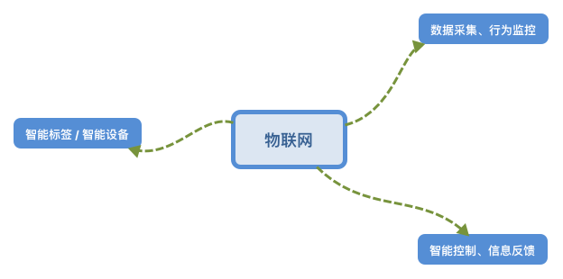
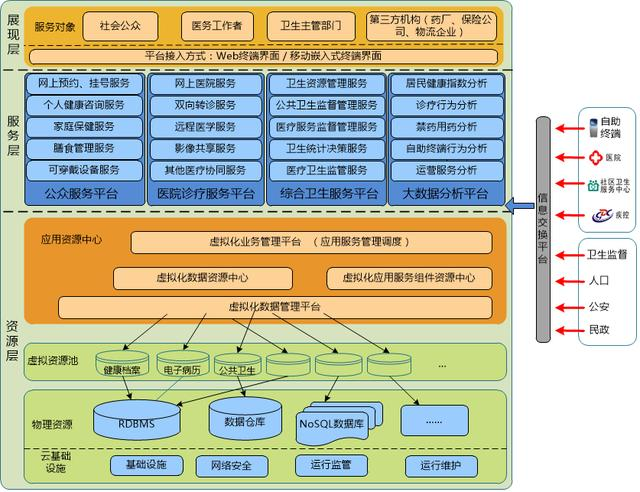
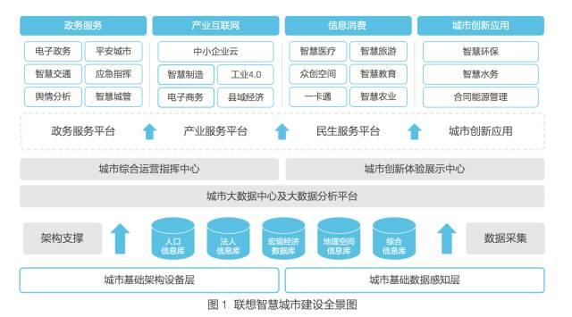
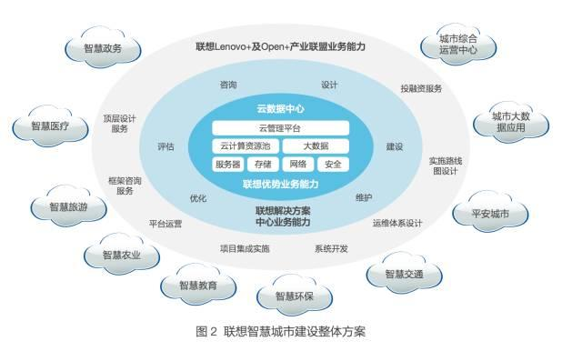
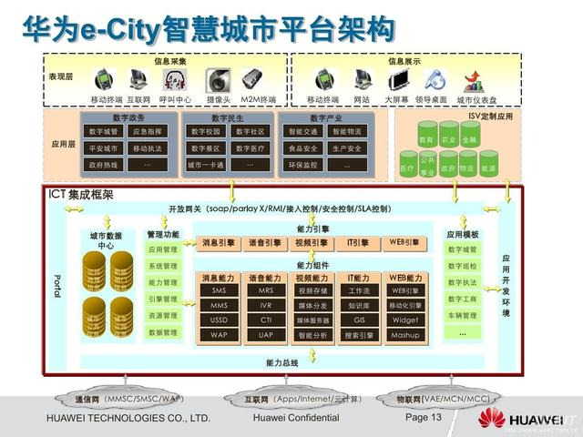
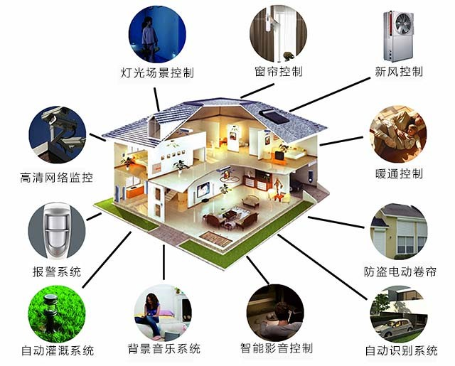
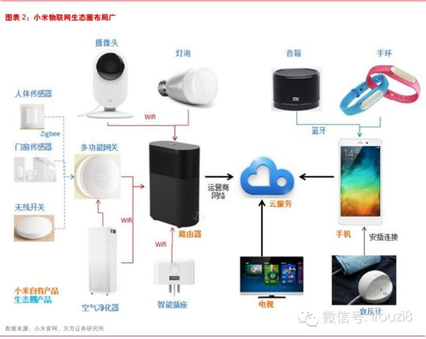
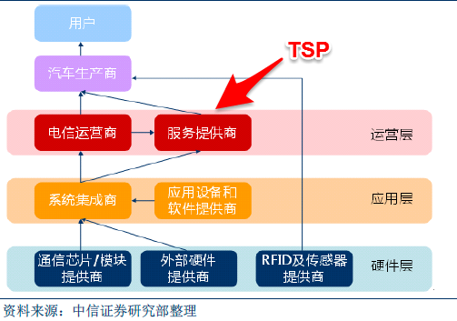
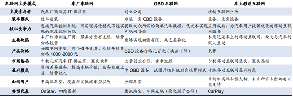
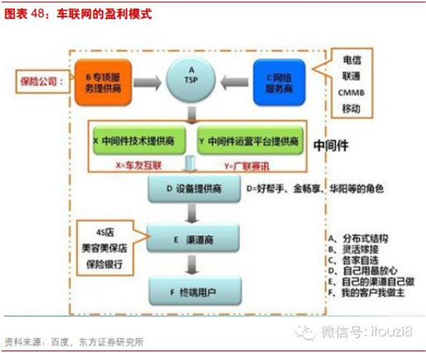

# IoT调研

## overview
所谓物联网，在中国也称为传感网，指的是将各种信息传感设备与互联网结合起来而形成的一个巨大网络。物联网是新一代信息技术的重要组成部分。其英文名称是“The Internet of things”。由此，顾名思义，“物联网就是物物相连的互联网”。这有两层意思：第一，物联网的核心和基础仍然是互联网，是在互联网基础上的延伸和扩展的网络;第二，其用户端延伸和扩展到了任何物品与物品之间，进行信息交换和通信。因此，物联网的定义是通过`射频识别(RFID)`、`红外感应器`、`全球定位系统`、`激光扫描器`等信息传感设备，按约定的协议，把任何物品与互联网相连接，进行信息交换和通信，以实现对物品的`智能化识别`、`定位`、`跟踪`、`监控和管理`的一种网络。

物联网作为新一代的信息技术的重要组成部分，有三个方面的特征：

首先，物联网具有互联网特征。对需要所用的物联网技术联网的物体来说一定要有能够实现互联互通的互联网支撑。

其次，物联网技术具有识别与通信特征。接入联网的物体一定要具备自动识别的功能和物物通信的功能(M2M)的功能。

最后，物联网技术具有智能化特性。使用物联网技术形成的网络应该具有自动化，自我反馈和只能控制的功能。

在物联网体系架构中，三层的关系可以理解为：

1. 感知层是物联网的皮肤和五官–识别物体，采集信息。感知层包括二维码标签和识读器、RFID标签和读写器、摄像头、GPS等，主要作用是识别物体，采集信息，与人体结构中皮肤和五官的作用相似。

2. 网络层是物联网的神经中枢和大脑–信息传递和处理。网络层包括通信与互联网的融合网络、网络管理中心和信息处理中心等。网络层将感知层获取的信息进行传递和处理，类似于人体结构中的神经中枢和大脑。

3. 应用层是物联网的“社会分工”—与行业需求结合，实现广泛智能化。应用层物联网与行业专业技术的深度融合，与行业需求结合，实现行业智能化，这类似于人的社会分工，最终构成人类社会。

## 应用篇

物联网的三个核心环节在于零部件、整机和内容及运维服务，生态圈的投资机会主要在两类公司：**一类是采用硬件、软件和服务一体化商业模式的公司，一类是具有新型硬件核心元器件能力的公司**。
	
物联网硬件市场空间大，细分领域商业模式各不相同：物联网市场空间到2018年将达到4.4万亿美元，CAGR22%。细分领域商业模式：1）一般消费类具有时尚行业特质，硬件和运维服务可以实现盈利；2） 医疗器械类可以从病患、医生、医院、药厂和保险公司多方获得盈利；3）智能家居类可以通过硬件直接盈利、硬件及运维服务和平台收费三种方式盈利；4）游戏 类的硬件和虚拟消费均可获得收入；5）车载类则通过精准营销和保险公司补贴来获利；6）智慧社区、工业追溯等也各具不同盈利模式。7）智慧农业，形成从育前、育中，育后销售等生态闭环。
目前大多的发展方向和切入点如下：

### 智能农业
农业物联网，作为整个物联网发展中非常重要的一部分，国家也相当重视，《中华人民共和国国民经济和社会发展地十二个五年规划刚要》指出，要“推动物联网关键技术研发和在重点领域的应用示范”。一、研发。二、应用。2009年8月7日，温家宝总理在视察无锡时提出了“感知中国”的理念，物联网自此发展迅速。农业物联网方面，利用信息传感设备去感知作物的生长环境，是一个不容忽视的领域。

国内企业也都相继摩拳擦掌，跃跃欲试，有些先锋企业已经有了比较成熟的产品。抛开物联网的概念不谈，农业现代化、农机自动化，再加上目前的互联网技术以及移动智能终端的大发展，农业物联网一定会有一个非常大的发展空间。那么农业物联网的创业方向有哪些呢？

1. 大部分农业方向的物联网的公司目前还只是简单的监测，展示，客户一般都是相关的政府部门，学校研究所之类，基本都是示范性工程项目，对农产品的产量销量几乎没有帮助，你可以跟这大部分公司一样，跑跑关系，接些单，赚些钱。  

2. 你也可以做一个大的平台，解决三个问题：1，为政府将农业信息化。2，为农民增产增量增收并帮农民将农产品卖出去。3，为消费者提供健康安全放心的农产品。比如做了一套农业物联网的平台，农民可以实时了解农作物的生长状态，平台里有农业专家帮你分析，设备可以将农产品调整到最佳的生长环境，平台里做一个农产品的商城，并且农产品都是可追溯的。 

3. 另外还有一些新型的农业方向，比如鱼菜共生系统与物联网的结合。 

农业物联网方向很多，但是目前发展很迅速的是农业环境的监测和检测。这是农业物联网的发展方向，也是国家规划方向。目前中国大部分地区加速城镇改造，将土地整合集中承包给大型企业进行农场运营。所以这块需要很多土地环境检测和监控设备。

###### 农业物联网应用发展现状
 
 **在农业资源监测和利用领域**，美国和欧洲主要利用资源卫星对土地利用信息进行实时监测，并将其结果发送到各级监测站，进入信息融合与决策系统，实现大区域农业的统筹规划。例如，美国加州大学洛杉矶分校建立的林业资源环境监测网络，通过对加州地区的森林资源进行实时监测，为相应部门提高实时的资源利用信息，为统筹管理林业提供支撑。我国主要将GPS定位技术与传感技术相结合，实现农业资源信息的定位与采集；利用无线传感器网络和移动通信技术，实现农业资源信息的传输；利用GIS技术实现农业资源的规划管理等。例如杭州电子科技大学学者研究了基于无线传感器网络的湿地水环境数据视频监测系统，该系统实现对湿地全天候的实时监测，具有数据分析与处理，并对污染等突发事件和环境急剧变化所影响的水域的水环境状况实时报警等功能。
  
　　**在农业生态环境监测领域**，美国、法国和日本等一些国家主要综合运用高科技手段构建先进农业生态环境监测网络，通过利用先进的传感器感知技术、信息融合传输技术和互联网技术等建立覆盖全国的农业信息化平台，实现对农业生态环境的自动监测，保证农业生态环境的可持续发展。例如，美国已形成了生态环境信息采集-信息传输处理-信息发布的分层体系结构。法国利用通信卫星技术对灾害性天气进行预报，对病虫害进行测报。我国研制了地面监测站和遥感技术结合的墒情监测系统，建立了农业部至各省、重点地县的农业环境监测网络系统等一批环境监测系统，实现对农业环境信息的实时监测。例如我国每年通过农业环境监测网络开展农业环境常规监测工作，获取监测数据10万多个；融合智能传感器技术的墒情监测系统已在贵阳、辽宁、黑龙江、河南、南京等地推广应用。
 
　　**在农业生产精细管理领域**，美国、澳大利亚、法国、加拿大等一些国家在大田粮食作物种植精准作业、设施农业环境监测和灌溉施肥控制、果园生产不同尺度的信息采集和灌溉控制、畜禽水产精细化养殖监测网络和精细养殖等方面应用广泛。例如，2008年，法国建立了较为完备的农业区域监测网络，指导施肥、施药、收获等农业生产过程。荷兰VELOS智能化母猪管理系统在荷兰以及欧美许多国家得到广泛应用，能够实现自动供料、自动管理、自动数据传输和自动报警。泰国初步形成了小规模的水产养殖物联网，解决了RFID技术在水产品领域的应用难题。我国在涉及田间环境土壤信息获取、联合收获机自动测产、农田作物产量空间差异分布图自动生产和农业机械作业监控等大田粮食作物生产方面；在设施农业环境数据采集、发布，调控等设施农业生产方面；在果园监测、水肥控制、节水灌溉自动化等果园精准管理方面；在养殖环境监控、健康养殖等畜禽水产养殖等方面研发了一批系统，且应用成效显著。例如国家农业信息化工程技术研究中心成功研制了基于GNSS、GIS、GPRS等技术的农业作业机械远程监控调度系统，可优化农机资源分配，避免农机盲目调度。中国农业大学建立了蛋鸡健康养殖网络系统和水产养殖环境智能监控系统。
 
　　**在农产品安全溯源领域**，国外发达国家在动物个体编号识别、农产品包装标识及农产品物流配送等方面应用广泛。例如加拿大肉牛2001年起使用一维条形码耳标，目前已过渡到使用电子耳标。2004年日本基于RFID技术构建了农产品追溯试验系统，利用RFID标签，实现对农产品流通管理和个体识别。我国开展了以提高农产品和食品安全为目标的溯源技术研究和系统建设，研发了农产品流通体系监管技术。例如北京、上海、南京、四川、广州、天津等地相继采用条码、IC卡、RFID等技术建立了农产品质量安全溯源系统。浙江大学、北京市农业信息中心等单位研究开发了车载端冷链物流信息监测系统。
 
###### 农业物联网产业发展现状

农业物联网产业链主要包括三方面内容:传感设备、传输网络、应用服务。
 
　　**在传感设备方面**，国外发达国家从农作物的育苗、生产、收获一直到储藏缓解，传感器技术得到了较为广泛的应用，包括`温度传感器、湿度传感器、光传感器`等各种不同应用目标的农用传感器。在农业机械的试验、生产、制造过程中也广泛应用了传感器技术。RFID广泛应用在农畜产品安全生产监控、动物识别与跟踪、农畜精细生产系统和农产品流通管理等方面，并由此形成了自动识别技术与装备制造产业。
　　　　 
　　**在传输网络方面**，国外已在无线传感器网络领域初步推出相关产品并得到示范应用。如美国加州Grape Networks公司为加州中央谷地区的农业配置了“全球最大的无线传感器网络”；2002年，英特尔研究中心采用跟踪方法采集了因州海岸的大鸭岛上的生态环境信息。国外互联网与移动通讯网在农业领域得到广泛的应用。2004年，佐治亚州的两个农产已经用上了与无线互联网配套的远距离视频系统和GPS定位技术，分别监控蔬菜的包装和灌溉系统。美国已建成世界最大的农业计算机网络系统，该系统覆盖美国国内46个州，用户可通过计算机便可共享网络中的信息资源。
　　 
　　**在应用服务方面**，SOA（Service Oriented Architecture）即服务导向架构，自1996年Gartner提出以来受到了IT业界的热捧，产业化进程不断加快。2006年以来，IBM、BEA、甲骨文等一批软件厂商开发推出了一系列实施方案并部署了一些成功案例，使得SOA进入现实的脚步在不断加快。同年，IBM全球SOA解决方案中心在北京和印度成立，定制各个行业的模块化SOA解决方案，并结合IBM服务咨询和软件力量全方位实施，这意味着IBM已经在SOA产业化方面抢先一步。BEA也宣布推出“360度平台”以进一步巩固其在中间件领域的优势，而微软和甲骨文也纷纷发力中间件市场，竞争进一步加快SOA产业化进程。
　　
　　
##### 案例

1. [大棚环境远程监控系统](http://www.yfnywlw.com/al/xm/273.html)
2. [水产、畜牧养殖管理系统](http://www.yfnywlw.com/fa/scyz/212.html)
3. [农田水肥一体化智能监控系统](http://www.yfnywlw.com/fa/sfyt/214.html)
4. [农林“四情”监测预警系统](http://www.yfnywlw.com/fa/ssny/59.html)

### 智能医疗
在物联网的加持下，医疗健康继续成为人们的焦点话题。在人口老龄化的大背景下，医疗服务亟需完善。令人振奋的是智能医疗已经渐行渐近，同时可穿戴智能设备行业亦正在快速成长，大量企业的蜂拥而至也突显了此市场的巨大魅力，到2018年，中国智能医疗市场规模将超过一百亿元，市场前景看好。在不久的将来医疗行业将融入更多人工智慧、传感技术等高科技，使医疗服务走向真正意义的智能化，推动医疗事业的繁荣发展。业内人士认为，下一个十年，从诊断、监护、治疗到给药的医药细分领域将开启智能化时代，医疗器械行业向便携化、智能化发展是大势所趋。在这样的背景下，现代移动互联、穿戴式设备、大数据等新兴技术与新商业模式的结合，传统的医疗器械或被移动医疗、穿戴医疗、商业保险、大数据等新兴技术颠覆，智慧医疗尤其是可穿戴设备将成为未来重点投资领域。

目前在物联网与医疗健康的存在和发展形势如下：

1. **智能医疗设备** 
   随着人们对自身健康状况的日益关注和各地养老产业园、养老社区的迅速兴起，与养老产业配套的掌上监护仪、一体式监护仪等医疗设备和轮椅、血压计、血糖仪等家用医疗设备需求巨大。医疗器械行业未来看好的方向包括慢性病相关领域、中高端进口替代和移动智能医疗、掌上监护仪、一体式监护仪等医疗监护设备。另外，轮椅和血压计、血糖仪等家用医疗设备对老人监控身体状况至关重要，同样需求巨大。   “**可穿戴设备的微型化、便携化，将为医疗器械行业带来一场革命。**” 可穿戴类医疗**最大的潜力不在于硬件，而在于其用户黏性，企业通过可穿戴设备监测到的服务患者数据，可以为医院、药企和其他产业链相关者收集医疗云端“大数据”，由此衍生出新的商业模式。**
   
   	以心脏病监测为例，一次心电图难以捕捉到有效的诊断依据，可穿戴式的设备可以很方便帮助患者监测并记录心电数据，能够及时发现常规心电图不易发现的心率失常和心肌缺血，是临床分析病情的重要依据。借助无线动态心电图监测，通过其所收集的数据送达云端，医生可以轻松访问这些数据。

	高血压是严重威胁生命健康的心血管疾病。借助可穿戴式医疗设备可以24小时动态地监测用户的血压数据，向医生提供不同时段的血压数据信息。MIT在2009年就开发出了能长时间连续测量的“可穿戴式血压计”，能够24小时连续测量血压。

	传统的血糖检测是通过监控餐后或空腹血糖，但是餐后或空腹血糖的测定，只反映患者的某一具体时间的血糖水平。而可穿戴式医疗设备可以实施动态血糖监测，可以更好掌握血糖的变化，帮助患者及时发现问题，并且降低糖尿病并发症的风险。目前谷歌正在研发测血糖的隐形眼镜，可以衡量佩戴者眼泪中的葡萄糖水平，有效地帮助糖尿病人监控血糖水平。
	
	##### 案例
	[RFID助力医院监控跟踪儿科血液制品](http://iot.ofweek.com/2017-02/ART-132209-11000-30108838.html)
	
	[智能机器人“糖宝” ](http://news.hc3i.cn/art/201704/38689.htm)
	
	
	[帕金森患者智能勺子](http://news.cctv.com/2016/12/17/ARTIeLjP1Ns6ArSAoRGKRMBS161217.shtml)
	
	[床旁监测设备-Wearable Biosensor](http://news.hc3i.cn/art/201603/35722.htm)
	
	
2. **医疗健康大数据服务平台**

	从麦肯锡分析大数据价值，提出大数据时代到现在不过短短5年时间，大数据好像突然间就进入了我们的生活，人人嘴边都挂着大数据。	马云在《2015年致投资者公开信》中所说“人类已经从IT时代步入DT时代”。而硅谷也流传着这样一句话 “你正坐在一座数据金山上”。

	如今HealthTech行业内的一个共识：健康数据将成为数字医疗时代的重要资产。
 有效的健康数据，不仅代表着对于每个患者的个性化处理方案，更意味着对于整个产业的变革与颠覆。
 
	针对数据的`采集`、`分析`、`处理`，将成为主导数字医疗发展的重要方向。事实上，近年受到资本狂热追捧的基因组排序，也是人体众多医疗数据采集的一种。根据Global Market Insights的最新统计，十年之内，数字医疗的市场规模将从513亿美元飙升至3790亿美元。

	数字医疗时代对医疗数据的需求包括三个方面：**医疗级数据采集**，**数据存储与管理**，**以及数据分析**。这三个方面也正是许多高科技医疗企业努力的方向。
 
	新时代的数据采集，不仅要做到收集具有临床价值、及时的人体生理健康信息，还要尽可能地符合用户的使用习惯。“厂商们需要努力找到一个‘最佳路径’——最不干扰用户的日常生活，又能完成医疗级精度的数据采集的目标。”李江博士说。值得注意的是，“最佳路径”代表着未来重要的人体数据入口，这正是许多传统的厂商开始发力医疗级智能可穿戴设备的原因之一。
 
	数据存储与管理也是包罗万象，其中包括了各种传感器数据的存储和管理，个人用药习惯，EHR（电子健康病历）和EMR（电子病历记录）等等，能够记录一个人几乎所有的健康以及行为和获得的医疗服务数据。未来，这些数据组成的个人电子病历也会保存在云端，让医疗机构能够随时调用。
 
	数据分析与挖掘部分，医疗健康领域产生海量的数据，和其他领域相比，相应的数据挖掘工作却显得严重滞后。为提高医疗健康水平，医疗领域需要找到一个能够有效处理大数据的方法。数据挖掘技术在医疗实践中的应用是一个过程，而不是一次性的任务，随着时间的推移，健康数据会越积越多，数据间的关联性也会更加复杂，因此行之有效的医疗数据挖掘技术，对于医学领域的发展有着重大的现实意义。小到监测体温来确定患者是否发烧和预测康复情况，大到用人工智能来分析X光片，通过DNA数据分析患癌几率等等，都需要利用分析工具，从数据中获取有效的结果。

	例如基于以上数据的采集，挖掘，我们可以为患者提供个性化医疗推荐，可以为患者生成专属的治疗方案，充分挖掘患者间、疾病间和医生间的关系，为疾病的科学诊断保驾护航。由于患者的个性差异和疾病间的共性共存，同时在许多层面还存在着某种联系，个性化医疗推荐系统就是运用数据挖掘的方法找出并建立其中的联系，根据关联建立患者、疾病和临床数据间的模型，针对病人的治疗经历、基因、遗传、环境、生活方式等信息挖掘出适合该患者的个性化治疗方案侧，个性化推荐流程。如图：

	对于数字医疗国家也是相当的重视，从国务院办公厅印发的[《关于促进和规范健康医疗大数据应用发展的指导意见》](https://36kr.com/p/5048603.html)中我们可以看出国家层面的对健康大数据的规划和展望。
	
	基于以上我们可以提供出医疗健康大数据服务平台.医疗健康大数据服务平台是一个包含多个业务系统、多个自身管理软件、是一系列软、硬件和人员、政策支持的综合系统体系，统一建设医疗健康云计算服务中心，集中存储居民医疗卫生信息和居民电子健康档案等数据，满足社会大众、医务工作者、各级卫生主管部门、第三方机构的应用需求。 医疗健康大数据服务平台总体架构如下图所示  

	######1、展现层

	负责对用户提供医疗健康信息、以及分析与挖掘信息服务，支持4大类用户，包括：社会公众、医务工作者、卫生主管部门和第三方机构。通过本平台，既可以获得医疗健康数据服务结果展示，也可以获得医疗健康数据分析与挖掘服务结果展示。本平台对外提供 Web页面接入方式或移动通讯终端（android、iOS）接入方式。

	######2、服务层

	服务层主要是平台建设过程中能够提供的所有应用相关服务。应用服务大致可分为业务应用类服务、数据资源类服务、工具软件类服务和其他类服务。业务应用类服务主要面向不同的用户提供解决具体业务功能需要，主要包括公众服务、医院诊疗服务、综合卫生服务、大数据分析服务等；数据类服务按业务所划分的各类数据服务。工具软件类服务主要提供给数据的维护和采集、清洗、整合、分析、统计等。

	######3、资源层

	资源层负责医疗健康大数据和数据分析与挖掘相关应用资源的一体化存储和管理。资源层又可分为三层：**虚拟化业务管理平台、虚拟化数据管理平台和物理资源层。**其中：
	
	物理资源层提供各种数据资源、应用资源的实际存储，包括：医疗健康相关的所有数据，建设的数据资源中心和应用服务资源中的所有资源。本层将提供关系数据库系统、非关系数据库、数据仓库等多种类型的数据管理系统。

	虚拟化数据管理平台采用虚拟化技术对所有物理资源进行封装，对上层提供各种虚拟化资源。对内部，虚拟化数据管理平台通过异构式数据集成与管理、虚拟化资源调度、数据划分、负载均衡、实时备份监控、故障恢复等多种手段保证整个平台的高性能、高可用性、高可扩展性。

	虚拟化业务管理平台负责对所有的应用服务相关资源进行管理和调度。根据功能，它又可以划分为：虚拟化数据资源中心和虚拟化应用服务组件资源中心。其中：数据资源中心针对不同的需求，对不同业务部门不同结构数据进行分析、抽取、加工，形成面向主题的综合数据，为组织内各个层面的人员提供高效的、用于宏观决策的各种信息。应用服务资源中心应用服务组件资源中心通过提供数据挖掘等服务，使卫生行业管理者们能够利用各种历史数据和现在的数据进行各种复杂分析、预测和辅助决策。

机遇总是伴随着挑战，智能医疗虽然拥有广阔的发展空间和良好的发展机遇，但是也存在诸多潜在的挑战和问题。
如用户习惯的有待培养；急需建立管理规范行业标准；远程医疗等费用支付与保险理赔的依据问题；医疗数据共享以及数据安全，个人隐私问题；智能医疗的专业人才队伍培养等等。

### 智慧城市
智慧城市的概念最早源于IBM提出的“智慧地球”这一理念，此前类似的概念还有数字城市等。2008年11月，恰逢2007年－2012年环球金融危机伊始，IBM在美国纽约发布的《智慧地球：下一代领导人议程》主题报告所提出的“智慧地球”，即把新一代信息技术充分运用在各行各业之中。

具体地说，“智慧”的理念就是通过新一代信息技术的应用使人类能以更加精细和动态的方式管理生产和生活的状态，通过把传感器嵌入和装备到全球每个角落的供电系统、供水系统、交通系统、建筑物和油气管道等生产生活系统的各种物体中，使其形成的物联网与互联网相联，实现人类社会与物理系统的整合，而后通过超级计算机和云计算将物联网整合起来，即可实现。此后这一理念被世界各国所接纳，并作为应对金融海啸的经济增长点。同时，发展智慧城市被认为有助于促进城市经济、社会与环境、资源协调可持续发展，缓解“大城市病”，提高城镇化质量。

基于国际上的智慧城市研究和实践，“智慧”的理念被解读为不仅仅是智能，即新一代信息技术的应用，更在于人体智慧的充分参与。**推动智慧城市形成的两股力量，一是以物联网、云计算、移动互联网为代表的新一代信息技术，二是知识社会环境下逐步形成的开放城市创新生态。**一个是技术创新层面的技术因素，另一个则是社会创新层面的社会经济因素。但总的来说，**智慧城市以云计算中心为核心，实现全面感知、互联互通、数据共享和高效服务**，具备以下几个方面的技术特点：

######全面感知：
通过各种终端、摄像头、传感器等收集和获取各种信息，各种感知设备是智慧城市的神经末梢。

######互联互通：
各类宽带有线、无线网络技术的发展为城市中物与物、人与物、人与人的全面互联、互通、互动提供了基础条件，智慧城市通过有线及无线设备，实现各种终端的无线接入，并承载到相应的业务网络。

######数据共享：
基于新一代数据中心的云计算、物联网及运营支撑系统，对收集到的数据进行存储、处理和转发，支撑上层具体业务应用。同时，数据开放性也是衡量智慧城市的关键标准，通过数据支撑层打破各业务系统之间的条块分割，实现数据的横向联合和共享应用。

######高效服务：
智慧城市的最终应用是服务，为市民、企业和政府管理部门提供各种服务。

###### 发展趋势
随着国家城镇化建设以及十三五期间城镇信息化建设的规划，智慧城市建设的市场潜力非常之大。2014年，我国智慧城市IT投资规模达2，060亿元，较2013年同期增长17．0％；2015年，我国智慧城市IT投资规模达2，480亿元，较2014年同期增长20．4％。预计，2017年我国智慧城市IT投资规模将达到3，752亿元，未来五年（2017－2021）年均复合增长率约为31．12％，2021年IT投资规模将达到12，341亿元。2017年我国智慧城市市场规模将达到6．0万亿元，未来五年（2017－2021）年均复合增长率约为32．64％，2021年市场规模将达到18．7万亿元。仅仅智能路灯的

面对如此之大的市场规模和潜力，国内外各大科技公司也在积极的布局和参与智慧城市发展：

**谷歌**
谷歌不仅在人工智能及智能技术研发上成绩卓越，并逐渐渗透进智慧城市建设，Google Y实验室，致力于先进技术及产品研发，解决机场甚至城市是如何运作的新方法，从而完成创建智能城市模型的超前设想。
谷歌在智能家居、人工智能、图像与语音识别领域。通过一系列并购、开放平台的建立、软件硬件一体化来打造这个生态系统。

**微软**
2013年7月10日微软在全球合作伙伴大会上发布智慧城市“Citynext”计划，在Citynext，微软将运用云计算、移动设备、海量数据分析平台、社交网络等软硬件技术，并整合合作伙伴的资源，解决方案有城市指标仪表板（CityNext Dashboard）、智能交通（Intelligent Traffic）、智能市民服务大厅（Smart Citizen Service Hall）、智能健康护理（Intelligent Healthcare）。

**甲骨文**
甲骨文全公司有近万产品线，其中就有与最近流行的物联网、智能城市密切相关。“甲骨文智能城市”项目的关注点主要包括三个方面：服务提交平台、智能平台、集成和IT基础设施平台。其主要目的是要实现重要信息的共享，例如在各级政府范围内公布某个可能有犯罪记录的游客的护照信息。
甲骨文参与了世界各地不同智慧城市或相关领域如云计算、电子政务、电子商务／两化融合、物联网等方面的建设。

**IBM**
2008年11月IBM提出“智慧地球”概念，2009年8月，IBM又发布了《智慧地球赢在中国》计划书，正式揭开 IBM智慧地球中国战略的序幕。
IBM 智慧城市的使命就是要提供各种流程、系统和产品，促进城市发展和可持续性，为其居民、经济以及城市赖以生存的生态大环境带来利益。通过应用信息技术（IT）规划、设计、建造和运营城市基础设施，改善生活质量和经济福利。

**SAP**
SAP目前已全面转型云服务，加入云服务阵营。推出基于SAPHANA云平台的解决方案及服务。实时数据分析平台HANA的推出，使得本来专注于企业级软件的SAP成为一个平台供应商，从而涉猎很多“以前不可能去碰”的创新应用领域，智慧城市就是其中一个重要领域。

**英特尔**
英特尔智慧城市推动产业伙伴协同创新，针对不同地区发展的特色需求打造智慧城市解决方案。2014年中，英特尔实施了一项被称作“智能城市美国”的试验性项目，这也是英特尔在美国的第一个类似项目。除此之外，英特尔收购Altera进军物联网，或成该领域领头羊，并大举进攻可智能设备及车联网的研发设计，力图打造一个智能物联生态。

**三星SDS**
三星SDS通过对中心平台（UBI－center）的开发和建设，为城市提供了一个智慧的大脑，城市中政府，企业，市民等等元素都在这个大脑的领导下高效运行，真正意义上做到了打破信息孤岛及综合管理。

**通用电气**
GE通用电气公司正在美国的圣地亚哥、加利福尼亚、杰克逊维尔、佛罗里达等地区建立智能路灯引导系统，监控停车位和交通路况。在圣地亚哥，GE部署了4000个带有摄像监控的智能LED路灯，路灯可以监控追踪城市停车位情况，并将数据发送到GE的云平台Predix，用户通过手机App，可查找最近的空置停车位。该智能灯还可以追踪道路的交通情况，每年还可节省25万美金的电力开销。目前，GE对Predix云平台的投资已经超过10亿美元，并希望将该平台开放给第三方开发者，以此打造更多智慧城市的App。

**高通**
高通去年宣布串联旗下多家公司（QTI），包括高通技术、高通创锐讯、高通生命，以及高通互联体验公司（QCE），宣布在物联网、智慧家庭、智慧城市、穿戴装置、汽车电子与医疗照护等市场已经就位。其互联网领域的All seen联盟，现有超140家企业加入，联盟成员已发表75项支持All joyn 架构的产品。

**华为**
在智慧城市上，华为的战略已经清晰，在率先提出**“一云二网三平台”**的智慧城市整体架构解决方案的同时将业务定位于“聚焦ICT基础设施。”在“云”上，华为的云数据中心具有分布式架构、开源平台、云产业链各环节能力最全的特点；在“网”上，华为以有线＋无线组成的敏捷网络，构建城市无处不在的宽带；作为NB－IoT标准的引领者，华为还为物联网提供业界最轻量级的物联网操作系统LiteOS，在联接“物”的数量、广度及超低功耗表现上领先业界，此外，华为还提倡合作共赢，与伙伴共同提供大数据服务支撑平台、ICT业务应用使能平台、城市运营管理平台等。
华为在传感领域则推出自主研发的Boudica物联网芯片、IoT－OS物联操作系统，华为在大数据平台层提供分布式的数据处理系统FusionInsight，在提供海量数据的存储，分析和查询能力的同时支持从数据孤岛向数据融合的演进，通过数据共享与交换＋大数据集成管理，支撑城市大数据应用，构建智慧城市生态圈。

去年，**华为成立了智慧城市业务部**，此举表明其在该领域已经有了较为深刻的认识。2017年，华为将在城市IOC、智慧水务等物联网应用，以及政务、教育、医疗等民生领域加大投资，并且会投入上亿元基金用于与合作伙伴的联合解决方案研发、联合营销以及人才培养，打造智慧城市生态圈。

此外，华为还联合生态伙伴发布了9大联合解决方案：奥格＆华为海绵城市雨洪管理联合解决方案、超图＆华为智慧城市GIS云联合解决方案、广通＆华为城市公共信息资源共享交换平台联合解决方案、华傲＆华为城市大数据平台联合解决方案、软通动力＆华为城市移动门户联合解决方案、泰豪＆华为智慧城市能耗监测节能减排云联合解决方案、太极股份＆华为智慧政务联合解决方案、未来国际＆华为基于政务云的新型智慧城市联合解决方案、易智瑞＆华为智慧城市GIS云联合解决方案，覆盖新型智慧城市建设多个方面。

**中兴**

在中兴通讯今年发布的《M－ICT2．0白皮书》中，将物联网定为开拓未来的五大战略方向之一，并将物联网具体施行的战略概括为**“两平三横四纵”，**“两平”即重点打造生态圈和资本两大支撑平台，在构建开放的连接、管理和应用平台，为上下游产业链的客户提供服务的同时，SmartIoT OS系统还为IoT终端提供智能化方案，结合大数据和云计算能力，帮助伙伴挖掘每个“BIT”的价值。ZTE AnyLink新的城市物联网公共云平台，该平台破除了城市管理中各部门的信息壁垒，使其全面协同，对城市完成全面的感知；同时，采用先进快速的大数据等技术进行科学有效的深度分析处理，支撑城市管理新服务深度，创生新的城市智慧。
“三横”则是在终端、网络及IoT PaaS三个层面布局，这原本就是中兴通讯所擅长的领域，在网络上，中兴通过优化在短距离、广域网以及城域和核心网的技术，满足IoT应用的差异化需求；作为NB－IOT技术的重要贡献者之一，中兴通讯在NB－IOT上走得比华为更远，在积极与国内三大运营商合作，进行NB－IoT的规范制订、技术试验和试点建设的同时，与移动合作完成了业界首家基于3GPP NB－IoT标准协议的技术验证演示，二者还一起在浙江乌镇开通首例符合3GPP标准的NB－IOT蜂窝物联网智能停车业务。此外，中兴通讯在LoRa技术上不遗余力，具备提供全套LoRa网络解决方案的能力。
“四纵”主要聚焦在智慧城市、智慧家庭、工业互联网、车联网四大垂直领域，这几大领域的应用是中兴通讯物联网核心技术的延伸，均取得不瞩的成绩。此外，中兴通过不断地合纵连横，建立GIA联盟，联盟成员可享受中兴通讯全球物联网专利技术的优先授权及商机共享，从而吹响了构建生态联盟的号角！

在智慧城市的时间上：今年年初中兴通讯联合上海电信，还有上海电信研究院一起在上海世博园做了一个**NB—IOT的智能井盖**的实际应用的试点。这个试点实际上基于现有NB—IOT的新技术的对现有智能井盖进行改造，达到对智能井盖进行实时监控。通过方案解决了井盖自动的监控、检测、判定还有报警问题，同时还可以通过把传统井盖的一些资产管理，告警管理还有一些维护管理等等功能，也内置在这一套基于NB—IOT改造的智能井盖的应用系统之中，完成了对井盖全方位在线的监控，同时完全简化传统智能井盖的复杂的模式。

**联想**

作为智慧城市深度参与者的联想，首次提出了**建设新型智慧城市的道与法**。所谓“道”即新型智慧城市建设和理念和目标；所谓“法”即新型智慧城市建设的方式和方法。

在联想看来，智慧城市是一个巨系统，涵盖城市管理中的各个领域，因此联想秉承国家新型智慧城市建设标准及建设目标，通过对众多城市管理者的深入访谈调研，提出了以城市管理大数据处理中心为运营基础，城市综合运营管理中心为管理窗口，及城市创新体验中心为展示窗口的城市运营核心理念。

联想认为，智慧城市建设总体可以归纳为城市治理及产业升级两方面，在规划建设时应针对不同城市特点予以不同的建设方法，才能更有效地保证城市平稳运营并快速提升产业的创新发展及经济造血功能。所以，联想也提出了贯彻双态IT建设理念的新型智慧城市建设思路，具体包括：
首先，针对城市治理中确保服务稳定、持续创新的要求，以稳态建设为指导思想，深入调研分析各类政务应用， 采用恰当的信息化手段，逐步提升公众服务能力。
其次，针对产业升级中利用新长板理论，在优势产业上快速突破的要求，以敏态建设为指导思想，快速结合当地优势，在品牌塑造、“互联网 ＋”营销、生态圈打造等多个方面，集中力量快速提升品牌效应。

**阿里**

2月28日，重庆市政府与阿里巴巴集团、蚂蚁金服集团签订战略合作协议，共同推进西部创新中心建设以及“互联网＋”行动计划。根据协议，三方将发挥各自优势，在云计算、大数据、电商、物流、新型智慧城市、普惠金融服务等领域加强合作。

阿里巴巴集团将提供基于云计算、大数据、物联网的先进技术和解决方案，在重庆打造“YunOS生态圈”，围绕智能语音交互、智能物联网、车联网、智能家居等领域，重点推动汽车、手机、电脑、电视等智能终端产业创业创新。

蚂蚁金服集团董事长彭蕾表示，要深度参与“信用重庆”建设，助力重庆市建立和完善新型智慧城市和精准社会治理的信用基础。积极推动重庆农村金融服务，打造农村金融示范县，为重庆精准扶贫贡献力量。
目前，支付宝“城市服务”在重庆已开通5大类共40项在线服务，涵盖政务、医疗、车主、交通等各领域。

###### 存在的问题
虽然目前各大科技公司都在智慧城市方面进行了很多的投资和布局，但是目前智慧城市还不成熟，还存在诸多问题：

1. 是顶层设计缺乏创新。从现在看，大部分智慧城市建设都面临顶层设计困扰。由于大中城市智慧城市建设早，投资空间大及建设复杂度高等原因，各个领域分开建设，缺少顶层设计思考，导致了大中城市智慧城市建设千城一面、缺少亮点。
2. 是投资回报难以衡量。从过去的经验看，很多城市都遇到投资效益问题。从信息化基础设施、平台建设直至上层应用建设，智慧城市建设需要在前期进行一定程度的先期投入。但很多城市在智慧城市建设过程中，也都遇到了投资回报或不明确、或无法界定、或投资模式不成熟的难题。
3. 是新兴技术不易融合。统计显示，智慧城市在建设过程中都趋向采用全新技术。新兴技术首先在商业领域得到了广泛应用，已经逐渐成熟的云计算、大数据、物联网等第三平台技术，支撑起各行业的业务发展对信息化的需求。不过，未来如何利用新兴技术来支撑智慧城市的建设，增强城市持续发展能力，如何在建设过程中更好地融合各方需求将成为一大考验。
4. 是传统的智慧城市建设侧重于技术和管理，忽视了“技术”与“人”的互动、“信息化”与“城市有机整体”的协调，导致了“信息烟囱”、“数据孤岛”，公共数据难以互联互通，市民感知度较差等问题。
5. 数据碎片化和不透明化。滴滴高级副总裁兼工程技术委员会主席章文嵩介绍，滴滴在中国每日订单量有2000多万，中国做智慧交通有巨大的数据资源优势。他同时指出，如果数据的价值不能评估，就很难做数据交换，数据资源的优势也发挥不出来。政府可以推动整体数据生态的建设，开放一些可安全公开的数据，和企业的数据整合在一起，搭建云数据平台。过去搞孤岛型建设，使得很多数据在各部门、各行业间被孤立隔离，智慧城市建设目前的关键就是解决该问题。
6. 群众参与感不强，未能打通联系群众的最后一公里。
目前的智慧城市建设多是从供给端出发，通过供应商提供后台产品和应用，以政府服务平台得以展现，真正能够连接到“服务接受者”的“智慧”种类并不多。从对各省内部分政府公务员与事业单位工作人员的抽样调查来看，多数公务人员都对智慧城市建设的现状与相关信息了解甚少。对智慧城市建设来说，公务人员既是智慧服务的“接受者”也是智慧服务的“提供者”，对智慧城市建设的参与和了解是非常有必要的。目前这种缺乏“地气”的现状亟待改善。此外，智慧城市不仅意味着硬件的完善，更要求该地居民IT素质、环保意识、城市创新能力、人才吸引力等软性综合实力的提升。因此，要注重城市人才的培养，要积极引导院校和企业关注大数据技术演进、承担关键技术和系统的创新研发工作，以创新技术的推广应用带动智慧城市产业链集聚和发展。

因此在智慧城市建设中，**互联网企业主要扮演着两个重要角色：连接政府与居民的桥梁、以及提供数据整合与大数据分析的技术提供商**。对于普通居民来讲，评价公共服务的主要标准有两个：一个是获得服务的便捷性，一个是服务的效率和质量，国内BAT三大互联网公司也对城市公共服务涉足已久，路径也颇为类似：**一开始是水电煤缴费，再后来是缴纳违章罚款，而后则是服务于交通（网约车、共享单车等等）、医疗等民生领域**。智能终端为公众方便地获得城市服务提供了入口。但仅有这个并不够，如果后端的效率得不到提升，服务请求便捷了反倒是麻烦。这时就**需要云计算和大数据来实现应用协同和数据融通**。
互联网企业参与智慧城市建设，不是简单地把政务服务放在网上或手机上，而是深度的整合底层系统、数据与服务平台及入口的整体解决方案。这样才更能给城市管理、公共服务的全方位改进带来帮助。

### 智能家居

几年之前的冬天，每天下班回家都没有热水洗澡，需要拖着疲惫的身体打开热水器，等着水烧开才能去洗澡。那时候我就想要是热时期能够远程控制就好了。下班时候远程打开，到家就有热水洗澡。在后来看了美国大片《钢铁侠》被里面强大而贴心机器人管家而震撼。
到了今天智能化的家用电器已经不再是理想化的东西了，它已经出现在我们的生活中了。

作为物联网在家居方面的垂直化领域的应用，智能家居与普通家居相比，不仅具有传统的居住功能，还兼备建筑、网络通信、信息家电、设备自动化为一体的综合性功能，为人们提供高效、舒适、安全、便利、环保的居住环境，以及全方位的信息交互功能。帮助家庭与外部保持信息交流畅通，优化人们的生活方式，帮助人们有效安排时间，增强家居生活的安全性，甚至为各种能源费用节约资金。

智能家居的实现形式是首先实现传统家居产品的智能化和连接功能，再通过智能家居控制系统进行统一控制。智能家居的**第一阶段是实现远程控制**，通过手机App等 控制家居产品。**第二阶段是智能化**，感应人体和环境，通过记录和学习从而实现自动调节。例如：Nest的自动调温器产品会根据用户的使用特性分析调温，自动 感应无人在家时就关闭空调等。智能家居可以给用户带来安全、便利和节能等诸多的好处。

智能家居的盈利模式分为三类：**硬件直接盈利、硬件及运维服务和平台类**

**硬件直接盈利**通过产品的差异化收取更高的硬件费用，即厂商若能够提供更智能化、更受消费者认可的产品，则可以享受更高的溢价。例如：美菱智能冰箱的定价可以比普通冰箱高1000-2000元。房地产开发商为了实现精装房的高端定位也常常愿意给智能家居硬件买单。 

**硬件及运维服务**的产品包括安防摄像头、智能电视等，以Dropcam为例，摄像头产品单价为149美元，7天云存储服务是每月收费9.99美元，或每年99美元，而1个月云存储服务则是月付29.95美元，或年付295美元。运维服务的盈利能力甚至高于硬件。 

**平台类公司收取加入平台的费用**，例如：苹果推出HomeKit，其它公司产品接入HomeKit需要向苹果支付一定的费用。

目前国内在智能家居领域拥有良好的生态体系的是`小米`和`360`.

在智能家居这块`小米`布局很早，崛起很迅速，其快速发展得益于强大的互联网思维，定位发烧友手机并形成了独特的粉丝文化，发展路径也从供应链到渠道再到云服务，在这块形成了自己良好的生态。

安全为本 360发力智能家居市场

针对IOT时代的到来，360公司也已推出了系列**智能家居安全产品**， 360随身Wifi首创细分品类累计销量接近3000万，儿童卫士上线3个月销量便超过50万成为国内销量最高的智能手表，1万台安全路由器P1仅用10秒售罄，屡创国内智能家居产品的热销纪录。

和小米一样，360 在市场布局节奏上也是围绕自身产品、外界合作到开放平台的“三部曲”展开。

1）全面覆盖360旗下的智能产品，如360儿童卫士、360随身Wifi、360安全路由、360智能摄像机等等；

2）与传统家电企业达成深度合作。据介绍，未来360将继续扩大合作范围，与更多的家电商展开跨界合作。

3）360还将对一系列没有自建云平台能力、产品线比较单一的企业进行全面的技术开放与扶持，包括平台开放（好的产品允许使用360品牌，在市场中共同打造爆品）、能力开放（包括360云开放、用户和流量开放、营销平台开放、芯片组开放以及超级APP开放，从各层面对合作企业予以扶持）和资本开放。在《360智能家居战略》中，360表示将投资100亿打造100家以上有前景的初创型企业和项目。

此次除了360生活助手外，智能摄像头、儿童卫士、车行记录仪、安全路由器等360旗下的其他重磅智能终端设备也悉数亮相。虽然看似散乱，但其实包括生活助手在内的每一款软件、硬件全部围绕“家庭”这个最常见的生活场景，并使之因智能变得更和谐、更温暖。

从终端领域布局，用生活助手分发服务，360已基本创建了一个完整的智慧家居生活生态链。而有了智能终端的支持，360生活助手平台将有望成为国内最大的“智慧生活服务中心”。

**总之：**

智能家居产业是一个产业链集合，不是单一的公司能够包揽得了的，从下图可以清晰地看到整个产业链的各个环节：

未来，白电企业和创业型公司负责智能设备的研发和生产，智能单品采用通用的模块（实质上是遵循通用的协议），由智能控制中心对家庭智能设备进行统一控制和管理，并将数据上传到云端，在云端进行数据分析，返回解决方案，用户既可以通过操作设备与家庭中的智能设备进行控制，也可以通过云服务进行傻瓜式的控制。

[国外一些智能家居厂商](https://m.taihuoniao.com/topic/view-103454-0.html)

[9大国外智能家居科技产品对比](http://smarthome.ofweek.com/2014-08/ART-91009-8120-28862720_2.html)

### 车联网

车联网就是：车内是个局域网，车跟车组成车际网，车网与互联网相连，三者基于统一的协议，实现人、车、路、云之间数据互通，并最终实现智能交通、智能汽车、智能驾驶等功能。

**车联网能够满足什么需求**

你是否有过这样的经历。自己所在的车道堵的一动不动，旁边车道上的汽车一辆又一辆的快速驶过，其实只是因为你所在车道的前方发生了事故。如果未来云端保存了高精度地图数据，每辆汽车都具备GPS定位和一颗“眼睛”，汽车就可以将发现的异常情况上报云端。那么，当你即将驶过事发路段时，就可以收到预警，提前变更你的行驶车道或路线，也就能够躲避拥堵。同时道路上的每一辆汽车都可以变成一名“电子警察”，这个时候交通违法甚至整个社会的犯罪率都会大幅降低（可参考“速7”中的天眼系统）。

每天下班准备回家时，你是否希望既不用提前出门，又能够最快的到家？当车联网时代到来后，只要每一位车主在下班前，将希望到家的时间输入手机App，通过云端大数据的计算，分析出你经过的每条路段，在某个时间可能产生的车流量，再结合道路通过能力及周边道路状况，计算出最适合您的出发时间和路线。只要按照导航规划路线与速度行驶，就可以实现早回家的愿望。

你在开车使用手机时，是否担心危险？车联网到来后，汽车能够通过自身传感器主动探索周边环境。当发现可能发生碰撞时，立即发出预警甚至主动为您减速，以规避危险。当你听音乐时有电话呼入，汽车可以自动降低音量。

当车内空气质量恶化时，汽车可以根据外面天气情况（甚至太阳所处位置、风向），自动为你打开合适的车窗或启动空调。当你等红灯时发现旁边兰博基尼里坐了一位美女时……总之，车联网时代到来后，驾驶会变得更加智能、更有乐趣。

**我们现在处于车联网的什么阶段？**

如果将车联网划分阶段，我觉得可以参考对移动互联网的发展历程。
第一阶段，手机（不是指大哥大）在2000年前进入国内，那时只能满足高端人群的需求。

进入到第二阶段后，手机平民化，价格降低、产能提升、品牌增多，并逐渐覆盖了每个家庭。但此时，手机满足的依旧是打电话、发短信点对点的沟通需求。

接下来到了第三阶段，诺基亚、moto、多普达等智能手机诞生，有了wap、移动梦网和java应用。手机不仅可以满足点对点的沟通需求，还能够把个人与世界连接在一起，此时移动互联网露出水面。

最后到了第四阶段，也就是现在，伴随科研能力的提升、基础设施的完善、传感器进一步变小以及工业制造水平的快速发展，苹果安卓智能手机所带来的触屏交互体验横空出世，移动互联网真正到来，并汹涌的席卷一切。

我认为，现在的车联网还只是刚刚进入第三阶段。即已经完成了基本普及，并初具联网能力，但还远未达到大规模爆发的时代。以苹果、谷歌、BAT为代表的互联网巨头，以及无数家伴随智能硬件大潮而起的新创公司，在2014年纷纷进入车联网领域，甚至包括像大众、通用、PSA集团之类的整车厂也开始逐渐转型。其大体分为三条路径：

1. 在OBD和Can总线上做文章：最典型的就是腾讯2014年5月推出的“腾讯路宝盒子”。通过插在汽车上的路宝盒子（OBD设备）获取汽车数据，如里程、油耗、速度、驾驶行为等信息。将这些信息通过路宝盒子传到手机、云端，并经过大数据分析后，为车主提供服务与应用。这条道路一般能实现的功能大致有：保养推送、UBI保险、驾驶行为纠正以及车辆远程监控（门、窗、灯的状态）。如果能够进一步获得私有协议及CAN总线操控能力，还可以实现对车辆的控制。比如，炎炎夏日，只要出门前通过手机查看一下车内温度，并遥控空调的开启，就可以在进入车内时体验冰爽的感觉。这条路径受到的限制是，不同厂家，OBD及Can总线通讯协议各不相同，并且对外完全封闭，单纯由互联网公司来做，很难达到普适性（路宝盒子就在车辆适配这一方面做了大量工作，现在已经可以兼容市面超过90%的车辆）。如果单纯依靠破解，又会产生法律及安全风险。但种受限，需要具备强大的谈判能力或更为统一的汽车行业标准出台，才会有所突破。
2. 在车机上做文章：国外以苹果carplay、android auto为代表，国内以百度Carnet为代表的产品。可以将手机的内容投射到车机屏幕上，让车机更具灵活性和延展性，旨在改变车内的视听娱乐体验。但我个人觉得，这条路与目前智能电视所面临的问题相似。它只解决了从手机屏幕向另一块屏幕转移的问题，却没有根本的解决人机交互问题。依旧需要用户用手指在车机屏幕或手机屏幕上点点划划进行操作，即便具备语音操控功能，但在现阶段能提供的帮助也还有限。从长远来看，它需要的是车内传感器、人机交互和肢体操控能力的进一步发展与普及，并结合HUD技术（Head Up Display），让用户的眼睛能够脱离开手机、车机，只需要专心盯着路面即可实现任何操作。（可参考漫威系列，钢铁侠、神盾据特工等作品里的情节）
3. 直接在汽车上做文章：以阿里&上汽、乐视汽车为代表的产品，甚至直接打出无人驾驶概念。估计短时间还无法问世，比较期待。（我个人认为，无人驾驶是车联网的终极形态）以上无论哪一种方式，相对于整个车联网而言，都只是万里长征的一小步。

**车联网什么时候能够到来？**

需要具备以下客观环境： 

1. 更统一的汽车行业标准出台。不同汽车品牌之间统一通信协议及标准配置，并可以有条件的对外开放，这样就可以解决互联网普适性的问题。“封闭的大门”早晚会被互联网攻破。
2. 高精度地图的全面普及。每条道路的宽度、坡度、周边环境全部数字化。云端能够获知每辆汽车最微小的变化。
3. 传感器技术需要进一步发展。激光、雷达、摄像等设备的价格和体积还需降低，同时能力需要更强。军方的顶尖技术能够进入民用领域。
4. 更快的网络传输及ECU处理速度。车辆与云端交互的时间变得更短，车内本地的计算能力大幅增强。
5. 后装智能车载硬件的快速发展与普及，对车厂形成倒逼。如同移动互联网汹涌来袭，传统汽车厂商企业不得不接受这种改变，并主动寻求合作，探寻车联网的发展之路。
6. 市场保有汽车快速淘汰，新车都安装先进的传感器。（如果，马车与汽车如果同在高速上奔跑，即便开着法拉利，也很难提升得了速度。）

###### 车联网产业分析

车联网产业链的三层架构。完整的车联网产业链涉及的环节较多，主要包括通信芯片 /模块提供商、外部硬件提供商、 RFID及传感器提供商、系统集成商、应用设备和软件提供商、电信运营商、服务提供商、汽车生产商等；总体而言，可以分为运营层、应用层和管理层三层架构。

TSP占据产业链核心地位。Telematics服务提供商即 TSP（ Telematics Service Provider）在Telematics 产业链居于核心地位，上接汽车、车载设备制造商、网络运营商，下接内容提供商。谁掌控了 Telematics服务提供商，谁就能掌握 Telematics产业的控制权，因此， Telematics服务提供商也成为了汽车制造商、电信运营商、 GPS运营商及汽车影音导航厂商力争的角色。

**TSP目前格局：汽车厂商 VS 互联网公司汽车厂商：**

车厂把主要精力放在车载娱乐系统的屏幕上，作为汽车的生产者，它们可以深入地整合软硬件，但同时研发周期也更长。车厂的互联网解决方案肯定会更全面、更深入。互联网巨头：苹果、谷歌相信依靠自身的强大影响力，足以与车厂抗衡，最终进入汽车的中控中心；木有操作系统的互联网公平年公司如腾讯的路宝等于切入了车联网的后装市场，用配件来实现汽车智能。与车企相比，互联网的高速迭代、大数据的云端分析能力是互联网公司的优势。可能的趋势：汽车厂商的系统并未统一，各大厂商都有自己的车载系统，通用有On-start、宝马有idrive等等，车主并不愿意去熟悉不同的系统，既然在手机和平板电脑上iOS、Android已经双雄通吃，车联网系统未来很有可能与手机趋同。

**TSP核心——OBD和地图导航OBD**：OBD是车载诊断系统(On-Board Diagnostic)的英文缩写。通俗来说，OBD就像医生的听诊器和B超设备，医生通过听诊器可以知道你的心跳，通过B超可以知道心脏功能是否正常。OBD 装置监测多个系统和部件，包括 发动机、催化转化器、颗粒捕集器、氧传感器、排放控制系统、燃油系统、GER 等 。在车联网环境下，汽车驾驶过程的每一分钟都会创造大量的数据（工业互联网概念）：行驶速度、司机操作、设备运行等情况都会转化为数据，有效地收集并利用这些数据将为汽车企业创造大量的价值，主要用途如下：

1. 通过监测汽车运行状况降低保修成本，提高安全性能，提示车主维修、降低行驶速度或提示车厂及时召回；
2. 根据车辆信息推广增值服务，包括基于车主情况、车辆位臵、行车习惯定向推送的广告；
3. 出售数据给第三方，如保险公司、广告公司以及4S 店**，北美最大的汽车保险公StateFarm 与车联网服务提供商Hughes 早在2011 年便展开合作，给保险以更精准的定价**。

**地图导航：**地图的能力和车联网服务息息相关。在传统车载设备中，地图往往是离线的，起到的作用局限于目的地导航。而在车联网中，地图将成为用户生活服务的入口，地图的重要性大幅提升。地图作为O2O的入口，受到各大互联网公司的重视。从阿里投资易图通、全资收购高德，到百度收购长地万方，腾讯收购科菱航睿等，都表明了地图的重要性。5月22日，腾讯更是大手笔地宣布投资11.73亿元人民币收购地图厂商四维图新7800万股。

**车联网主流模式比较**

腾讯也积极介入OBD市场，推出路宝盒子(路宝盒子的工作原理是，将盒子插入汽车的通用接口之后，手机便可以通过蓝牙的方式与之连接，10秒钟之内汽车的数据会借由路宝App传到腾讯的云端，手机在其中起到了传输介质的作用。通过云端的数据分析，为用户提供即时的导航、车辆诊断和油耗分析等服务。比如，当汽车出现故障，手机会告诉用户故障的详情和紧急程度。对于腾讯路宝而言，与车厂相比最大的竞争优势在于，消费者想要感受车联网的便捷，并不需要花高价购买新车，或者更换一套全新的车载系统，只需将一个智能硬件插在车内。)，用于监测汽车驾驶数据.

布局路宝和入股四维图新表明了腾讯全力抢占车联网入口的决心 ，路宝走后装模式，而四维深耕前装车厂车联网，二者本身并无直接冲突 。对腾讯来说，抢占入口，获得用户，搭建生态系统是其最核心目的。“互联网公司布局车联网，主要是为了从地图切入，进而植入本地生活服务、地理位置服务、搜索等应用，可谓醉翁之意不在酒。”腾讯的马喆人也承认，目前腾讯地图上的POI(Point of Interest)信息和点评内容皆来自于大众点评，将来路宝和大众点评之间存在着非常大的想象空间。也就是OBD+LBS模式。

###### 商业模式

OBD（车载诊断系统）的商业模式主要有两个：精准营销和保险市场。

（1）精准营销：解决用户汽车后市场痛点，获取精准营销数据 
　　用户痛点在于售后服务价格不透明。以往OBD获得的汽车诊断信息主要被4S店或维修厂商获得，现在通过后装以及部分前装市场提供的OBD抬头显示器，消费者 也可以获得汽车的数据，知道故障原因，避免被维修厂商漫天要价；发生故障时可以预警，避免重大事故。OBD硬件现在普遍盈利能力有限，主要通过OBD获得 的用户数据可以为广告商等提供更精准的营销服务，例如OBD可以记录用户经常到达的地点，提供该地点周围的生活类广告。

（2）保险市场：激励规范驾驶数据用作分级保险 
　
　羊毛出在狗身上，猪来买单的盈利模式。车联网产业链划分为5个角色：车厂、车主、网络运营商、技术提供商（软硬件）、内容提供商。这其中技术提供商可以通过 补贴用户来抢占汽车内的显示屏市场，从而抢占用户，再利用用户数据实现盈利。目前最受追捧的便是与保险合作，将用户驾驶行为习惯数据销售给保险公司，保险 公司根据数据设立分层级的保费机制，激励规范驾驶行为。因此，消费者获得的羊毛出在技术提供商身上，但由保险公司为其买单。

###  其他一些物联网新兴的点：
[阿里巴巴、中兴、中国联通共同打造物联网区块链框架](http://mt.sohu.com/20170407/n487072946.shtml)

[IBM:为认知 IoT 应用程序实现区块链](https://www.ibm.com/developerworks/cn/cloud/library/cl-blockchain-for-cognitive-iot-apps-trs/index.html)

[如何用区块链技术加密 IoT](https://www.linkedin.com/pulse/securing-internet-things-iot-blockchain-ahmed-banafa)

[Android Things给物联网设备带来基于TensorFlow的机器学习和计算机视觉](http://www.infoq.com/cn/news/2017/02/android-things-dev-preview-2)

[IBM和福布斯发布的2017年物联网5大发展趋势](http://mt.sohu.com/it/d20170204/125460971_472880.shtml)

[2016年物联网行业十大新闻事件](http://iot.ofweek.com/2016-12/ART-132209-8440-30085634.html)

[解读2016物联网：巨头割据，安全问题凸显](http://www.infoq.com/cn/articles/2016-review-iot)

[2016年最具影响力的十大并购](http://www.leiphone.com/news/201611/XF2WXjr3byBfgZEr.html)

[可由语音控制外加能进行人脸识别的自主飞行无人机](https://www.oreilly.com.cn/ideas/?p=717)

[爱立信成功演示基于NB-IoT(窄带物联网)的智能停车系统](http://network.chinabyte.com/195/13779195.shtml)

## 技术篇

###  开发
**一.** [intel IoT平台](https://www.codeproject.com/articles/895740/intel-iot-developer-kit-v-is-here)

英特尔® IoT，它提供一个端到端平台，使尚未连接的得以连接 — 允许来自数十亿台设备、传感器和数据库的数据能跨行业被安全地收集、交换、存储和分析。 
 
	主要优点：
	
1. 安全性：在数据最容易被攻击的地方开始实施基于硬件和软件的安全性的紧密结合，以提供受信任的数据。 
2. 互操作性：利用技术实施无缝通信，帮助加快上市速度，并降低部署和维护 IoT 解决方案的成本。
3. 可扩展性：以英特尔® Quark™ 到英特尔® 至强™ 和基于英特尔® 处理器的设备、网关和数据中心解决方			  案实现从边缘到云可扩展的计算。
4. 可管理性：从传感器到数据中心获得先进的数据管理和分析。

**二.** [Google Android Things IoT开发平台](https://developer.android.com/things/hardware/index.html) 
		Google 希望将 Android 普及到用户家中的每一个角落，而伴随着物联网（IoT）的大潮，该公司刚	刚推	出了全新的 Android Things 平台。
		Build connected devices for a wide variety of consumer, retail, and industrial 	applications 是他们的目标。
	主要优点： 
	
1. Get Familiar with Android Development 和android开发很相似，android开发者上手快，能吸引大量的开发人员。
2. 支持众多硬件厂商产品 `Intel Edison` `Intel Joule` `NXP Argon` `NXP Pico` `Raspberry Pi 3`等等
，此外，不仅支持 Google 自家的平台，同时也对 iOS 持有包容的态度
3. 在 Android Things 上的开发，可以通过相同的 Android 标准开发工具完成。如此一来，有经验的开发者们可以很快搞定一款新产品并将之推向市场

**三.** [微软Azure IoT平台](https://azure.microsoft.com/en-us/suites/iot-suite/)

平台定位：
连接设备、其它 M2M 资产和人员，以便在业务和操作中更好地利用数据。[更多说明](http://www.cnblogs.com/kinging/articles/5865037.html)

**四. **[IMB Watson IoT Platform](https://www.ibm.com/internet-of-things/platform/watson-iot-platform/) 

* Watson IoT Platform 提供对 IoT 设备和数据的强大应用程序访问，可快速编写分析应用程序、可视化仪表板和移动 IoT 应用程序。 
* Watson IoT Platform可以执行强大的设备管理操作，并存储和访问设备数据，连接各种设备和网关设备。
* Watson IoT Platform 通过使用 MQTT 和 TLS，提供与设备之间的安全通信。
* Watson IoT Platform使应用程序与已连接的设备、传感器和网关进行通信并使用由它们收集的数据。应用程序可以使用实时 API 和 REST API 来与设备进行通信。

**五.** [亚马逊AWS IoT](https://aws.amazon.com/cn/iot-platform/) 

AWS IoT 是一款托管的云平台，使互联设备可以轻松安全地与云应用程序及其他设备交互。AWS IoT 可支持数十亿台设备和数万亿条消息，并且可以对这些消息进行处理并将其安全可靠地路由至 AWS 终端节点和其他设备。借助 AWS IoT，您的应用程序可以随时跟踪所有设备并与其通信，即使这些设备未处于连接状态也不例外。

借助 AWS IoT，您可以轻松使用 AWS Lambda、Amazon Kinesis、Amazon S3、Amazon Machine Learning、Amazon DynamoDB、Amazon CloudWatch、AWS CloudTrail 和内置 Kibana 集成的 Amazon Elasticsearch Service 等 AWS 服务来构建 IoT 应用程序，以便收集、处理和分析互连设备生成的数据并对其执行操作，且无需管理任何基础设施.

**六.** [Ablecloud物联网自助开发和大数据云平台](http://www.cnblogs.com/ibrahim/p/ablecloud-iot.html)

平台定位
面向IoT硬件厂商，提供设备联网与管理、远程查看控制、定制化云端功能开发、海量硬件数据存储与分析等基础设施，加速硬件实现联网智能化。

**七.** [QQ物联](http://iot.open.qq.com/)

“QQ物联智能硬件开放平台”发布，将QQ账号体系及关系链、QQ消息通道能力等核心能力，提供给可穿戴设备、智能家居、智能车载、传统硬件等领域合作伙伴，实现用户与设备及设备与设备之间的互联互通互动，充分利用和发挥腾讯QQ的亿万手机客户端及云服务的优势，更大范围帮助传统行业实现互联网化

**八.** [百度 IoT Hub](https://cloud.baidu.com/product/iot.html)
	
物接入（IoT Hub）是一个全托管的云服务，帮助建立设备与云端之间安全可靠的双向连接，以支撑海量设备的数据收集、监控、故障预测等各种物联网场景。

**九.**[华为LiteOS](http://www.huawei.com/minisite/iot/cn/liteos.html)
	
	
Huawei LiteOS 是华为面向IoT领域，构建的"统一物联网操作系统和中间件软件平台"，以`轻量级`（内核小于10k）、`低功耗`（1节5号电池最多可以工作5年），`快速启动`，`互联互通`，`安全`等关键能力，为开发者提供 "一站式" 完整软件平台，有效降低开发门槛、缩短开发周期。

Huawei LiteOS 目前主要应用于智能家居、穿戴式、车联网、智能抄表、工业互联网等 IoT 领域的智能硬件上。

[相关代码地址](https://github.com/LITEOS)

**十.** [Arduino](http://www.huawei.com/minisite/iot/cn/liteos.html)

Arduino是一款便捷灵活、方便上手的开源电子原型平台。包含硬件（各种型号的Arduino板）和软件（Arduino IDE)

**跨平台**
Arduino IDE可以在Windows、Macintosh OS X、Linux三大主流操作系统上运行，而其他的大多数控制器只能在Windows上开发。

**简单清晰**
Arduino IDE基于processing IDE开发。对于初学者来说，极易掌握，同时有着足够的灵活性。Arduino语言基于wiring语言开发，是对 avr-gcc库的二次封装，不需要太多的单片机基础、编程基础，简单学习后，你也可以快速的进行开发。

**开放性**
Arduino的硬件原理图、电路图、IDE软件及核心库文件都是开源的，在开源协议范围内里可以任意修改原始设计及相应代码。

**发展迅速**
Arduino不仅仅是全球最流行的开源硬件，也是一个优秀的硬件开发平台，更是硬件开发的趋势。Arduino简单的开发方式使得开发者更关注创意与实现，更快的完成自己的项目开发，大大节约了学习的成本，缩短了开发的周期。
因为Arduino的种种优势，越来越多的专业硬件开发者已经或开始使用Arduino来开发他们的项目、产品；越来越多的软件开发者使用Arduino进入硬件、物联网等开发领域；大学里，自动化、软件，甚至艺术专业，也纷纷开展了Arduino相关课程。

**十一.** [MQTT](http://mqtt.org/) 

MQTT是M2M/IoT的网络连接协议：
MQTT is a **machine-to-machine (M2M)/"Internet of Things" connectivity protocol**. It was designed as an extremely lightweight publish/subscribe messaging transport. It is useful for connections with remote locations where a small code footprint is required and/or network bandwidth is at a premium.

**十二.** [LPWAN](https://en.wikipedia.org/wiki/LPWAN#Platforms_and_technologies)

低功耗广域物联网（LPWAN）是为物联网应用中的M2M通信场景优化的，由电池供电的，低速率、超低功耗、低占空比的，以星型网络覆盖的，支持单节点最大覆盖可达100公里的蜂窝汇聚网关的远程无线网络通讯技术。
该技术是近年国际上一种革命性的物联网接入技术，具有远距离、低功耗、低运维成本等特点，与WiFi蓝牙、ZigBee等现有技术相比，LPWAN真正实现了大区域物联网低成本全覆盖.

**十三.** [NB-IoT](http://baike.baidu.com/item/NB-IoT/19420464)

基于蜂窝的窄带物联网（Narrow Band Internet of Things, NB-IoT）成为万物互联网络的一个重要分支。NB-IoT构建于蜂窝网络，只消耗大约180KHz的带宽，可直接部署于GSM网络、UMTS网络或LTE网络，以降低部署成本、实现平滑升级。[1] 

NB-IoT是IoT领域一个新兴的技术，支持低功耗设备在广域网的蜂窝数据连接，也被叫作低功耗广域网(LPWA)。NB-IoT支持待机时间长、对网络连接要求较高设备的高效连接。据说NB-IoT设备电池寿命可以提高至至少10年，同时还能提供非常全面的室内蜂窝数据连接覆盖.

目前部分共享单车已经采用该技术使得自行车具备位置定位的防盗功能，以及其他的信息上报和跟踪功能。

**十四.** [Zigbee](https://en.wikipedia.org/wiki/ZigBee)

ZigBee是基于IEEE802.15.4标准的低功耗局域网协议。根据国际标准规定，ZigBee技术是一种短距离、低功耗的无线通信技术。这一名称（又称紫蜂协议）来源于蜜蜂的八字舞，由于蜜蜂(bee)是靠飞翔和“嗡嗡”(zig)地抖动翅膀的“舞蹈”来与同伴传递花粉所在方位信息，也就是说蜜蜂依靠这样的方式构成了群体中的通信网络。其特点是近距离、低复杂度、自组织、低功耗、低数据速率。主要适合用于自动控制和远程控制领域，可以嵌入各种设备。简而言之，ZigBee就是一种便宜的，低功耗的近距离无线组网通讯技术。ZigBee是一种低速短距离传输的无线网络协议。ZigBee协议从下到上分别为物理层(PHY)、媒体访问控制层(MAC)、传输层(TL)、网络层(NWK)、应用层(APL)等。其中物理层和媒体访问控制层遵循IEEE 802.15.4标准的规定。

**十五.** [Liota](https://github.com/vmware/liota) 
	
Liota是VMware开源的IoT网关应用程序框架。通过在IoT设备与云应用之间建立安全的网关通信，分析输入数据流并控制远程设备，Liota框架使得应用程序的开发变得更简单。除了开源，Liota还实现了供应商无关性。Iyer称：“普适的Liota可以通过不同模块与任何数据中心组件交互，支持任何IoT网关所使用的所有传输协议，Liota可以与任何其他IoT系统配合使用，对供应商的选择无要求，这一特性有效解决了IoT市场上面临的一个最大问题。”

Liota SDK使用Python语言开发，可部署在任何支持Python的网关平台上。	

**十六.** [Gladys](https://github.com/GladysProject/Gladys)
	
是一个基于 Node.js 与 Raspberry Pi 的智能家居助手。它可以连接到你家中的所有设备，以及日历，并且还可以为你提供大量的 API。它可以在你起床前唤醒 Philips Hue、准备好音乐，还能准备好咖啡机，打开百叶窗等等的操作。
	
**十七.**[netdata](https://github.com/firehol/netdata)

NetData 是一个用于分布式实时性能和健康监控的系统，可以用于实时监控物联网设备。它使用了现代化的交互式Web仪表板，为其运行的系统（包括 Web 和数据库服务器等应用程序）提供无与伦比的实时洞察信息。

**十八.** [Docker、MQTT、InfluxDB 与 Grafana 搭分布式物联网平台](http://air.imag.fr/index.php/Developing_IoT_Mashups_with_Docker,_MQTT,_Node-RED,_InfluxDB,_Grafana)

该教程的目标是，快速构建从传感器，到数据与实时分析的最小 IoT 技术栈。里面用到的硬件有，各类传感器、嵌入式IoT网关、Raspberry Pi、AWS 云服务等。教程中使用了 Grafana 提供数据分析服务、Node-RED 作为可视化编程工作、InfluxDB 作为数据库、运行在 Raspberry Pi 上的 Docker 作为快速部署工作。
	
**十九.** [Progressive Web Apps（google PWA） and the IoT](https://iceddev.com/blog/introducing-pagenodes/)

文章介绍了完全基于浏览器的物联网平台Pagenodes设计思路，它基于node-red、并用Google的Progressive Web App理念实现。通过使用Progressive Web App，用户可以直接在浏览器上Web USB访问USB，通过Web Bluetooth访问蓝牙，通过Web Push直接推送消息等等功能。

**二十.** [IoT 开发最佳实践](https://www.ibm.com/developerworks/cn/iot/iot-mobile-practices-iot-success/index.html?ca=drs)

在设计物联网系统的时候，需要注意到的API设计、原型设计、如何连接等问题。设计API时，我们需要解耦和服务化API。在设计物联网系统原型时，我们应该尽快构建出原型，并授受反馈来改进系统。同时，我们还需要考虑在不同的环境下使用网络的问题。

### 安全

随着互联网和物联网的普及人们对于信息安全的日益重视，物联网安全远远不止关系家里的温度计、智能灯泡等智能家居小设备，还有特斯拉这样的联网汽车，更可能涉及到更加严重的后果。美国遭受黑客攻击最频繁的公司就是智能电网Smart Grid，而金融机构和医院更是经常被黑客窃取数据或者威胁敲诈。目前美国绝大部分服务都已经联网，但企业IT保护能力却非常孱弱。举例来说，可穿戴智能胰岛素泵Insulin Pump极大化解了糖尿病人的烦恼，但这款设备被黑客攻击之后甚至有可能远程威胁患者生命安全；如果像不久前的《速度与激情8》中的场景，利用汽车互联的漏洞控制汽车的场景在现实中上演，那后果不可想象。 由于目前物联网还没有统一的标准和协议，现有的物联网在安全方面还有所欠缺，也正是这个原因催生了很多专注于物联网安全的公司和产品。

1. **[IoT技术架构与安全威胁](http://www.broadview.com.cn/article/62)**

1. [ZingBox](https://www.zingbox.com/).Enable the interner of trusted things
	 当前的防火墙安全防护思路是“发现坏人，分析病毒特性，然后下次拒绝侵入”，而他们的思路是“物联网设备通常功能和简单，所以不能简单去发现和抓住坏人，而是基于云端搜集信息进行行为分析，判断好人(正常运转情况)该是什么状况，建立数学模式进行描述。这样一旦发现不正常状况就进行上报封堵，然后通过沙盒等机制包括设备的健康运转。”
	
	Zingbox已经完成了产品Demo，目前正在与高通、Marvel、博通和飞思卡尔等芯片巨头商谈合作，希望自己的产品可以并入到系统集成商推向市场。他们还希望与家庭网关设备合作，将自己产品装在这些中间设备上。

2. 360。
在IoT时代，从云端数据、网络安全、硬件本身、传感器等， 安全性存在于智能家居的方方面面，不仅关系到人的信息和隐私安全，甚至也关系到人生健康安全，可见，智能家居安全问题无疑更为严峻。因此，360启动智能家居战略，基于现有安全、大数据、云服务等核心竞争优势，从平台开放、合作 扶持等多角度进行产业及跨界的聚合，将助力智能家居市场安全产业链条更快更好地发展。此举也符合360未来对自身的定位，**即从最大的“互联网安全公司”转变成为最大的“安全互联网公司”。
**

3. [腾讯领御守护计划](http://slab.qq.com/news/kuaixun/1007.html)

	计划方案包括硬件认证设备、TUSI认证标准和领御守护平台，重点关注打造人与人、人与机器、机器与机器之间的安全应用与生态，为移动支付、智能家居行业搭建了安全开放平台。其中，[QKey](http://qkey.qq.com/)是作为用户在物联网时代的安全守护者的价值而存在；基于硬件和密码学算法的一套身份认证及移动支付鉴权标准——TUSI认证标准，则主要是为产业链各方提供了设计软件、智能硬件和智能家居设备的统一标准，让物联网共享统一的安全防护能力，与领御守护平台一起为整个物联网产业提供了统一的标准和安全防护能力。

3. [Project Sopris](https://www.microsoft.com/en-us/research/project/sopris/) 

	微软推出主打安全性的 Project Sopris 低成本物联网设备.

4. [OK Bitcoin Fullnode OS ](https://github.com/BitcoinFullnode/ROKOS-OK-Bitcoin-Fullnode)

	OK Bitcoin Fullnode OS  是一个面向 Raspberry Pi、Pine64 + 及IoT设备的加密操作系统。它在 Core OS、 Flavors OS 上集成了不同的加密货币/技术，如：Bitcoin, OKCash, Open Bazaar。
	
5. [如何用区块链技术加密 IoT](https://www.linkedin.com/pulse/securing-internet-things-iot-blockchain-ahmed-banafa)
	
	文章介绍了如何使用区块链技术加密 IoT。通过利用区块链技术，物联网解决方案可以在IoT网络中的设备之间实现安全，无信赖的消息传递。
	
6. IBM Watson IoT Platform 的 API 安全性设计

	1. [保护 IoT 设备和网关](https://www.ibm.com/developerworks/cn/iot/library/iot-trs-secure-iot-solutions1/index.html)

	
 	2. [保护在网络上传输的 IoT 数据](https://www.ibm.com/developerworks/cn/iot/library/iot-trs-secure-iot-solutions2/index.html)

	3. [保护 IoT 应用程序](https://www.ibm.com/developerworks/cn/iot/library/iot-trs-secure-iot-solutions3/index.html)

7. [亚马逊和 Microchip 合作，开发 IoT 设备安全芯片](http://www.leiphone.com/news/201612/IEbGf4FDzzpeZPcT.html) 

	AWS-ECC508 芯片的设计方案，是为物联网设备和云基础设施提供端到端的安全保护。它利用了亚马逊的人工身份验证系统，后者能在任何指令、数据被接收之前，为云服务和设备验明正身。而这基于秘钥：直到现在，创建这样的密码身份要依靠制造商，而它们一般是为设备品牌代工的生产厂商。它们秘密生成密钥，然后安全、隐蔽地沿着制造链传递下去。但 AWS-ECC508 芯片另辟蹊径：它会生成自己的密钥，由亚马逊认证。
	
8. [美国国土安全部（DHS）发布《物联网安全的战略原则》](https://www.easyaq.com/news/1441298949.shtml)
	* 在设计阶段结合安全：“经济驱动力使得企业将设备推入市场时很少考虑安全。这给恶意攻击者创造大量机会操控联网设备的信息流”。
	* 启用安全更新和漏洞管理：即使安全从一开就内置存在，但在产品部署后发现产品漏洞很常见。这些漏洞能通过补丁、安全更新和漏洞管理策略缓解。
	* 建立在可靠的安全最佳实践之上：传统网络安全中许多经过验证的实践可以作为提升物联网安全的出发点。
	* 根据影响优先考虑安全措施：数据泄露的风险和后果大不相同，这取决于联网设备。因此，专注破坏、泄露或恶意活动的潜在后果对决定物联网生态系统的安全方向尤为重要。
	* 提升透明度：在可能的情况下，开发人员和制造商需要了解供应链，因此他们能识别软件和硬件组件，并了解任何相关漏洞。增强意识能帮助制造商和工业消费者识别安全措施应用的位置和具体方法。
	* 连接需仔细谨慎：考虑物联网的使用和物联网被破坏的相关风险，物联网消费者，尤其工业企业应该仔细并谨慎考虑是否需持续连网。

9. [Mirai物联网僵尸攻击深度解析](http://www.freebuf.com/articles/terminal/117927.html)

	文章从黑客Anna-senpai在GitHub上开源的Mirai源码，来对Mirai物联网僵尸攻击进行深度解析。Mirai通过扫描网络中的Telnet等服务来进行传播，其感染通过黑客配置服务来实施，这个服务被称为Load。黑客的另外一个服务器C&C服务主要用于下发控制指令，对目标实施攻击。

10. [golix](https://github.com/Muterra/doc-golix)
 
	项目设计了一个端对端物联网安全协议Golix。它为基于代理的分布式网络提供了一个端对端加密方案，特别适合于物联网设备。
	
11. [matrixssl](https://github.com/matrixssl/matrixssl)

 matrixssl是一个面向物联网设备的SSL/TLS实现，并能为每个连接都保持低功耗。其只需要不到50kb的硬盘空间，它的客户端和服务端都可以支持通过 TLS 1.2、交叉认证、会话恢复以及RSA，ECC，AES，SHA1，SHA-256等的实现。
 
12. [创业公司Afero推出解决物联网通信安全的平台](https://www.afero.io/release/afero-launches-platform-to-securely-connect-the-internet-of-things-in-the)

	该平台使用一个安全的蓝牙智能模块同连接到Afero云的移动手机进行通信。蓝牙智能模块同Afero云之间的所有通信都会加密
	
13. [MQTT安全篇](http://dataguild.org/?p=6866)
	
	文章介绍了如何在使用MQTT协议时使用一些加密手段，如TLS、认证、用户名密码、证书等等
 

