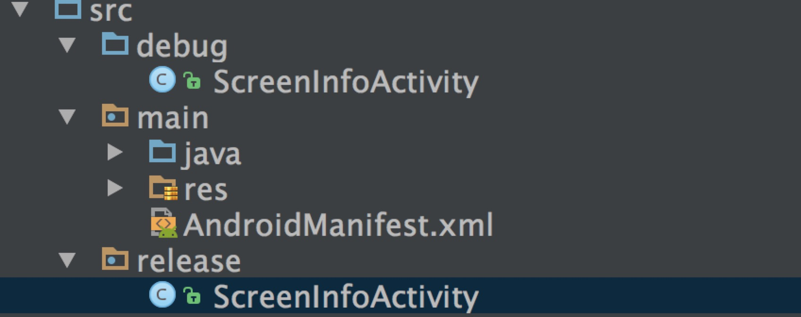

# 搭建maven私服及其在android的使用
 最近在公司做SDK开发，由于要区分对内版本和对外版本，功能和代码上有所不同。所以每次改动需要提供两套SDK.目前还是手动打包，分发。所以想把一些模块抽出来自由组合，并且改善发布流程。
  
 之前写过一篇这样的文章
 [创建maven私有仓库及其在Android Gradle 中的使用](http://techtalk.alo7.com/?p=220)
 
 在此基础上做一些补充： 
 
##  生成AAR的源码追踪以及生成Doc
对于内部使用的aar,我们希望能够附带源码，这样在debug和查看修改是否起作用的时候能够方便一些。所以在打包aar的同时，映射source Code.方便我们开发具体操作如下

	task androidJavadocs(type: Javadoc) {
        source = android.sourceSets.main.java.srcDirs

	}

	task androidJavadocsJar(type: Jar) {
         classifier = 'javadoc'
                 from androidJavadocs.destinationDir

	}

	task androidSourcesJar(type: Jar) {
         classifier = 'sources'
                 from android.sourceSets.main.java.srcDirs
	}

	artifacts {
	 //    archives packageReleaseJar
    	     archives androidSourcesJar
   	              archives androidJavadocsJar
	}
	
	
## 条件编译
先看一下我在项目中的需求： 
	
	1. debug不提供某功能
	2. release提供该功能
	3. 该功能是一个通用模块在众多SDK都会用到
	3. 不提供该功能不引入对应的代码
	
大家都知道在IOS中可以进行条件编译，但是在Java中很困难了。在针对不同版本提供不同功能上这边确实会比较坑 **这边不仅仅是是功能不同，由于是提供的SDK所以希望尽可能的减小体积，没有提供的功能，对应的代码也不要引入。所以通过设置运行时条件来做这个功能就无法实现**，经过研究我们可以在gradle编译脚本中针对不同的buildType以及Flavor设置不同的sourceSets，但是我的AAR本身有引入了其他的的AAR(根据不同的版本会使用不同的aar)，所幸目前只生产两个版本，如果以后还需更多版本估计就要跪了（因为只提供`releaseCompile`  `debugComplie`）,
 
只对指定版本引入功能组件，例如只有在release中提供该功能

	releaseCompile ('com.zhongan.mobile:SDKAuthCheck:1.0.3-SNAPSHOT@aar') {
        transitive = true;
        changing = true
    }
    
    
然后对不同的版本指定不同的代码

	
	sourceSets {

        release {
            java.srcDirs = ['src/release','src/main/java']  // 使用release对应的代码
            resources.srcDirs = ['src/main/res']
            aidl.srcDirs = ['src']
            renderscript.srcDirs = ['src']
            res.srcDirs = ['res']
            assets.srcDirs = ['assets']
        }

        debug {
            java.srcDirs = ['src/debug','src/main/java']  // 使用debug对应的代码
            resources.srcDirs = ['src/main/res']
            aidl.srcDirs = ['src']
            renderscript.srcDirs = ['src']
            res.srcDirs = ['res']
            assets.srcDirs = ['assets']
        }
    }

对应的文件目录结构如下：
 
 
 **PS:不要修改debug 和 release 文件中的包名**
 
 这样就可以满足该要求了
