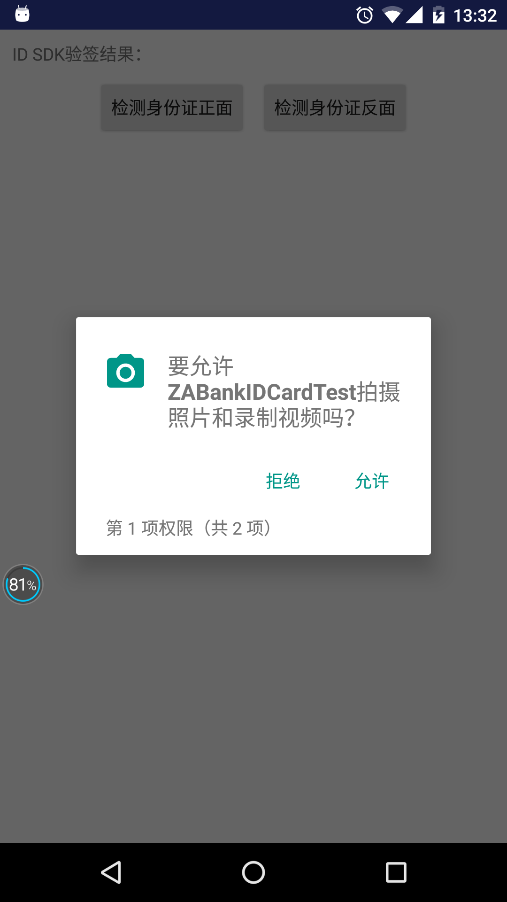
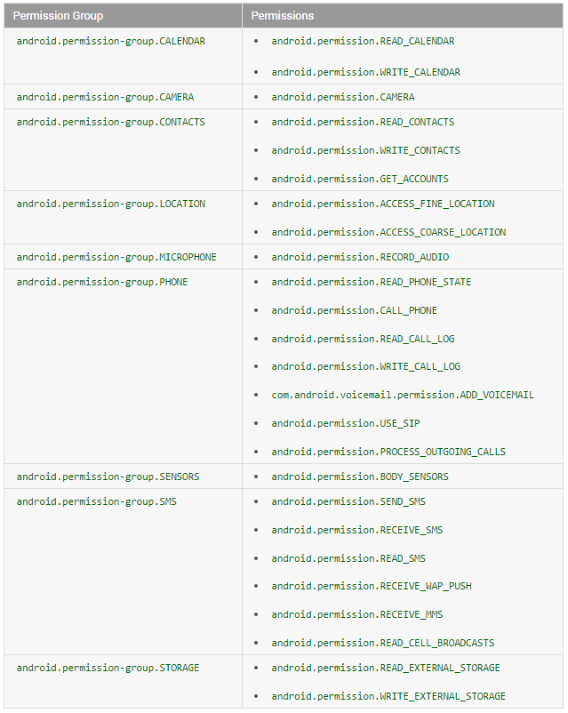

#Android M 运行时权限

Android M 已经发布很久时间了，对于一些最新特性比较感兴趣，刚好最近入手了一台入手了一台nexus 5x ，在上面安装了公司的项目发现直接跪了，后来一看log是由于一个权限引起的，但是我一看所需要的权限我已经在manifest中申请了啊，后来一想Android M对应用的权限作出了一些改变，接下来就让我们来学习一下Android M 运行时权限

## 新的运行时权限
android的权限系统一直是首要的安全概念，因为这些权限只在安装的时候被询问一次。一旦安装了，app可以在用户毫不知晓的情况下访问权限内的所有东西。
难怪一些坏蛋利用这个缺陷恶意收集用户数据用来做坏事了！
android小组也知道这事儿。7年了！权限系统终于被重新设计了。在android6.0棉花糖，app将不会在安装的时候授予权限。取而代之的是，app不得不在运行时一个一个询问用户授予权限`但是也不是所有的需要的权限都会询问用户的，只有一些比较重要的危及手机和用户安全的操作，才会需要在运行时动态授权`。如图：<br>



**ps:** 权限询问对话框不会自己弹出来。开发者不得不自己调用。如果开发者要调用的一些函数需要某权限而用户又拒绝授权的话，函数将抛出异常直接导致程序崩溃

另外，用户也可以随时在设置里取消已经授权的权限。


作为一个用户当然是欢天喜地了，但是作为一个android developer 是不是菊花一紧啊？这意味着我们不能像以前那样直接调用方法了，你不得不为每个需要的地方检察权限，否则app就崩溃了！
是的。我不能哄你说这是简单的事儿，但是这套机制只有在你设置了`targetSdkVersion 23`,并且在运行在android 6.0以上的系统，这套运行时权限规则才会生效。

## 已经发布的应用APP要怎么办

新运行时权限可能已经让你开始恐慌了。“hey，伙计！我三年前发布的app可咋整呢。如果他被装到android 6.0上，我的app会崩溃吗？！？”<br>
莫慌张，放轻松。android小队又不傻，肯定考虑到了这情况。如果app的targetSdkVersion 低于 23，那将被认为app没有用23新权限测试过，那将被继续使用旧有规则：用户在安装的时候不得不接受所有权限，安装后app就有了那些权限咯！然后app像以前一样奔跑！**注意，此时用户依然可以取消已经同意的授权！**用户取消授权时，android 6.0系统会警告，但这不妨碍用户取消授权。问题又来了，这时候你的app崩溃吗？<br>
善意的主把这事也告诉了android小组，当我们在targetSdkVersion 低于23的app调用一个需要权限的函数时，这个权限如果被用户取消授权了的话，不抛出异常。但是他将啥都不干，结果导致函数返回值是null或者0.<br>
别高兴的太早。尽管app不会调用这个函数时崩溃，返回值null或者0可能接下来依然导致崩溃。
好消息（至少目前看来）是这类取消权限的情况比较少，我相信很少用户这么搞。如果他们这么办了，后果自负咯。<br>
但从长远看来，我相信还是会有大量用户会关闭一些权限。我们app不能在新设备完美运行这是不可接受的。
怎样让他完美运行呢，你最好修改代码支持最新的权限系统，而且我建议你立刻着手搞起！
代码没有成功改为支持最新运行时权限的app,不要设置targetSdkVersion 23 发布，否则你就有麻烦了。只有当你测试过了，再改为targetSdkVersion 23 。<br>
**警告：**现在你在android studio新建项目，targetSdkVersion 会自动设置为 23。如果你还没支持新运行时权限，我建议你首先把targetSdkVersion 降级到22

## PROTECTION_NORMAL类权限

	android.permission.ACCESS_LOCATION_EXTRA_COMMANDS
	android.permission.ACCESS_NETWORK_STATE
	android.permission.ACCESS_NOTIFICATION_POLICY
	android.permission.ACCESS_WIFI_STATE
	android.permission.ACCESS_WIMAX_STATE
	android.permission.BLUETOOTH
	android.permission.BLUETOOTH_ADMIN
	android.permission.BROADCAST_STICKY
	android.permission.CHANGE_NETWORK_STATE
	android.permission.CHANGE_WIFI_MULTICAST_STATE
	android.permission.CHANGE_WIFI_STATE
	android.permission.CHANGE_WIMAX_STATE
	android.permission.DISABLE_KEYGUARD
	android.permission.EXPAND_STATUS_BAR
	android.permission.FLASHLIGHT
	android.permission.GET_ACCOUNTS
	android.permission.GET_PACKAGE_SIZE
	android.permission.INTERNET
	android.permission.KILL_BACKGROUND_PROCESSES
	android.permission.MODIFY_AUDIO_SETTINGS
	android.permission.NFC
	android.permission.READ_SYNC_SETTINGS
	android.permission.READ_SYNC_STATS
	android.permission.RECEIVE_BOOT_COMPLETED
	android.permission.REORDER_TASKS
	android.permission.REQUEST_INSTALL_PACKAGES
	android.permission.SET_TIME_ZONE
	android.permission.SET_WALLPAPER
	android.permission.SET_WALLPAPER_HINTS
	android.permission.SUBSCRIBED_FEEDS_READ
	android.permission.TRANSMIT_IR
	android.permission.USE_FINGERPRINT
	android.permission.VIBRATE
	android.permission.WAKE_LOCK
	android.permission.WRITE_SYNC_SETTINGS
	com.android.alarm.permission.SET_ALARM
	com.android.launcher.permission.INSTALL_SHORTCUT
	com.android.launcher.permission.UNINSTALL_SHORTCUT
只需要在AndroidManifest.xml中简单声明这些权限就好，安装时就授权。不需要每次使用时都检查权限，而且用户不能取消以上授权。


## Dangerous Permissions



只有这些权限会在第一次需要的时候弹出提示框，同一组的任何一个权限被授权了，其他权限也自动被授权。例如，一旦WRITE_CONTACTS被授权了，app也有READ_CONTACTS和GET_ACCOUNTS了。


## 让你的app支持新运行时权限

是时候让我们的app支持新权限模型了，从设置compileSdkVersion and targetSdkVersion 为 23开始吧.

```
android {
    compileSdkVersion 23
    ...

    defaultConfig {
        ...
        targetSdkVersion 23
        ...
    }
 ```
 
 例如我想使用照相机
 
 ```
 
final private int REQUEST_CODE_ASK_PERMISSIONS = 100;
 
private void takePhoto() {
    int hasuerPhotoPermission = checkSelfPermission(Manifest.permission.CAMERA);
    if (hasuerPhotoPermission != PackageManager.PERMISSION_GRANTED) {
        requestPermissions(new String[] {Manifest.permission.WRITE_CONTACTS},
                REQUEST_CODE_ASK_PERMISSIONS);
        return;
    }
    yourMethod()
}
 ```
 如果已有权限，yourMethod()会执行。否则，requestPermissions被执行来弹出请求授权对话框。
 **被用来检查和请求权限的方法分别是Activity的checkSelfPermission和requestPermissions。这些方法在api23引入。**
 
 
 不论用户同意还是拒绝，activity的onRequestPermissionsResult会被回调来通知结果（通过第三个参数）
 
 ```
 @Override
public void onRequestPermissionsResult(int requestCode, String[] permissions, int[] grantResults) {
    switch (requestCode) {
        case REQUEST_CODE_ASK_PERMISSIONS:
            if (grantResults[0] == PackageManager.PERMISSION_GRANTED) {
                // Permission Granted
                yourMethod();
            } else {
                // Permission Denied
                Toast.makeText(MainActivity.this, "permission  Denied", Toast.LENGTH_SHORT)
                        .show();
            }
            break;
        default:
            super.onRequestPermissionsResult(requestCode, permissions, grantResults);
    }
}
 ```
 
## 在fragment中使用
现在很多应用在开发中会大量的使用fragment来作为开发，所以在这里也要讲一下在fragment中的使用。

1. 在Fragment中申请权限，不要使用ActivityCompat.requestPermissions, 直接使用Fragment的requestPermissions方法，否则会回调到Activity的 onRequestPermissionsResult.
2. 如果在Fragment中嵌套Fragment，在子Fragment中使用requestPermissions方 法，onRequestPermissionsResult不会回调回来，建议使用 getParentFragment().requestPermissions方法，
这个方法会回调到父Fragment中的onRequestPermissionsResult，加入以下代码可以把回调透传到子Fragment

``` 
 @Override
  public void onRequestPermissionsResult(int requestCode, String[] permissions, int[] grantResults) {
      super.onRequestPermissionsResult(requestCode, permissions, grantResults);
      List<Fragment> fragments = getChildFragmentManager().getFragments();
      if (fragments != null) {
          for (Fragment fragment : fragments) {
              if (fragment != null) {
                  fragment.onRequestPermissionsResult(requestCode,permissions,grantResults);
              }
          }
      }
  }
  ```

## 处理不在提醒

如果用户拒绝某授权。下一次弹框，用户会有一个“不再提醒”的选项的来防止app以后继续请求授权。

如果这个选项在拒绝授权前被用户勾选了。下次为这个权限请求requestPermissions时，对话框就不弹出来了，结果就是，app啥都不干。
这将是很差的用户体验，用户做了操作却得不到响应。这种情况需要好好处理一下。在请求requestPermissions前，我们需要检查是否需要展示请求权限的提示通过activity的shouldShowRequestPermissionRationale，代码如下:

```
if (hasWriteContactsPermission != PackageManager.PERMISSION_GRANTED) {
	if (!shouldShowRequestPermissionRationale(Manifest.permission.CAMERA)) {
		showMessageOKCancel("You need to allow access to Camera",new DialogInterface.OnClickListener() {
            @Override
        	public void onClick(DialogInterface dialog, int which) {
       		requestPermissions(new String[] {Manifest.permission.CAMERA},REQUEST_CODE_ASK_PERMISSIONS);}
            	});
                return;
            }
        requestPermissions(new String[] {Manifest.permission.WRITE_CONTACTS},
                REQUEST_CODE_ASK_PERMISSIONS);
        return;
    }
```
当一个权限第一次被请求和用户标记过不再提醒的时候,我们写的对话框被展示。
后一种情况，onRequestPermissionsResult 会收到PERMISSION_DENIED ，系统询问对话框不展示。这样就会给用户一个良好的体验

## 一次请求多个权限
当然了有时候需要好多权限，我们可以改进上面的做法，来做到一次请求多个权限。不要忘了为每个权限检查“不再提醒”的设置。话不多说还是直接上代码：

	public static final int REQUEST_CODE_ASK_PERMISSIONS = 100;
    final List<String> permissionsList = new ArrayList<>();


```

setRequestCodeAskPermissions();
if (permissionsList.size() > 0) {
	for (String s : permissionsList) {
		mActivity.requestPermissions(permissionsList.toArray(new String[permissionsList.size()]),REQUEST_CODE_ASK_PERMISSIONS);
	}
} else {
	bankCardDection(requestCode);
}
 ```
 
 ```
    private List<String> setRequestCodeAskPermissions() {
        List<String> permissionsNeeded = new ArrayList<>();
        if (!addPermission(permissionsList, Manifest.permission.READ_PHONE_STATE))
            permissionsNeeded.add("read phone");
        if (!addPermission(permissionsList, Manifest.permission.ACCESS_NETWORK_STATE))
            permissionsNeeded.add("Read network");
        if (!addPermission(permissionsList, Manifest.permission.CAMERA))
            permissionsNeeded.add("CAMERA");
        return permissionsNeeded;
    }

 ```

```

    private boolean addPermission(List<String> permissionsList, String permission) {
            if (mActivity.checkSelfPermission(permission) != PackageManager.PERMISSION_GRANTED) {
                permissionsList.add(permission);
                // Check for Rationale Option
                if (!mActivity.shouldShowRequestPermissionRationale(permission))
                    return false;
            }
        }
        return true;
        
```
然后就需要在回调方法中去检测这个权限是否已经被授予

```
    @Override
    public void onRequestPermissionsResult(int requestCode, String[] permissions, int[] grantResults) {
        switch (requestCode) {
            case VerifiedManager.REQUEST_CODE_ASK_PERMISSIONS: {
                Map<String, Integer> perms = new HashMap<>();
                perms.put(Manifest.permission.READ_PHONE_STATE, PackageManager.PERMISSION_GRANTED);
                perms.put(Manifest.permission.ACCESS_NETWORK_STATE, PackageManager.PERMISSION_GRANTED);
                perms.put(Manifest.permission.CAMERA, PackageManager.PERMISSION_GRANTED);
                for (int i = 0; i < permissions.length; i++)
                    perms.put(permissions[i], grantResults[i]);
                if (perms.get(Manifest.permission.READ_PHONE_STATE) == PackageManager.PERMISSION_GRANTED
                    && perms.get(Manifest.permission.ACCESS_NETWORK_STATE) == PackageManager.PERMISSION_GRANTED
                    && perms.get(Manifest.permission.CAMERA) == PackageManager.PERMISSION_GRANTED
                    ) {
                    // All Permissions Granted
                    ZAIDBankCardSDKManager.getInstance(this).verifyBankCard(this, INTO_BANK_CARDSCAN_PAGE);
                } else {
                    // Permission Denied
                    Toast.makeText(this, "Some Permission is Denied", Toast.LENGTH_SHORT)
                        .show();
                }
            }
            break;
            default:
                super.onRequestPermissionsResult(requestCode, permissions, grantResults);
        }
    }

```
这样就会一次弹出多个权限请求的对话框。


## 低版本兼容

以上代码在android 6.0以上运行没问题，但是23 api之前就不行了，因为没有那些方法。
粗暴的方法是检查版本

```
if (Build.VERSION.SDK_INT >= 23) {
    // Marshmallow+
} else {
    // Pre-Marshmallow
}
```

但是太复杂，我建议用v4兼容库，已对这个做过兼容，用这个方法代替

* ContextCompat.checkSelfPermission()
被授权函数返回PERMISSION_GRANTED，否则返回PERMISSION_DENIED ，在所有版本都是如此
* ActivityCompat.requestPermissions()
这个方法在M之前版本调用，OnRequestPermissionsResultCallback 直接被调用，带着正确的 PERMISSION_GRANTED或者 PERMISSION_DENIED 。
* ActivityCompat.shouldShowRequestPermissionRationale()
在M之前版本调用，永远返回false

我们也可以在Fragment中使用，用v13兼容包:FragmentCompat.requestPermissions() and FragmentCompat.shouldShowRequestPermissionRationale().和activity效果一样。

"
## 第三方库
看到上面的实现过程相信大家一定都很头疼。所幸，这世界上总是有那么一群牛逼的人的存在他们已经帮我们实现了相应的库。

[PermissionsDispatcher](https://github.com/hotchemi/PermissionsDispatcher)
使用标注的方式，动态生成类处理运行时权限，目前还不支持嵌套Fragment。

[RxPermissions](https://github.com/tbruyelle/RxPermissions)
基于RxJava的运行时权限检测框架

[Grant](https://github.com/anthonycr/Grant)
简化运行时权限的处理，比较灵活


## 总结
新的运行时权限，可能会对用户的隐私保护的更好，但是它对我们开发者来说绝对是是一件头疼的事情，我们在使用和兼容的过程中一定要多加小心。不过看完这篇文章我想你一定对Android M 运行时权限有了一个比较全面的认识的。