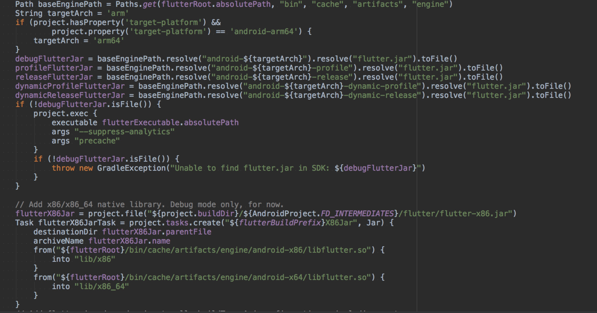
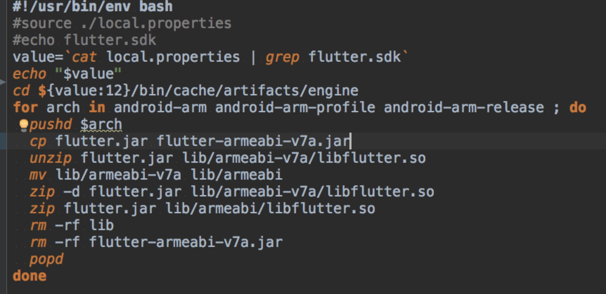

# Flutter工程化实践（Android平台）

### 前言
前不久Flutter刚好发布1.0 releas版本，而公司刚好在这方面有打算去实践，因此我迎来了flutter实践的机会。
关于Flutter的一些介绍、和其他平台的对比、编译和运行原理我就不在这里介绍，网上有大堆的资料可供学习、参考。这篇文章主要是介绍我在android平台上flutter集成以及工程化工程中遇到一些问题。

###  目标
对于flutter的使用目前通常有两种做法：
	
1. 纯Flutter的项目
2. flutter和native的混合项目

对于第一种方式来说更适合一个全新的从头开的APP，而且这中做法也不需要太android或者iOS开发介入。<br>
对于第二种做法：官方介绍的`flutter create -t module my_flutter`的方式，是在本身的android项目中添加了一个flutter的module,进行依赖编译的。这样的方式就存在以下问题：

1. 构建打包问题：引入Flutter后，Native工程因对其有了依赖和耦合，从而无法独立编译构建。在Flutter环境下，工程的构建是从Flutter的构建命令开始，执行过程中包含了Native工程的构建，开发者要配置完整的Flutter运行环境才能走通整个流程；
2. 混合编译带来的开发效率的降低：在转型Flutter的过程中必然有许多业务仍使用Native进行开发，工程结构的改动会使开发无法在纯Native环境下进行，而适配到Flutter工程结构对纯Native开发来说又会造成不必要的构建步骤，造成开发效率的降低。


针对以上的问题，也借鉴了一些其他平台的类似的操作：
决定将对原始的flutter的项目进行改造，**实现输出AAR的方式**，让native工程依赖。
<br>从而达到：

1. flutter 和 native分别独立编写，编译互不影响；
2. native能够方便的集成flutter包并且使用；
3. flutter项目可以方便移植到任何模块去

###  过程

##### 一、改造成lib项目
在一个flutter工程中，默认的情况下是android打包构建输出的是一个APK,为了能够达成AAR的我们将android包下面的工程该成一个lib项目，修改build.gradle文件

```
apply plugin: 'com.android.library'
//apply plugin: 'com.android.application'
```
```
//applicationId "com.example.fluttersocial"

```

之后通过`./gradlew build` 构建之后会得到如下产物


##### 二、集成运行
把刚才得到的AAR的引入到Android native的工程中(依赖过程略过)，通过Activity直接打开flutter工程中的MainActivity，会得到一个这样的崩溃信息：

	 16:32:36.124 21199-21199/com.example.androidwithflutter3 A/flutter: [FATAL:flutter/fml/icu_util.cc(95)] Check failed: context->IsValid(). Must be able to initialize the ICU context. Tried: /data/user/0/com.example.androidwithflutter3/app_flutter/icudtl.dat
	 16:32:36.124 21199-21199/com.example.androidwithflutter3 A/libc: Fatal signal 6 (SIGABRT), code -6 in tid 21199 (oidwithflutter3)
	 
发现是context初始化失败，并且ICU有关的。
然后我们通过解压对比同一个type的aar和release发现 

aar:


apk:


aar比apk在assets中少了一个fluter_shared文件夹，其中包含着icudtl.dat.
 
**目前还不清楚flutter在编译打包过程中针对两种输出中为什么会存在这样的差异？？**

icu库是一个什么东西呢？
支持最新的Unicode标准。
不同代码页的字符集转换。
本地化数据，如：数字、日期、货币等等。
语言相关的字符串处理，如：排序、搜索等等。
正则表达式支持。
语言转换。
阿拉伯语、希伯来语、印度语、泰语等文字排版。
文本分词。
同时这个文件是在flutter引擎中的


所以我们可以把这个文件copy出来放在flutter工程中的android的assets目录下

重新打包即可，再次运行就不会报这个错误了。

**ps:这个做法比较low，但是由于目前还不熟悉flutter的打包和编译过程，所以暂时没有编译打包方面去做相应的复制和改动，后面希望可以通过脚本的方式在编译的过程中来自动化的处理这一步操作。**

##### 三、arm支持 
当把我们的集成到我们的我们真实的项目中的时候，发现会报这样的一个错误：

	
	AndroidRuntime: java.lang.UnsatisfiedLinkError: dalvik.system.PathClassLoader[DexPathList[[zip file "/data/app/com.example.androidwithflutter3-1/base.apk"],nativeLibraryDirectories=[/data/app/ccom.example.androidwithflutter3/lib/arm, /data/app/com.example.androidwithflutter3-1/base.apk!/lib/armeabi, /vendor/lib, /system/lib]]] couldn't find "libflutter.so"

	at java.lang.Runtime.loadLibrary (Runtime.java:367)
  	at java.lang.System.loadLibrary (System.java:1076)
  	at io.flutter.view.FlutterMain.startInitialization (FlutterMain.java:172)
  	at io.flutter.view.FlutterMain.startInitialization (FlutterMain.java:149)
  	at io.flutter.app.FlutterApplication.onCreate (FlutterApplication.java:22)
  	at android.app.Instrumentation.callApplicationOnCreate (Instrumentation.java:1037)
  	at android.app.ActivityThread.handleBindApplication (ActivityThread.java:6496)
  	at android.app.ActivityThread.access$1800 (ActivityThread.java:229)
  	at android.app.ActivityThread$H.handleMessage (ActivityThread.java:1887)
  	at android.os.Handler.dispatchMessage (Handler.java:102)
  	at android.os.Looper.loop (Looper.java:148)
  	at android.app.ActivityThread.main (ActivityThread.java:7406)
  	at java.lang.reflect.Method.invoke (Native Method)
  	at com.android.internal.os.ZygoteInit$MethodAndArgsCaller.run (ZygoteInit.java:1230)
  	at com.android.internal.os.ZygoteInit.main (ZygoteInit.java:1120)  
  解压aar发现在`jni`下面只有**armeabi-v7a**的文件夹

同时因为项目中设置了abiFilters
 
 	ndk {
            abiFilters "armeabi"
        }
所以我们需要使得在输出aar兼容armeabi架构。

我们先来看flutter 支持那些架构


可以看到官方只提供了四种CPU架构的SO库：`arm`、`arm64-v8a`、`x86`和`x86-64`，其中x86系列只支持Debug模式
而在`arm`架构中提供的是armeabi-v7a


然后我们再来看看flutte是如何指定的使用那个架构的，在flutter中的`“pagkages/flutter_tools/gralde/flutter.gradle”`有如下逻辑：

可以看出在编译打包过程中会更具指定平台来决定解压engins下的那个jar包，在android平台下默认情况的是使用arm的下的flutter.jar的所以我们可以针对这点进行修改使得aar兼容armeabi

具体操作如下：


将arm下各个包中的flutter解压 修改其中的jni的文件名 `armeabi-v7a` -> `armeabi` 这样在输出的时候就会变成 armeabi了，（由于armeabi-v7a向下兼容了armeabi，只是在指令方面做了一些优化）之后打包的AAR之后就变成了


再次集成之后就不会出现这个错误了，类似的我们想同时兼容`armeabi-v7a` `armeabi`` arm64-v8a` 可以在修改相应的脚本保留对应的文件夹下的动态库。

#####  四、native跳转flutter页面 
根据官方文档上提供的资料我们可以有如下两种方式从native打开一个flutter page:

	View flutterView = Flutter.createView(
      MainActivity.this,
      getLifecycle(),
      "route1"
    );	
 或者
    
    FragmentTransaction tx = getSupportFragmentManager().beginTransaction();
    tx.replace(R.id.someContainer, Flutter.createFragment("route1"));
    tx.commit();

原以为`Flutter` 和 `FlutterFragment`类是包含在flutter jar中的，可以通过输出的aar直接使用的；结果发现并没有存在这样类，只好先通过`flutter create -t module my_flutter`方式创建一个submodule 看看这两个类的来源，发现这两个其实是flutter module 生成的 只是对 `FlutterMain`做了一个简单的封装，所以就简单的将其copy到flutter项目中android文件夹，重新打包这样在主项目中就可以引用到，并且实现页面的跳转到功能。

##### 五、第三方插件管理
在Flutter项目的迭代过程中，我们native项目在更新AAR的过程中发现，会有一些AAR找不到，比如`shared_preferences`、`image_picker`等,但是在我们主工程中发现完全没有引用这些库啊，那么他到底是从哪里的来的呢？我使用 `./gradlew app_crm:dependencies ` 查看相应依赖树：

发现相应的这些库都是由flutter引来引用的。为了进一步确定这个问题我们查看flutter aar 在maven 中的pom文件：

可以看出的确是在flutter的aar中引入了一些三方库。

在flutter项目中第三方依赖是库的管理是由`pub`管理的，其中依赖的申明都放在`pubspec.yaml`中,最终会生成一个`pubspec.lock`文件，对依赖进行说明


我们可以看到他们`依赖属性`，`名称`，`版本` `source的形式：host和SDK`等信息。而我发现那些没找到的库都是 source:host的方式的库，他是将整个项目的源码拉下来的，并且在远端没有aar或者jar存在的,而对应的source 都存放在存放在本地的.pub仓库中


但是在构建主AAR的过程flutter会将相应的第三方插件打包成AAR:


那么我们的重点就是两个：

1. 将AAR上传到远端或者私有maven仓库中
2. 使得对应的AAR有和Flutter AAR中pom中dependencies节点一致的pom文件，这样的才可以能够自动匹配

在解决问题的过程中分别尝试了如下方法：

1. **uploadArchives 上传多个AAR**：但是由于他的多个aar只是针对同一个构建的不同flavor,不能够达到目标
2. **uploadArchives 依赖子任务**：但是uploadArchives没法依赖子任务，所以也没成功。
3.  **单开一个任务上传第三方插件包**：存在两个问题一是单独执行任务生成的pom信息会和主AAR不一致；且已经在子任务中我们无法再次开启一个uploadArchives task。对于第二个问题 经过同事提醒可以使用mvn的方式上传到指定远端仓库

最终我在uploadArchives中根据的dependencies信息结合mvn命令（关于mvn 是需要先安装，配置的大家自行搜索，以及mvn的 deploy命令），将第三方插件上传到远程仓库，具体代码如下：
	
	uploadArchives {
    configuration = configurations.archives
    repositories {
        mavenDeployer {
            android.libraryVariants.all { variant ->
                def _flavorBuildTypeName = "release"
                addFilter(_flavorBuildTypeName) { artifact, file ->
                    true
                }
                snapshotRepository(url: "${artifactory_contextUrl}/libs-snapshot-local") {
                    authentication(userName: artifactory_user, password: artifactory_password)
                }
                repository(url: "${artifactory_contextUrl}/libs-release-local") {
                    authentication(userName: artifactory_user, password: artifactory_password)
                }
                pom(_flavorBuildTypeName).artifactId = "flutter-"+project.archivesBaseName + "-" + _flavorBuildTypeName
                pom(_flavorBuildTypeName).version = "0.1.3-SNAPSHOT"
                pom(_flavorBuildTypeName).groupId = "com.ymm.lib"
                pom(_flavorBuildTypeName).name = 'lib_flutter'
                pom(_flavorBuildTypeName).packaging = 'aar'
                pom(_flavorBuildTypeName).withXml {
                    def root = asNode()
                    def depsNode = root["dependencies"][0] ?: root.appendNode("dependencies")
                    def addDep = {
                        if (it.group == null) return // Avoid empty dependency nodes
                        def dependencyNode = depsNode.appendNode('dependency')
                        dependencyNode.appendNode('groupId', it.group)
                        dependencyNode.appendNode('artifactId', it.name)
                        dependencyNode.appendNode('version', it.version)
                        if (it.hasProperty('optional') && it.optional) {
                            dependencyNode.appendNode('optional', 'true')
                        }
                        //生成依赖包的mvn 部署
                        def dir = file('../../build/')
                        def repoUrl = "${artifactory_contextUrl}/libs-snapshot-local"
                        dir.eachFileRecurse { file ->
                            if (file.name.contains(it.name) && file.name.endsWith("-release.aar")) {
                                println file.name + "++++++++++++++++++"
                                println it.group + "+++++++++++++++++"
                                println it.name + "+++++++++++++++++"
                                println it.version + "+++++++++++++++++"

                                def command = "mvn deploy:deploy-file"
                                        .concat(" -DgroupId=${it.group}")
                                        .concat(" -DartifactId=${it.name}")
                                        .concat(" -Dversion=${it.version}")
                                        .concat(" -Dpackaging=aar")
                                        .concat(" -Dfile=${file.path}")
                                        .concat(" -Durl=${repoUrl}")
                                        .concat(" -DgeneratePom=true")

                                def proc = command.execute()
                                proc.waitFor()

                            }
                        }


                    }
                    configurations.api.allDependencies.each addDep
                    configurations.implementation.allDependencies.each addDep
                }

            }
        }
   	  }
  	}


至此我们基本上达成了我们native和flutter工程分离开发的目标，并且能够良好的运行起Flutter,但是对于flutter还有下面一些疑问。

###  问题与思考

#### 1. 多个flutter包的集成问题
	
因为目前我们的项目里面只用到一个flutter工程，如果后面由flutter实现的模块很多，分裂成多个Flutter工程的话，这样会就输出到多个AAR，那么会存在以下的问题：
	1. class的重复
	2. 动态库.so文件的冲突
	3. dart编译后的文件覆盖导致功能丢失的问题

关于问题一、二，主要是flutter.jar 和 flutter.so中的文件冲突，我们可以通过将flutter底层抽出库一份让各个flutter工程共享，最终在主工程中值使用一份，当然这也需要结合我们之前看到的flutter.gradle文件中的打包逻辑和改造每个aar的打包过程。

关于问题三之所以会发生是因为每个flutter工程的Dart文件最终都会编译成相应的文件，我们这里以release包作为说明，他会有如下几个文件：


分别对应isolate的数据集合和指针以及Dart VM相关的东西。
	这个文件最终都会copy到APK包的assets目录，重名文件会覆盖掉，那么在多个flutter aar 下面	最终只会保留一份，丢失其他的。

那么有人可能会想到我们可以更改每个一个工程的对应文件的名称，这很OK是一个很正确的思路,但是我们将要面临两个新的问题是：

* 修改flutter的编译引擎，以便修改每个项目输出的文件名
* 修改Dart VM的加载器，以便能够加载指定的文件
	
就目前的调研来看，还没发现在哪里能够修改这两个操作，以及将来实现过程中会遇到什么坑。

*所以建议是：dart实现的类都在统一的一个工程中实现，按照模块划分包，输出一个aar，在加载的时候通过不同的route打开不同的功能模块或者page*

#### 2. 动态化的可能性
原则上flutter本身是不支持动态加载的，而他所提供的debug版本下 `hot reload`机制，也是通过在debug环境下使用的jit加载方式实现的，并且还有这样的限制：

* 编译错误，如果修改后的Dart代码无法通过编译，Flutter会在控制台报错，这时需要修改对应的代码。
* 控件类型从StatelessWidget到StatefulWidget的转换，因为Flutter在执行热刷新时会保留程序原来的state，而某个控件从stageless→stateful后会导致Flutter重新创建控件时报错“myWidget is not a subtype of StatelessWidget”，而从stateful→stateless会报错“type 'myWidget' is not a subtype of type 'StatefulWidget' of 'newWidget'”。
* 全局变量和静态成员变量，这些变量不会在热刷新时更新。
* 修改了main函数中创建的根控件节点，Flutter在热刷新后只会根据原来的根节点重新创建控件树，不会修改根节点。
* 某个类从普通类型转换成枚举类型，或者类型的泛型参数列表变化，都会使热刷新失败。
* 热刷新无法实现更新时，执行一次热重启（Hot Restart）就可以全量更新所有代码，同样不需要重启App，区别是restart会将所有Dart代码打包同步到设备上，并且所有状态都会重置。

而我们这里的的动态化，指的是像web、rn这个样的Flutter部分能够APP在不发版本的情况的更新.官方虽说不支持，但是我们在android平台下还是可以做到的：

基于上一个问题中我们提到：dart部分的文件最终都被编译成了`isolate*data/instr`和`vm*data/instr`这样的文件，而这些文件最终都会被放在APK的`assets`目录下，而当APK安装到手机上的时候这部分文件不会被做任何改动，于此同时android也开放出了针对assets目录下的文件读写。

**所以，我们可以通过文件下发的方式将dart部分编译后的文件覆盖写入到`assets`目录下，以便实现Dart动态化的更新,其限制在于新更改的Dart中相较于上一版本，没有引入一些由java实现的第三方插件**

当然要做好一个Flutter的动态更新，我们可能还需要**文件下发**，**文件校验**，**版本监控**，**错误回滚**等一系列的辅助配套设施


