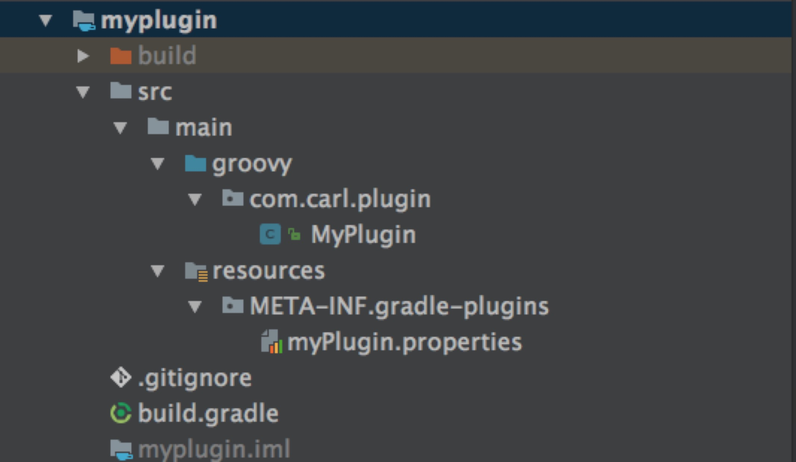
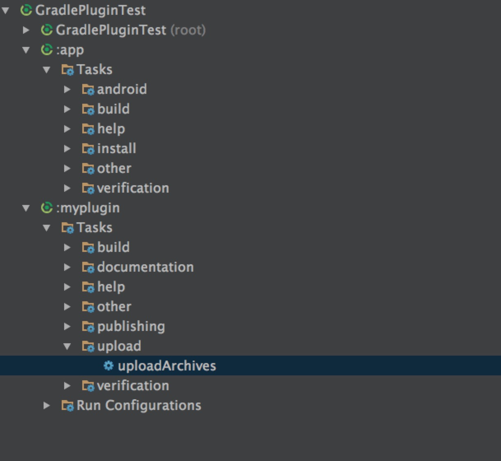
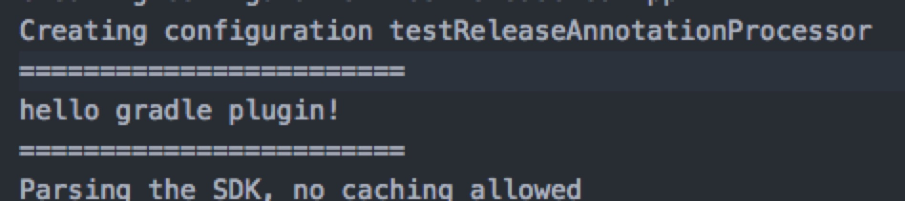
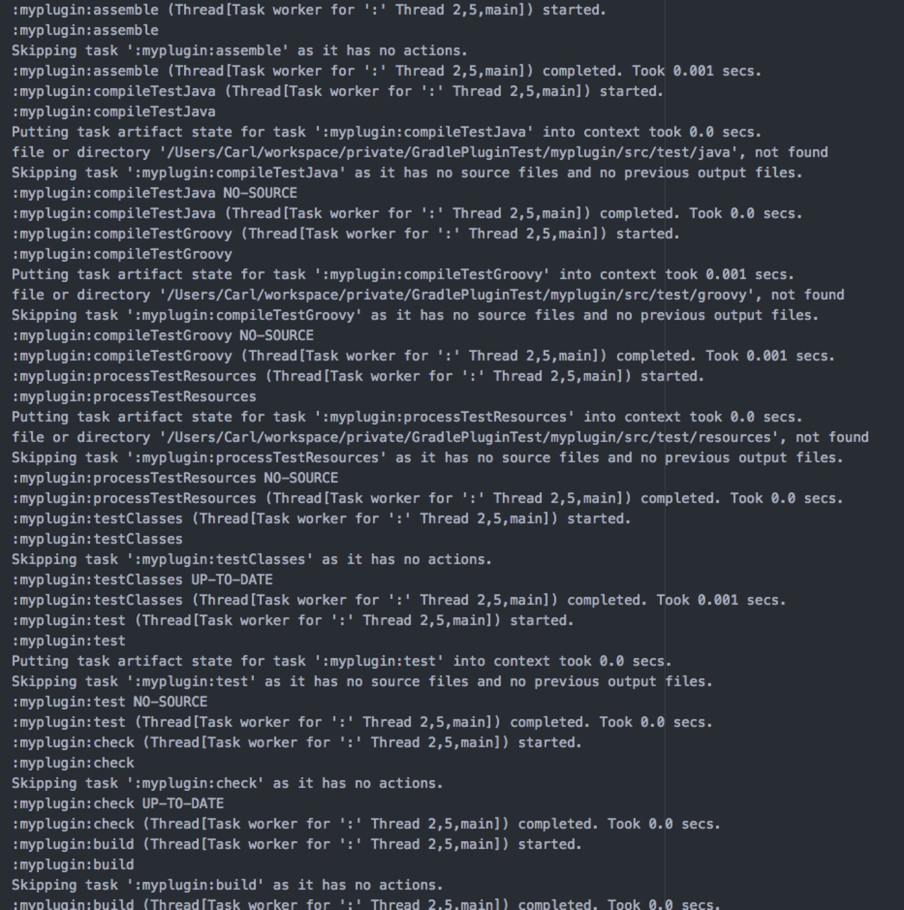

# GradlePlugin

## 前言
最近在研究一些android中使用AOP的方式进行埋点的技术，其中很多都使用到了在编译时进行代码处理，大多数都是使用了自定义的gradle插件技术，所以一直比较好奇这个gradle插件是如何实现，经过学习和实践之后特此做一个总结

## 实现

### 1.创建plugin工程
AS中是没有专门的plugin工程的，所以在这里要特别处理一下

	1.先创建一个普通的android项目
	2. 然后新建一个module,该module作为插件项目，module的类型不用特别关心
	3. 将module的内容删除，只保留build.gralde 和 src/main目录
	4. 我们都知道gradle是基于groovy语言，插件开发也不例外，所以在src/mian下面新建一个目录groovy
	5. groovy本身是基于java的所以它的结构也有点像，有一个包名在项目中如：com.carl.plugin 然后在该包下面创建groovy文件如：MyPlugin.groovy

### 2. 实现Plugin
 为了使该项目能够编译且实现gradle插件功能，我们先要在该model保留的`build.gradle`文件中添加如下内容
 
 	apply plugin: 'groovy'

	dependencies {
    	//gradle sdk
    	compile gradleApi()
    	//groovy sdk
    	compile localGroovy()
	}

	repositories {
   	 	mavenCentral()
	}
	
然后编写刚才创建的`MyPlugin.groovy`文件，最主要是使其实现**`Plugin<Project>`**接口,在例子中只是打印了日志

	public class MyPlugin implements Plugin<Project> {

    	void apply(Project project) {
        	println("========================");
        	println("hello gradle plugin!");
        	println("========================");
    	}
	}
 现在我们已经实现了插件类了，**但是最重要的是告诉`gradle`我们实现的是哪一个插件也就是向gradle声明插件**,因此，需要在src/main目录下创建`resources/META-INF/gradle-plugins`目录，最后在该目录下创建一个properties文件，**注意这个文件的命名，你可以随意取名，但是后面使用这个插件的时候，会用到这个名字。比如，你取名为myPlugin.properties，而在其他build.gradle文件中使用自定义的插件时候则需写成：apply plugin: 'myPlugin'**,然后在该文件中指明实现插件的自定义类：
 `implementation-class=com.carl.plugin.MyPlugin`
 
 到此项目结构如下：
 
 
### 3. 打包上传Plugin
如何打包上传到maven这里就不在展开了请参考另一篇文章[here](http://techtalk.alo7.com/?p=220) 

在这里学到了一种不不使用命令行的的构建方式，直接在AS通过按钮操作：点击AndroidStudio右侧的gradle工具可以看到如下：

双击uploadArchives就可以代替原来的命令行的方式进行打包上传

### 4.使用Plugin,验证功能
关于第三方仓库的使用在3节已经介绍过了这里不再赘述，重点关注插件使用
与aar使用不同，需要在项目的build.gradle文件中的配置
 	
 	dependencies {
        //格式为-->group:module:version
        classpath 'com.carl.mobile:plugin:1.0.1-SNAPSHOT'
    }

引用的jar是以classpath作为前缀的。

然后在app module中 使用插件

	apply plugin: 'myPlugin' //这个名字之前有重点介绍过
	
	
接下来验证plugin有没有生效，首先`clean project`,然后通过命令行编译项目`./gradlew build --info
`	会在终端中看到刚才在plugin中输出的语句
 
 并且在编译过程的生命周期中能够看到自定义plugin相应的处理流程
 
	
	
	
至此，一个自定义gradle plugin的开发和使用就完成，后面我会基于这个Plugin进行一些实际功能的开发。

[demo 地址](https://github.com/carl1990/GradlePlugin) 
