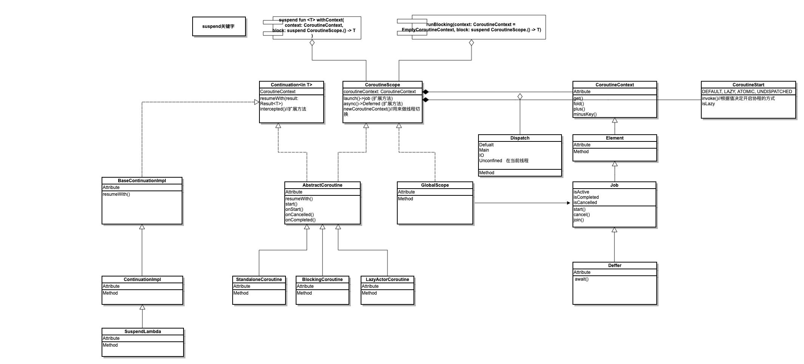
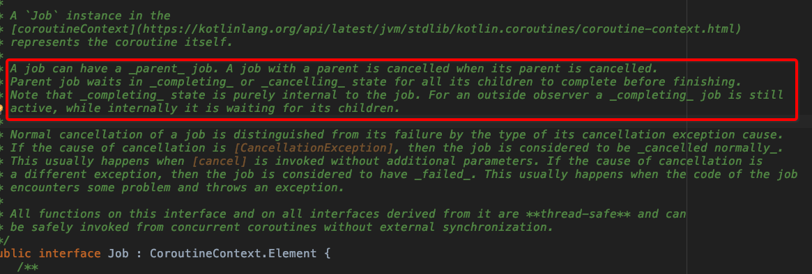
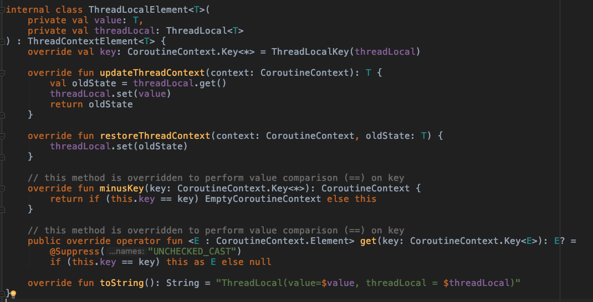
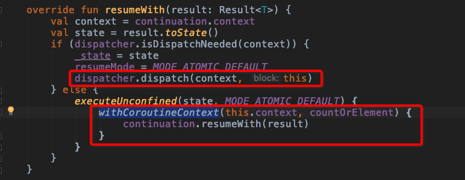
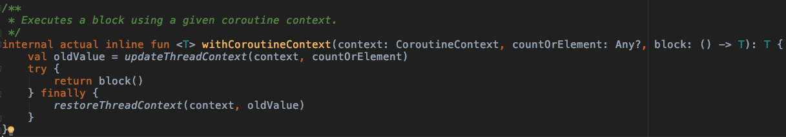

# kotlin中的协程

### 什么是协程(Coroutine)？
在说明协程之前我们先来看看一个段子:


这可能是一个玩笑，可是对于一个使用java语言作为开发语言的Android Developer来说是很真实的。相信如果没有学习其他一些语言的同学可能是真的没有听说过这个概念。那么协程到底是什么呢？我们先来回顾一下计算机中常用的进程、线程。

* 进程

	进程是具有一定独立功能的程序关于某个数据集合上的一次运行活动,进程是系统进行资源分配和调度的一个独立单位。每个进程都有自己的独立内存空间，不同进程通过进程间通信来通信。由于进程比较重量，占据独立的内存，所以上下文进程间的切换开销（栈、寄存器、虚拟内存、文件句柄等）比较大，但相对比较稳定安全。

* 线程

	线程是进程的一个实体,是CPU调度和分派的基本单位,它是比进程更小的能独立运行的基本单位.线程自己基本上不拥有系统资源,只拥有一点在运行中必不可少的资源(如程序计数器,一组寄存器和栈),但是它可与同属一个进程的其他的线程共享进程所拥有的全部资源。线程间通信主要通过共享内存，上下文切换很快，资源开销较少，但相比进程不够稳定容易丢失数据。
	
* 协程
	
	协程通过将复杂性放入库来简化异步编程。程序的逻辑可以在协程中顺序地表达，而底层库会为我们解决其异步性。该库可以将用户代码的相关部分包装为回调、订阅相关事件、在不同线程（甚至不同机器）上调度执行，而代码则保持如同顺序执行一样简单
	
	协程的开发人员 Roman Elizarov 是这样描述协程的：**协程就像非常轻量级的线程**。**线程是由系统调度的，线程切换或线程阻塞的开销都比较大。而协程依赖于线程，但是协程挂起时不需要阻塞线程，几乎是无代价的，协程是由开发者控制的**。所以**协程也像用户态的线程**，非常轻量级，一个线程中可以创建任意个协程。
	
总结下来协程就是：**由开发控制，简化异步编程，轻量级的异步实现方式**。
kotlin也在1.3中正式转正了协程，之前一直作为实验性功能在迭代。


### 协程的亮点

既然协程是为了异步而生的那么我们就以此为例来看看协程的亮点在哪里，在异步编程中最为常见的场景是：在后台线程执行一个复杂任务，然后通知UI线程更新。
通常的写法是这样的

```java
	request.execute(callback)
	callback = {
    	onSuccess =  { res ->
        	runOnUIThread() {
        		//TODO
        }
    	}

    	onFail =  { error -> 
        // TODO
    	}
	}
```
或者我们使用RXJava的方式进行如下：
	
	request.subscribe(subscriber)
	...
	subscriber = ...
	
	request.subScribeOn(Androd.Mian).subscribe({
    	// TODO Success
	}, {
    // TODO Error
	})
	
但是在kotlin我们可以这样写

	fun getData(): Data { ... }
	fun showData(data: Data) { ... }
	launch {
		val result = withContext(Dispatchers.IO) {
            getData()
       }
       if (result.isSuccessful) {
           showData(result)
      	}
    }
我们可以看到使用kotlin之后我们没有用回调，就像是同步操作一样，写着异步代码。<br>如果这个例子还不够直观我们再来看一个场景：在后台线程执行一个复杂任务，下一个任务依赖于上一个任务的执行结果，所以必须等待上一个任务执行完成后才能开始执行。
看下面代码中的三个函数，后两个函数都依赖于前一个函数的执行结果。

	fun requestToken(): Token {
    	// makes request for a token & waits
    	return token // returns result when received 
	}
	fun createPost(token: Token, item: Item): Post {
    	// sends item to the server & waits
    	return post // returns resulting post 
	}
	fun processPost(post: Post) {
    	// does some local processing of result
	}
三个函数中的操作都是耗时操作，因此不能直接在 UI 线程中运行，而且后两个函数都依赖于前一个函数的执行结果，三个任务不能并行运行，该如何解决这个问题呢？

* 回调

	
		fun requestTokenAsync(cb: (Token) -> Unit) { ... }
		fun createPostAsync(token: Token, item: Item, cb: (Post) -> Unit) { ... }
		fun processPost(post: Post) { ... }
		fun postItem(item: Item) {
    		requestTokenAsync { token ->
        		createPostAsync(token, item) { post ->
            		processPost(post)
        		}
    		}
		}

* Future或者promise
	
		fun requestTokenAsync(): CompletableFuture<Token> { ... }
		fun createPostAsync(token: Token, item: Item): CompletableFuture<Post> { ... }
		fun processPost(post: Post) { ... }
		fun postItem(item: Item) {
    		requestTokenAsync()
            .thenCompose { token -> createPostAsync(token, item) }
            .thenAccept { post -> processPost(post) }
            .exceptionally { e ->
                e.printStackTrace()
                null
            }
		}
		
* RX 方式
	
		fun requestToken(): Token { ... }
		fun createPost(token: Token, item: Item): Post { ... }
		fun processPost(post: Post) { ... }
		fun postItem(item: Item) {
    			Single.fromCallable { requestToken() }
            	.map { token -> createPost(token, item) }
            	.subscribe(
                    { post -> processPost(post) }, // onSuccess
                    { e -> e.printStackTrace() } // onError
            	)
		}
		
* kotlin 协程
	
	
		suspend fun requestToken(): Token { ... }   // 挂起函数
		suspend fun createPost(token: Token, item: Item): Post { ... }  // 挂起函数
		fun processPost(post: Post) { ... }
		fun postItem(item: Item) {
  			GlobalScope.launch {
        		val token = requestToken()
        		val post = createPost(token, item)
        		processPost(post)
        		// 需要异常处理，直接加上 try/catch 语句即可
    			}
		}
		
使用协程后的代码非常简洁，以顺序的方式书写异步代码，不会阻塞当前 UI 线程，错误处理也和平常代码一样简单。

### kotlin中的协程

通过上面协程的例子来介绍kotlin中协程相关的一些基本概念和常用的方法：

* **挂起函数**
  
  用`suspend`修饰的方法称之为挂起函数，挂起函数能够以与普通函数相同的方式获取参数和返回值，但是调用函数可能挂起协程（如果相关调用的结果已经可用，库可以决定继续进行而不挂起），挂起函数挂起协程时，不会阻塞协程所在的线程。挂起函数执行完成后会恢复协程，后面的代码才会继续执行。但是挂起函数只能在协程中或其他挂起函数中调用。所以suspend修饰符可以标记普通函数、扩展函数和 lambda 表达式。
  
*  **CoroutineScope 和 CoroutineContext**
	
	`CoroutineScope`，可以理解为协程本身，包含了 CoroutineContext。
	
	`CoroutineContext`，协程上下文，是一些元素的集合，主要包括 Job 和 CoroutineDispatcher 元素，可以代表一个协程的场景。
	
* **CoroutineDispatcher**
	
	`CoroutineDispatcher`，协程调度器，决定协程所在的线程或线程池。它可以指定协程运行于特定的一个线程、一个线程池或者不指定任何线程（这样协程就会运行于当前线程）。coroutines-core中 CoroutineDispatcher 有四种标准实现**Dispatchers.Default**、**Dispatchers.IO**，**Dispatchers.Main**和**Dispatchers.Unconfined**，Unconfined 就是不指定线程。

launch函数定义如果不指定CoroutineDispatcher或者没有其他的ContinuationInterceptor，默认的协程调度器就是Dispatchers.Default，Default是一个协程调度器，其指定的线程为共有的线程池，线程数量至少为 2 最大与 CPU 数相同。

* **Job & Deferred**
	
	Job，任务，封装了协程中需要执行的代码逻辑。Job 可以取消并且有简单生命周期，它有三种状态：
	`isActive`，`isCompleted`，`isCancelled`。
	
	Job 完成时是没有返回值的，如果需要返回值的话，应该使用 Deferred，它是 Job 的子类public interface 	Deferred<out T> : Job。

* **Coroutine 构建器**
	
	CoroutineScope.launch函数属于协程构建器 Coroutine builders，Kotlin 中还有其他几种 Builders，负责创建协程。
	
	1. CoroutineScope.launch {}：是最常用的 Coroutine builders，不阻塞当前线程，在后台创建一个新协程，也可以指定协程调度器，例如在 Android 中常用的GlobalScope.launch(Dispatchers.Main) {}。
			
		fun postItem(item: Item) {
   			 GlobalScope.launch(Dispatchers.Main) { // 在 UI 线程创建一个新协程
        	 	val token = requestToken()
        	 	val post = createPost(token, item)
        	 	processPost(post)
    		}
		}
		
	2. runBlocking {}:是创建一个新的协程同时阻塞当前线程，直到协程结束。这个不应该在协程中使用，主要是为main函数和测试设计的。
	
	3. withContext {}:不会创建新的协程，在指定协程上运行挂起代码块，并挂起该协程直至代码块运行完成.
	     
	     fun login(userName: String, passWord: String) {
        	launch {
            	val response = withContext(Dispatchers.IO) { repository.login(userName, passWord) }
            	executeResponse(response, { mLoginUser.value = response.data }, { errMsg.value =response.errorMsg })
        	}
    	}
    	
   4. async {}: CoroutineScope.async {}可以实现与 launch builder 一样的效果，在后台创建一个新协程，唯一的区别是它有返回值，因为CoroutineScope.async {}返回的是 Deferred 类型。
   
       		
       		GlobalScope.launch(Dispatchers.IO) {
           	 	//Coroutine context is inherited from a [CoroutineScope], additional context elements can be specified with [context] argument.
            	val result = async {
                	delay(2000)
            	}.await()
            	show(result)
        	}
 获取CoroutineScope.async {}的返回值需要通过await()函数，它也是是个挂起函数，调用时会挂起当前协程直到 async 中代码执行完并返回某个值。
 
		整个体系大概是这个样子的:<br>
 	
 
 

### 原理和高级用法
1. **挂起与恢复**
  * 挂起函数工作原理 
  
  		协程的内部实现使用了 Kotlin 编译器的一些编译技术，当挂起函数调用时，背后大致细节如下：
  		挂起函数或挂起 lambda 表达式调用时，都有一个隐式的参数额外传入，这个参数是Continuation类型，封装了协程恢复后的执行的代码逻辑。
  		
  		比如：<br>
  		```suspend fun requestToken(): Token { ... }```<br>
  		在JVM中是这样的：<br>
  		```Object requestToken(Continuation<Token> cont) { ... }```<br>
		**协程内部实现不是使用普通回调的形式，而是使用状态机来处理不同的挂起点**，比如之前的postItem大致的 CPS(Continuation Passing Style) 代码为
		
		```	java // 编译后生成的内部类大致如下
	final class postItem$1 extends SuspendLambda ... {
   	 		public final Object invokeSuspend(Object result) {
        	...
        	switch (this.label) {
            	case 0:
                	this.label = 1;
                	token = requestToken(this)
                	break;
            	case 1:
                	this.label = 2;
                	Token token = result;
                	post = createPost(token, this.item, this)
                	break;
            	case 2:
                	Post post = result;
                	processPost(post)
                	break;
        		}
    		}
		}
	```	
	上面代码中**每一个挂起点和初始挂起点对应的 Continuation 都会转化为一种状态，协程恢复只是跳转到下一种状态中**。挂起函数将执行过程分为多个 Continuation 片段，并且利用状态机的方式保证各个片段是顺序执行的。
  		
  * 挂起函数可能会挂起协程
  
  		挂起函数使用 CPS style 的代码来挂起协程，保证挂起点后面的代码只能在挂起函数执行完后才能执行，所以挂起函数保证了协程内的顺序执行顺序。
  
  		```java
  fun postItem(item: Item) {
    	GlobalScope.launch {
        	// async { requestToken() } 新建一个协程，可能在另一个线程运行
        	// 但是 await() 是挂起函数，当前协程执行逻辑卡在第一个分支，第一种状态，当 async 的协程执行完后恢复当前协程，才会切换到下一个分支
        	val token = async { requestToken() }.await()
        	// 在第二个分支状态中，又新建一个协程，使用 await 挂起函数将之后代码作为 Continuation 放倒下一个分支状态，直到 async 协程执行完
        	val post = aync { createPost(token, item) }.await()
        	// 最后一个分支状态，直接在当前协程处理
        	processPost(post)
    	}
}
  ```
  await()挂起函数挂起当前协程，直到异步协程完成执行，但是这里并没有阻塞线程，是使用状态机的控制逻辑来实现。而且挂起函数可以保证挂起点之后的代码一定在挂起点前代码执行完成后才会执行，挂起函数保证顺序执行，所以异步逻辑也可以用顺序的代码顺序来编写。
  <br>注意挂起函数不一定会挂起协程，如果相关调用的结果已经可用，库可以决定继续进行而不挂起，例如async { requestToken() }的返回值Deferred的结果已经可用时，await()挂起函数可以直接返回结果，不用再挂起协程。
  * 挂起函数不会阻塞线程
  
  		挂起函数挂起协程，并不会阻塞协程所在的线程，例如协程的delay()挂起函数会暂停协程一定时间，并不会阻塞协程所在线程，但是Thread.sleep()函数会阻塞线程。
  		
  		```java
	fun main(args: Array<String>) {
    		// 创建一个单线程的协程调度器，下面两个协程都运行在这同一线程上
    		val dispatcher = newSingleThreadContext("wm")
    		// 启动协程 1
    		GlobalScope.launch(dispatcher) {
        		println("the first coroutine")
        		delay(200)
        		println("the first coroutine")
    		}
		    // 启动协程 2
    		GlobalScope.launch(dispatcher) {
        		println("the second coroutine")
        		delay(100)
        		println("the second coroutine")
    		}
    		// 保证 main 线程存活，确保上面两个协程运行完成
    		Thread.sleep(500)
}
```
	结果为：
	
		```
		the first coroutine
	
		the second coroutine
	
		the second coroutine
	
		the first coroutine
		```
		从上面结果可以看出，当协程 1 暂停 200 ms 时，线程并没有阻塞，而是执行协程 2 的代码，然后在 200 ms 时间到后，继续执行协程 1 的逻辑。所以挂起函数并不会阻塞线程，这样可以节省线程资源，协程挂起时，线程可以继续执行其他逻辑。

  * 挂起函数恢复

		协程的所属的线程调度，主要是由协程的`CoroutineDispatcher`控制，`CoroutineDispatcher`可以指定协程运行在某一特定线程上、运作在线程池中或者不指定所运行的线程。所以协程调度器可以分为*Confined dispatcher*和*Unconfined dispatcher*，*Dispatchers.Default*、*Dispatchers.IO*和*Dispatchers.Main*属于Confined dispatcher，都指定了协程所运行的线程或线程池，挂起函数恢复后协程也是运行在指定的线程或线程池上的，而Dispatchers.Unconfined属于Unconfined dispatcher，协程启动并运行在 Caller Thread 上，但是只是在第一个挂起点之前是这样的，挂起恢复后运行在哪个线程完全由所调用的挂起函数决定。
		
		```java
		fun main(args: Array<String>) = runBlocking<Unit> {
    		launch { // 默认继承 parent coroutine 的 CoroutineDispatcher，指定运行在 main 线程
        		println("main runBlocking: I'm working in thread ${Thread.currentThread().name}")
        		delay(100)
        		println("main runBlocking: After delay in thread ${Thread.currentThread().name}")
    		}
    		launch(Dispatchers.Unconfined) {
        		println("Unconfined      : I'm working in thread ${Thread.currentThread().name}")
        		delay(100)
        		println("Unconfined      : After delay in thread ${Thread.currentThread().name}")
    		}
		}
```

		结果如下：
	
		```
	Unconfined      : I'm working in thread main
main runBlocking: I'm working in thread main
Unconfined      : After delay in thread kotlinx.coroutines.DefaultExecutor
main runBlocking: After delay in thread main
		```
其中协程是如何创建以及进行调度，限于篇幅不做过多介绍想了解可以自行阅读源码。
其中关键方法和类：
	coroutine.start()，createCoroutineUnintercepted()，	intercepted()，resumeCancellableWithException(), withCoroutineContext()

		DispatchedContinuation ,ContinuationInterceptor,CoroutineDispatcher,CoroutineScheduler
		
3. **delay和yield**
	
	delay的作用是延迟执行协程中代码,其实现为
	
	```java
	public suspend fun delay(timeMillis: Long) {
    	if (timeMillis <= 0) return // don't delay
    	return suspendCancellableCoroutine sc@ { cont: CancellableContinuation<Unit> ->
        cont.context.delay.scheduleResumeAfterDelay(timeMillis, cont)
    	}
	}
	```
	delay 使用**suspendCancellableCoroutine**挂起协程，而协程恢复的一般情况下是关键在DefaultExecutor.scheduleResumeAfterDelay()，其中实现是schedule(DelayedResumeTask(timeMillis, continuation))，其中的关键逻辑是将 DelayedResumeTask 放到 DefaultExecutor 的队列最后，在延迟的时间到达就会执行 DelayedResumeTask，那么该 task 里面的实现是什么：
	
	```java
	override fun run() {
    // 直接在调用者线程恢复协程
    	with(cont) { resumeUndispatched(Unit) }
	}
```
	`yield()`的作用是挂起当前协程，然后将协程分发到 Dispatcher 的队列，这样可以让该协程所在线程或线程池可以运行其他协程逻辑，然后在 Dispatcher 空闲的时候继续执行原来协程。简单的来说就是让出自己的执行权，给其他协程使用，当其他协程执行完成或也让出执行权时，一开始的协程可以恢复继续运行。
	
	```java
	fun main(args: Array<String>) = runBlocking<Unit> {
    	launch {
        	repeat(3) {
            	println("job1 repeat $it times")
            	yield()
        	}
    	}
    	launch {
        	repeat(3) {
            	println("job2 repeat $it times")
           	yield()
        	}
    	}
	}
```
结果如下：
	
	```
	job1 repeat 0 times
job2 repeat 0 times
job1 repeat 1 times
job2 repeat 1 times
job1 repeat 2 times
job2 repeat 2 times
```

	其实现为：
	
	```java
	public suspend fun yield(): Unit = suspendCoroutineUninterceptedOrReturn sc@ { uCont ->
    	val context = uCont.context
    	context.checkCompletion()
    	val cont = uCont.intercepted() as? DispatchedContinuation<Unit> ?: return@sc Unit
    	if (!cont.dispatcher.isDispatchNeeded(context)) {
        	return@sc if (cont.yieldUndispatched()) COROUTINE_SUSPENDED else Unit
    	}
    	cont.dispatchYield(Unit)
    	COROUTINE_SUSPENDED
	}
```
我们可以发现共同点就是:**挂起函数的关键是调用suspendCoroutineUninterceptedOrReturn函数包装，然后在异步逻辑完成时调用resume手动恢复协程**。

	我们可以手动尝试将异步网络回调封装为挂起函数

	```java
	suspend fun <T> Call<T>.await(): T = suspendCoroutine { cont ->
    	enqueue(object : Callback<T> {
        	override fun onResponse(call: Call<T>, response: Response<T>) { 
            	if (response.isSuccessful) {
                	cont.resume(response.body()!!)
            	} else {
                	cont.resumeWithException(ErrorResponse(response))
            	}
        	}
        	override fun onFailure(call: Call<T>, t: Throwable) { 
            cont.resumeWithException(t)
        	} 
    	})
	}
```
上面的await()的扩展函数调用时，首先会挂起当前协程，然后执行enqueue将网络请求放入队列中，当请求成功时，通过cont.resume(response.body()!!)来恢复之前的协程。


4. 协程关系

	在job的源码中有这样一段注释
	
	
	所以协程之间存在父子关系，他们之间的关系如下：
	* 父协程手动调用cancel()或者异常结束，会立即取消它的所有子协程。
	* 父协程必须等待所有子协程完成（处于完成或者取消状态）才能完成。
	* 子协程抛出未捕获的异常时，默认情况下会取消其父协程。

	在`AbstractCoroutine`的 Start()方法中我们会看到一开始就初始化了父任务
	
	```java
	public fun start(start: CoroutineStart, block: suspend () -> T) {
        initParentJob()
        start(block, this)
    }
	```
	
	```java
	internal fun initParentJobInternal(parent: Job?) {
        check(parentHandle == null)
        if (parent == null) {
            parentHandle = NonDisposableHandle
            return
        }
        parent.start() // make sure the parent is started
        @Suppress("DEPRECATION")
        val handle = parent.attachChild(this)
        parentHandle = handle
        // now check our state _after_ registering (see tryFinalizeSimpleState order of actions)
        if (isCompleted) {
            handle.dispose()
            parentHandle = NonDisposableHandle // release it just in case, to aid GC
        }
    }
	```
	可以看到最关键的流程是`parent.attachChild`
	
	```java
	@Suppress("OverridingDeprecatedMember")
    public final override fun attachChild(child: ChildJob): ChildHandle {
        /*
         * Note: This function attaches a special ChildHandleNode node object. This node object
         * is handled in a special way on completion on the coroutine (we wait for all of them) and
         * is handled specially by invokeOnCompletion itself -- it adds this node to the list even
         * if the job is already cancelling. For cancelling state child is attached under state lock.
         * It's required to properly wait all children before completion and provide linearizable hierarchy view:
         * If child is attached when job is already being cancelled, such child will receive immediate notification on
         * cancellation, but parent *will* wait for that child before completion and will handle its exception.
         */
        return invokeOnCompletion(onCancelling = true, handler = ChildHandleNode(this, child).asHandler) as ChildHandle
    }

	```
	invokeOnCompletion()方法如下：
	
	```java
	    public final override fun invokeOnCompletion(
        onCancelling: Boolean,
        invokeImmediately: Boolean,
        handler: CompletionHandler
    ): DisposableHandle {
        var nodeCache: JobNode<*>? = null
        loopOnState { state ->
            when (state) {
                is Empty -> { // EMPTY_X state -- no completion handlers
                    if (state.isActive) {
                        // try move to SINGLE state
                        val node = nodeCache ?: makeNode(handler, onCancelling).also { nodeCache = it }
                        if (_state.compareAndSet(state, node)) return node
                    } else
                        promoteEmptyToNodeList(state) // that way we can add listener for non-active coroutine
                }
                is Incomplete -> {
                    val list = state.list
                    if (list == null) { // SINGLE/SINGLE+
                        promoteSingleToNodeList(state as JobNode<*>)
                    } else {
                        var rootCause: Throwable? = null
                        var handle: DisposableHandle = NonDisposableHandle
                        if (onCancelling && state is Finishing) {
                            synchronized(state) {
                                // check if we are installing cancellation handler on job that is being cancelled
                                rootCause = state.rootCause // != null if cancelling job
                                // We add node to the list in two cases --- either the job is not being cancelled
                                // or we are adding a child to a coroutine that is not completing yet
                                if (rootCause == null || handler.isHandlerOf<ChildHandleNode>() && !state.isCompleting) {
                                    // Note: add node the list while holding lock on state (make sure it cannot change)
                                    val node = nodeCache ?: makeNode(handler, onCancelling).also { nodeCache = it }
                                    if (!addLastAtomic(state, list, node)) return@loopOnState // retry
                                    // just return node if we don't have to invoke handler (not cancelling yet)
                                    if (rootCause == null) return node
                                    // otherwise handler is invoked immediately out of the synchronized section & handle returned
                                    handle = node
                                }
                            }
                        }
                        if (rootCause != null) {
                            // Note: attachChild uses invokeImmediately, so it gets invoked when adding to cancelled job
                            if (invokeImmediately) handler.invokeIt(rootCause)
                            return handle
                        } else {
                            val node = nodeCache ?: makeNode(handler, onCancelling).also { nodeCache = it }
                            if (addLastAtomic(state, list, node)) return node
                        }
                    }
                }
                else -> { // is complete
                    // :KLUDGE: We have to invoke a handler in platform-specific way via `invokeIt` extension,
                    // because we play type tricks on Kotlin/JS and handler is not necessarily a function there
                    if (invokeImmediately) handler.invokeIt((state as? CompletedExceptionally)?.cause)
                    return NonDisposableHandle
                }
            }
        }
    }

	```
	他会根据root的状态来进行不同的处理，具体注释已经很清楚了就不多说了。
	
	这样我们就清除协程父子关系，以及他们之间的互相影响。

5. **异常处理**
	
	协程中排除异常时一般都在逻辑运算中，而在协程中的三层包装中，逻辑运算发生在第二层的`BaseContinuationImpl`中`resumeWith()`函数中的`invokeSuspend`运行。
	
	```java
	    // This implementation is final. This fact is used to unroll resumeWith recursion.
    public final override fun resumeWith(result: Result<Any?>) {
        // This loop unrolls recursion in current.resumeWith(param) to make saner and shorter stack traces on resume
        var current = this
        var param = result
        while (true) {
            // Invoke "resume" debug probe on every resumed continuation, so that a debugging library infrastructure
            // can precisely track what part of suspended callstack was already resumed
            probeCoroutineResumed(current)
            with(current) {
                val completion = completion!! // fail fast when trying to resume continuation without completion
                val outcome: Result<Any?> =
                    try {
                        val outcome = invokeSuspend(param)
                        if (outcome === COROUTINE_SUSPENDED) return
                        Result.success(outcome)
                    } catch (exception: Throwable) {
                        Result.failure(exception)
                    }
                releaseIntercepted() // this state machine instance is terminating
                if (completion is BaseContinuationImpl) {
                    // unrolling recursion via loop
                    current = completion
                    param = outcome
                } else {
                    // top-level completion reached -- invoke and return
                    completion.resumeWith(outcome)
                    return
                }
            }
        }
    }
	```
	从try {} catch {}语句来看，首先协程运算过程中所有未捕获异常其实都会在第二层包装中被捕获，然后会通过AbstractCoroutine.resumeWith(Result.failure(exception))进入到第三层包装中，所以协程的第三层包装不仅维护协程的状态，还处理协程运算中的未捕获异常。
	
	在上面我们讲到 当子协程发生未捕获的异常时，父协程也会被取消，我们看看系统是如何处理的。
	在`AbstractCoroutine`中的`resumeWith`方法中最终会调用到`tryMakeCompleting`方法
	
	```java
	private fun tryMakeCompleting(state: Any?, proposedUpdate: Any?, mode: Int): Int {
        if (state !is Incomplete)
            return COMPLETING_ALREADY_COMPLETING
        /*
         * FAST PATH -- no children to wait for && simple state (no list) && not cancelling => can complete immediately
         * Cancellation (failures) always have to go through Finishing state to serialize exception handling.
         * Otherwise, there can be a race between (completed state -> handled exception and newly attached child/join)
         * which may miss unhandled exception.
         */
        if ((state is Empty || state is JobNode<*>) && state !is ChildHandleNode && proposedUpdate !is CompletedExceptionally) {
            if (!tryFinalizeSimpleState(state, proposedUpdate, mode)) return COMPLETING_RETRY
            return COMPLETING_COMPLETED
        }
        // get state's list or else promote to list to correctly operate on child lists
        val list = getOrPromoteCancellingList(state) ?: return COMPLETING_RETRY
        // promote to Finishing state if we are not in it yet
        // This promotion has to be atomic w.r.t to state change, so that a coroutine that is not active yet
        // atomically transition to finishing & completing state
        val finishing = state as? Finishing ?: Finishing(list, false, null)
        // must synchronize updates to finishing state
        var notifyRootCause: Throwable? = null
        synchronized(finishing) {
            // check if this state is already completing
            if (finishing.isCompleting) return COMPLETING_ALREADY_COMPLETING
            // mark as completing
            finishing.isCompleting = true
            // if we need to promote to finishing then atomically do it here.
            // We do it as early is possible while still holding the lock. This ensures that we cancelImpl asap
            // (if somebody else is faster) and we synchronize all the threads on this finishing lock asap.
            if (finishing !== state) {
                if (!_state.compareAndSet(state, finishing)) return COMPLETING_RETRY
            }
            // ## IMPORTANT INVARIANT: Only one thread (that had set isCompleting) can go past this point
            require(!finishing.isSealed) // cannot be sealed
            // add new proposed exception to the finishing state
            val wasCancelling = finishing.isCancelling
            (proposedUpdate as? CompletedExceptionally)?.let { finishing.addExceptionLocked(it.cause) }
            // If it just becomes cancelling --> must process cancelling notifications
            notifyRootCause = finishing.rootCause.takeIf { !wasCancelling }
        }
        // process cancelling notification here -- it cancels all the children _before_ we start to to wait them (sic!!!)
        notifyRootCause?.let { notifyCancelling(list, it) }
        // now wait for children
        val child = firstChild(state)
        if (child != null && tryWaitForChild(finishing, child, proposedUpdate))
            return COMPLETING_WAITING_CHILDREN
        // otherwise -- we have not children left (all were already cancelled?)
        if (tryFinalizeFinishingState(finishing, proposedUpdate, mode))
            return COMPLETING_COMPLETED
        // otherwise retry
        return COMPLETING_RETRY
    }
	```
	 当发生异常的时候会调用`notifyCancelling`方法
	 
	 ```java
	private fun notifyCancelling(list: NodeList, cause: Throwable) {
        // first cancel our own children
        onCancelling(cause)
        notifyHandlers<JobCancellingNode<*>>(list, cause)
        // then cancel parent
        cancelParent(cause) // tentative cancellation -- does not matter if there is no parent
    }
	 ```
	 
	 会通知`cancelParent`
	 
	 ```java
	private fun cancelParent(cause: Throwable): Boolean {
        // CancellationException is considered "normal" and parent is not cancelled when child produces it.
        // This allow parent to cancel its children (normally) without being cancelled itself, unless
        // child crashes and produce some other exception during its completion.
        if (cause is CancellationException) return true
        if (!cancelsParent) return false
        return parentHandle?.childCancelled(cause) == true
    }
	 ```
	
	所以出现未捕获异常时，首先会取消所有子协程，然后可能会取消父协程。而有些情况下并不会取消父协程，一是当异常属于 CancellationException 时，二是使用`SupervisorJob`和`supervisorScope`时，子协程出现未捕获异常时也不会影响父协程，它们的原理是重写 `childCancelled()` 为
	
	`	override fun childCancelled(cause: Throwable): Boolean = false。
	`

	在`tryMakeCompleting`中还有一个关键方法是`tryFinalizeFinishingState`
	
	其中关键步骤为：
	
	```java
	if (finalException != null) {
            val handled = cancelParent(finalException) || handleJobException(finalException)
            if (handled) (finalState as CompletedExceptionally).makeHandled()
        }
```
上面代码中if (finalException != null && !cancelParent(finalException))语句可以看出，除非是 SupervisorJob 和 supervisorScope，一般协程出现未捕获异常时，不仅会取消父协程，一步步取消到最根部的协程，而且最后还由最根部的协程（Root Coroutine）处理协程。

	`handleJobException` 方法在 `StandaloneCoroutine`中实现为：

	```java
override fun handleJobException(exception: Throwable): Boolean {
        handleCoroutineException(context, exception)
        return true
    }
```

	```java
public fun handleCoroutineException(context: CoroutineContext, exception: Throwable) {
    // Invoke exception handler from the context if present
    try {
        context[CoroutineExceptionHandler]?.let {
            it.handleException(context, exception)
            return
        }
    } catch (t: Throwable) {
        handleCoroutineExceptionImpl(context, handlerException(exception, t))
        return
    }
    // If handler is not present in the context or exception was thrown, fallback to the global handler
    handleCoroutineExceptionImpl(context, exception)
}
```

	可以看出先有自己的ExceptionHandler处理，如果不存在或者处理过程中发生了异常则交由`handleCoroutineExceptionImpl`处理，这是一个internal 方法 由c实现。这里就不继续跟下去了。

	以上我们就看到协程整个异常的处理过程，以及当发生异常后是如何取消父协程的。
5. **并发**

	协程在运行时只是线程中的一块代码，线程的并发处理方式都可以用在协程上。不过协程还提供两种特有的方式，一是不阻塞线程的互斥锁Mutex，一是通过 ThreadLocal 实现的协程局部数据。
	
	* Mutex<br>
	在线程中锁都是阻塞式的，没获得锁时就没法执行相应的逻辑，而协程可以通过挂起函数解决这个问题，没有锁就挂起协程，获取后再恢复协程，挂起协程时并没有阻塞线程，可以执行其他逻辑。这就是互斥锁`Mutex`,它与synchronized关键字有些类似，还提供了`withLock`扩展函数，替代常用的mutex.lock; try {...} finally { mutex.unlock() }:
	
		```java
		fun main(args: Array<String>) = runBlocking<Unit> {
    		val mutex = Mutex()
    		var counter = 0
    		repeat(10000) {
        		GlobalScope.launch {
            		mutex.withLock {
                		counter ++
            		}
        		}
    		}
    		println("The final count is $counter")
	}
	```
	多个协程竞争的应该是同一个Mutex互斥锁。
	
	* 局部数据
	
		在线程中我们使用ThreadLocal作为线程局部数据，每个线程中的数据都是独立的。kotlin中协程可以通过`ThreadLocal.asContextElement()`扩展函数实现协程局部数据，每次协程切换会恢复之前的值。
		
		```java
	fun main(args: Array<String>) = runBlocking<Unit> {
    		val threadLocal = ThreadLocal<String>().apply { set("Init") }
    		printlnValue(threadLocal)
    		val job = 	GlobalScope.launch(threadLocal.asContextElement("launch")) {
        		printlnValue(threadLocal)
        		threadLocal.set("launch changed")
        		printlnValue(threadLocal)
        		yield()
        		printlnValue(threadLocal)
    		}
    		job.join()
    		printlnValue(threadLocal)
	}
	```
	
		```java
		private fun printlnValue(threadLocal: ThreadLocal<String>) {
    		println("${Thread.currentThread()} thread local value: ${threadLocal.get()}")
	}
	```
其结果如下：

		```
	Thread[main,5,main] thread local value: Init
Thread[DefaultDispatcher-worker-1,5,main] thread local value: launch
Thread[DefaultDispatcher-worker-1,5,main] thread local value: launch changed
Thread[DefaultDispatcher-worker-2,5,main] thread local value: launch
Thread[main,5,main] thread local value: Init
	```
	为什么在yied()之后值会变调呢？

		在`ThreadContextElement`文件中的`asContextElement`方法如下：
		
		```
		public fun <T> ThreadLocal<T>.asContextElement(value: T = get()): ThreadContextElement<T> =
    ThreadLocalElement(value, this)
		```
		
		
		其中`updateThreadContext`和`restoreThreadContext`分别用来更新和重置value.
		那这两个方法又是何时被触发的呢？我们知道在yeid()之后会切换到另一个协程中，最终会调用到该协程的`resumeWith()`方法
		
		
		不管最终是Dispatched.run()、DisptchedContinuation.resumeWith() 、DisptchedContinuation.resumeUndispatched()，最终都会执行`withCoroutineContext（）`方法。
	
	可以看见最终在这里都会重置TreadLocal的值。
	
		所以 ThreadContextElement 并不能跟踪所有ThreadLocal对象的访问，而且每次挂起时更新的值将丢失。最重要的牢记它的原理：**启动和恢复时保存ThreadLocal在当前线程的值，并修改为 value，挂起和结束时修改当前线程ThreadLocal的值为之前保存的值**。
	
整篇文章我们就基本介绍什么是协程，协程的基本使用，以及部分原理。希望能对对家有所帮助，同时欢迎指正，后面会写一个对应实践的demo.

参考：

[https://www.itcodemonkey.com/article/4620.html](https://www.itcodemonkey.com/article/4620.html).

[https://johnnyshieh.me/posts/kotlin-coroutine-introduction/](https://johnnyshieh.me/posts/kotlin-coroutine-introduction/).


	
