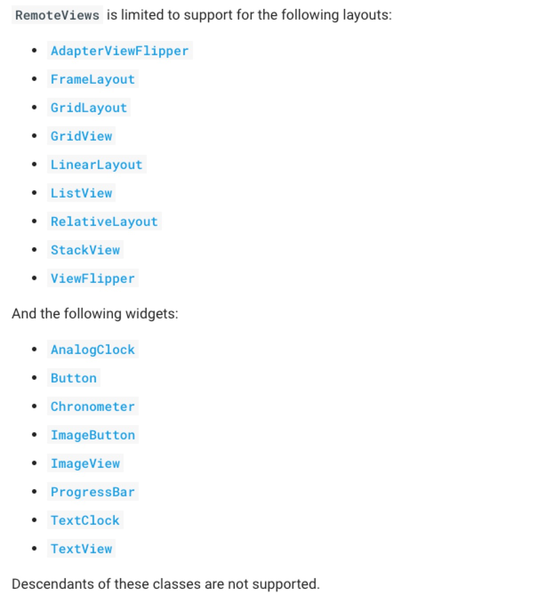

# Android 使用RemoteViews自定义通知栏

### 
最近接到一个需求，应用需要使用常驻通知栏显示一些自定义的view,并伴随这个一系列操作和视图更新，因此在这里记录一下。

#### 定义RemoteViews

1. 首先定义一个视图的XML文件，此处略去不表 <br>
 **PS:RemotesView只支持一些系统特定的view,并不支持一些自定义View.如下：**
 
	

2. 通过该XMl生成RemotesView，并且添加到notification中去


		mRemoteViews = new RemoteViews(ContextUtil.get().getPackageName(), R.layout.notification_normal_layout);


		NotificationCompat.Builder builder = new NotificationCompat.Builder(this);
        builder.setSmallIcon(R.mipmap.icon_notification);
        builder.setContent(mRemoteViews);
        builder.setWhen(System.currentTimeMillis());
        
        
#### 更新视图

RemotesView并不能直接获取到相应的View去设置相关属性它提供如下一些API去更新视图：
[传送门](https://developer.android.com/reference/android/widget/RemoteViews#public-methods_3)

之后需要使用之前构建的notification去通知刷线

	NotificationManager notificationManager = (NotificationManager) ContextUtil.get().getSystemService(Context.NOTIFICATION_SERVICE);
            notificationManager.notify(FOREGROUND_ID, notification);
            
### 设置点击事件---跳转
因为RemoteView无法获取view，也就无法想传统的View一样设置点击事件
他是通过
	
	public void setOnClickPendingIntent (int viewId, 
                PendingIntent pendingIntent)
去设置点击事件的，这里请注意一下`PendingIntent`，官方文档看着会比较懵逼，而网上会有一些误导性的文档介绍它 [比较好的一个解释](https://stackoverflow.com/questions/2808796/what-is-an-android-pendingintent) 和两张理解他：<br>


ps ：PendingIntent 只能调用起三种组件：

Activity<br>
Service<br>
Broadcast<br>

所以，我们先构建出一个打开Activity的 PanddingItent

	PendingIntent pendingIntent = PendingIntent.getActivity(context, 0, intent, PendingIntent.FLAG_CANCEL_CURRENT);
	
将其设置到相应的view上，此时点击view就会执行相应的跳转。

### 坑

#### 坑一：通知栏点击无法收起
后面由于在点击RemoteViews上的视图的时候系统跳转的同时，更新视图，所以之前构建的打开的Activity的方法就无法做到了，此时只好通过构建广播的方式来处理跳转和视图更新

	Intent intent = null;
        intent = new Intent("XXXXX_NOTIFY_ACTION");
	PendingIntent pendingIntent = PendingIntent.getBroadcast(context, 0, intent, PendingIntent.FLAG_CANCEL_CURRENT);
	
然后通过RecieVer来处理
	
	
    public class NotificationforReceiver extends BroadcastReceiver {
        @Override
        public void onReceive(Context context, Intent intent) {
            String action = intent.getAction();
            if (action.equals("COM_YMM_DRIVER_NOTIFY_ACTION")) {
                switch (intent.getStringExtra("id")) {
                    case NotificationData.NOTIFICATION_TYPE_CARGO:
                        context.startActivity(Router.route(context, Uri.parse("xxxx")));
                        NotificationData notificationCargo = NotificationViewHelper.get().getNotificationCargo();
                        notificationCargo.setMessageCount(0);
                        NotificationViewHelper.get().newsIncoming(notificationCargo);
                        break;
                    case NotificationData.NOTIFICATION_TYPE_CHAT:
                        context.startActivity(Router.route(context, Uri.parse("xxxx")));
                        break;
                    case NotificationData.NOTIFICATION_TYPE_ORDER:
                        context.startActivity(Router.route(context, Uri.parse("xxxxx")));
                        NotificationData notificationOrder = NotificationViewHelper.get().getNotificationOrder();
                        notificationOrder.setMessageCount(0);
                        NotificationViewHelper.get().newsIncoming(notificationOrder);
                        break;
                    default:
                        break;

                }
            }
        }
    }
    
    
 但是此时出现了一个坑就是：
 **点击了通知之后Notification的Statusbar不会自动收起来了**,无法及时看到页面的跳转，用户体验不是很好，所以只好强制收起**StatusBar**
 
 	public static void collapseStatusBar(Context context) {
        try {
            Object statusBarManager = context.getSystemService("statusbar");
            Method collapse;

            if (Build.VERSION.SDK_INT <= 16) {
                collapse = statusBarManager.getClass().getMethod("collapse");
            } else {
                collapse = statusBarManager.getClass().getMethod("collapsePanels");
            }
            collapse.invoke(statusBarManager);
        } catch (Exception localException) {
            localException.printStackTrace();
        }

    }
    
 并且在manifeast中添加如下权限：
 
 	<uses-permission android:name="android.permission.EXPAND_STATUS_BAR" />
 	
 	
 这样就会在点击的时候响应处理的同时自动收起通知栏
 
#### 坑二：pendingIntent 设置的Extra数据数据收不到
当我给不同view设置点击事件的时候，创建了同一个intent,根据view id不同向intent中设置数据：

```java
    private PendingIntent getPendingIntent(Context context, int resID) {
        Intent intent = null;
        intent = new Intent("COM_YMM_CONSIGNOR_NOTIFY_ACTION");
        switch (resID) {
            case R.id.order_layout:
                intent.putExtra("id", NotificationData.NOTIFICATION_TYPE_ORDER);

                break;
            case R.id.chat_layout:
                intent.putExtra("id", NotificationData.NOTIFICATION_TYPE_CHAT);
                break;
            case R.id.cargo_layout:
                intent.putExtra("id", NotificationData.NOTIFICATION_TYPE_CARGO);
                break;
        }
        PendingIntent pendingIntent = PendingIntent.getBroadcast(context, 0, intent, PendingIntent.FLAG_CANCEL_CURRENT);
        return pendingIntent;
    }
```

然而我点击不同事件的时候在receiver中收到的id都是一样的，导致bug,后来研究了官方文档以及PenddingIntent的flag 

在设定PendingIntent时第四个参数flag值时，一定要细心理解：

* FLAG_CANCEL_CURRENT:如果当前系统中已经存在一个相同的PendingIntent对象，那么就将先将已有的PendingIntent取消，然后重新生成一个PendingIntent对象。
* FLAG_NO_CREATE:如果当前系统中不存在相同的PendingIntent对象，系统将不会创建该PendingIntent对象而是直接返回null。
*FLAG_ONE_SHOT:该PendingIntent只作用一次。在该PendingIntent对象通过send()方法触发过后，PendingIntent将自动调用cancel()进行销毁，那么如果你再调用send()方法的话，系统将会返回一个SendIntentException。
* FLAG_UPDATE_CURRENT:如果系统中有一个和你描述的PendingIntent对等的PendingInent，那么系统将使用该PendingIntent对象，但是会使用新的Intent来更新之前PendingIntent中的Intent对象数据，例如更新Intent中的Extras。

当发送两个包含相同的PendingIntent的Notification，发现其中一个可以点击触发，第一个点击没有任何反应。
创建一个PendingIntent对象，都是通过getActivity、getBroadcast、getService方法来获取的。如果传递给getXXX方法的Intent对象的Action是相同的，Data也是相同的，Categories也是相同的，Components也是相同的，Flags也是相同的），如果之前获取的PendingIntent对象还有效的话，那么后获取到的PendingItent并不是一个新创建的对象，而是对前一个对象的引用。

如果我们只是想通过设置不同的Extra来生成不同的PendingIntent对象是行不通的，因为PendingIntent对象由系统持有，并且系统只通过刚才在上面提到的几个要素来判断PendingIntent对象是否是相同的，那么如果我们想在每次更新PendingIntent对象的话，怎么做呢？

1. 在调用getXXX方法之前，先调用NotificationManager.cancel(notifyId)方法，将之前发送的PendingIntent对象从系统中移除
2. 也可以在调用getXXX方法时，将第二参数RequestCode设置成不同的值，这样每次就会创建新的PendingIntent对象
3. 为每一个点击事件生成不同的Intent
```java

   		private static PendingIntent getPendingIntent(Context context, int resID) {
        switch (resID) {
            case 1:
                Intent intent = new Intent("COM_YMM_CONSIGNOR_NOTIFY_ACTION_ORDER");
                PendingIntent pendingIntent = PendingIntent.getBroadcast(context, 0, intent, PendingIntent.FLAG_CANCEL_CURRENT);

                return pendingIntent;
            case 2:
                Intent intent2 = new Intent("COM_YMM_CONSIGNOR_NOTIFY_ACTION_CHAT");
                PendingIntent pendingIntent2 = PendingIntent.getBroadcast(context, 0, intent2, PendingIntent.FLAG_CANCEL_CURRENT);
                return pendingIntent2;
            case 3:
                Intent intent3 = new Intent("COM_YMM_CONSIGNOR_NOTIFY_ACTION_CHAT");
                PendingIntent pendingIntent3 = PendingIntent.getBroadcast(context, 0, intent3, PendingIntent.FLAG_CANCEL_CURRENT);
                return pendingIntent3;
            default:
                return null;
        }
        }
 #### 坑三:点击没反应
 1. 对于getActivity，返回的PendingIntent递交给别的应用程序执行，这样就脱离了原始应用程序所在的task栈。
getActivity最后的flag参数要设置成`Intent.FLAG_ACTIVITY_NEW_TASK`，才能成功启动PendingIntent中包含的activity。
2. 对于broadcast而言，因为PendingIntent是递交给别的应用程序执行，所以接收Broadcast的receiver必须设置**“export=true”**，才能接收到广播。但是有些手机上，经过测试即使“export=false”也还是能接收到广播，可能是OEM厂商对系统有所修改。但是建议最好设置成“export=true”。
3. 这个最恶心的问题也是坑了好久的，在某些机型(比如我用的`VIVO NEX`)会有严格的权限管理，禁止**后台弹出界面**,所以需要去打开相应的权限之后点击才能打开应用相应的页面。<br>


	