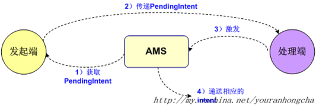

# Android 使用RemoteViews自定义通知栏

### 
最近接到一个需求，应用需要使用常驻通知栏显示一些自定义的view,并伴随这个一系列操作和视图更新，因此在这里记录一下。

#### 定义RemoteViews

1. 首先定义一个视图的XML文件，此处略去不表 <br>
 **PS:RemotesView只支持一些系统特定的view,并不支持一些自定义View.如下：**
 
	

2. 通过该XMl生成RemotesView，并且添加到notification中去


		mRemoteViews = new RemoteViews(ContextUtil.get().getPackageName(), R.layout.notification_normal_layout);


		NotificationCompat.Builder builder = new NotificationCompat.Builder(this);
        builder.setSmallIcon(R.mipmap.icon_notification);
        builder.setContent(mRemoteViews);
        builder.setWhen(System.currentTimeMillis());
        
        
#### 更新视图

RemotesView并不能直接获取到相应的View去设置相关属性它提供如下一些API去更新视图：
[传送门](https://developer.android.com/reference/android/widget/RemoteViews#public-methods_3)

之后需要使用之前构建的notification去通知刷线

	NotificationManager notificationManager = (NotificationManager) ContextUtil.get().getSystemService(Context.NOTIFICATION_SERVICE);
            notificationManager.notify(FOREGROUND_ID, notification);
            
### 设置点击事件---跳转
因为RemoteView无法获取view，也就无法想传统的View一样设置点击事件
他是通过
	
	public void setOnClickPendingIntent (int viewId, 
                PendingIntent pendingIntent)
去设置点击事件的，这里请注意一下`PendingIntent`，官方文档看着会比较懵逼，而网上会有一些误导性的文档介绍它 [比较好的一个解释](https://stackoverflow.com/questions/2808796/what-is-an-android-pendingintent) 和两张理解他：<br>




ps ：PendingIntent 只能调用起三种组件：

Activity<br>
Service<br>
Broadcast<br>

所以，我们先构建出一个打开Activity的 PanddingItent

	PendingIntent pendingIntent = PendingIntent.getActivity(context, 0, intent, PendingIntent.FLAG_CANCEL_CURRENT);
	
将其设置到相应的view上，此时点击view就会执行相应的跳转。

### 坑

#### 坑一：通知栏点击无法收起
后面由于在点击RemoteViews上的视图的时候系统跳转的同时，更新视图，所以之前构建的打开的Activity的方法就无法做到了，此时只好通过构建广播的方式来处理跳转和视图更新

	Intent intent = null;
        intent = new Intent("XXXXX_NOTIFY_ACTION");
	PendingIntent pendingIntent = PendingIntent.getBroadcast(context, 0, intent, PendingIntent.FLAG_CANCEL_CURRENT);
	
然后通过RecieVer来处理
	
	
    public class NotificationforReceiver extends BroadcastReceiver {
        @Override
        public void onReceive(Context context, Intent intent) {
            String action = intent.getAction();
            if (action.equals("COM_YMM_DRIVER_NOTIFY_ACTION")) {
                switch (intent.getStringExtra("id")) {
                    case NotificationData.NOTIFICATION_TYPE_CARGO:
                        context.startActivity(Router.route(context, Uri.parse("xxxx")));
                        NotificationData notificationCargo = NotificationViewHelper.get().getNotificationCargo();
                        notificationCargo.setMessageCount(0);
                        NotificationViewHelper.get().newsIncoming(notificationCargo);
                        break;
                    case NotificationData.NOTIFICATION_TYPE_CHAT:
                        context.startActivity(Router.route(context, Uri.parse("xxxx")));
                        break;
                    case NotificationData.NOTIFICATION_TYPE_ORDER:
                        context.startActivity(Router.route(context, Uri.parse("xxxxx")));
                        NotificationData notificationOrder = NotificationViewHelper.get().getNotificationOrder();
                        notificationOrder.setMessageCount(0);
                        NotificationViewHelper.get().newsIncoming(notificationOrder);
                        break;
                    default:
                        break;

                }
            }
        }
    }
    
    
 但是此时出现了一个坑就是：
 **点击了通知之后Notification的Statusbar不会自动收起来了**,无法及时看到页面的跳转，用户体验不是很好，所以只好强制收起**StatusBar**

 	public static void collapseStatusBar(Context context) {
        try {
            Object statusBarManager = context.getSystemService("statusbar");
            Method collapse;

            if (Build.VERSION.SDK_INT <= 16) {
                collapse = statusBarManager.getClass().getMethod("collapse");
            } else {
                collapse = statusBarManager.getClass().getMethod("collapsePanels");
            }
            collapse.invoke(statusBarManager);
        } catch (Exception localException) {
            localException.printStackTrace();
        }

    }

    
并且在manifeast中添加如下权限：
 
 	<uses-permission android:name="android.permission.EXPAND_STATUS_BAR" />
 	
 	
 这样就会在点击的时候响应处理的同时自动收起通知栏
 
#### 坑二：pendingIntent 设置的Extra数据数据收不到
当我给不同view设置点击事件的时候，创建了同一个intent,根据view id不同向intent中设置数据：

    private PendingIntent getPendingIntent(Context context, int resID) {
        Intent intent = null;
        intent = new Intent("COM_YMM_CONSIGNOR_NOTIFY_ACTION");
        switch (resID) {
            case R.id.order_layout:
                intent.putExtra("id", NotificationData.NOTIFICATION_TYPE_ORDER);

                break;
            case R.id.chat_layout:
                intent.putExtra("id", NotificationData.NOTIFICATION_TYPE_CHAT);
                break;
            case R.id.cargo_layout:
                intent.putExtra("id", NotificationData.NOTIFICATION_TYPE_CARGO);
                break;
        }
        PendingIntent pendingIntent = PendingIntent.getBroadcast(context, 0, intent, PendingIntent.FLAG_CANCEL_CURRENT);
        return pendingIntent;
    }


然而我点击不同事件的时候在receiver中收到的id都是一样的，导致bug,后来研究了官方文档以及PenddingIntent的flag 

在设定PendingIntent时第四个参数flag值时，一定要细心理解：

* FLAG_CANCEL_CURRENT:如果当前系统中已经存在一个相同的PendingIntent对象，那么就将先将已有的PendingIntent取消，然后重新生成一个PendingIntent对象。
* FLAG_NO_CREATE:如果当前系统中不存在相同的PendingIntent对象，系统将不会创建该PendingIntent对象而是直接返回null。
*FLAG_ONE_SHOT:该PendingIntent只作用一次。在该PendingIntent对象通过send()方法触发过后，PendingIntent将自动调用cancel()进行销毁，那么如果你再调用send()方法的话，系统将会返回一个SendIntentException。
* FLAG_UPDATE_CURRENT:如果系统中有一个和你描述的PendingIntent对等的PendingInent，那么系统将使用该PendingIntent对象，但是会使用新的Intent来更新之前PendingIntent中的Intent对象数据，例如更新Intent中的Extras。

当发送两个包含相同的PendingIntent的Notification，发现其中一个可以点击触发，第一个点击没有任何反应。
创建一个PendingIntent对象，都是通过getActivity、getBroadcast、getService方法来获取的。如果传递给getXXX方法的Intent对象的Action是相同的，Data也是相同的，Categories也是相同的，Components也是相同的，Flags也是相同的），如果之前获取的PendingIntent对象还有效的话，那么后获取到的PendingItent并不是一个新创建的对象，而是对前一个对象的引用。

如果我们只是想通过设置不同的Extra来生成不同的PendingIntent对象是行不通的，因为PendingIntent对象由系统持有，并且系统只通过刚才在上面提到的几个要素来判断PendingIntent对象是否是相同的，那么如果我们想在每次更新PendingIntent对象的话，怎么做呢？

1. 在调用getXXX方法之前，先调用NotificationManager.cancel(notifyId)方法，将之前发送的PendingIntent对象从系统中移除
2. 也可以在调用getXXX方法时，将第二参数RequestCode设置成不同的值，这样每次就会创建新的PendingIntent对象
3. 为每一个点击事件生成不同的Intent
	
	
    	private static PendingIntent getPendingIntent(Context context, int resID) {
        switch (resID) {
            case 1:
                Intent intent = new 	Intent("COM_YMM_CONSIGNOR_NOTIFY_ACTION_ORDER");
                PendingIntent pendingIntent = PendingIntent.getBroadcast(context, 0, intent, 		PendingIntent.FLAG_CANCEL_CURRENT);
                return pendingIntent;
            case 2:
                Intent intent2 = new Intent("COM_YMM_CONSIGNOR_NOTIFY_ACTION_CHAT");
                PendingIntent pendingIntent2 = PendingIntent.getBroadcast(context, 0, intent2, PendingIntent.FLAG_CANCEL_CURRENT);
                return pendingIntent2;
            case 3:
                Intent intent3 = new Intent("COM_YMM_CONSIGNOR_NOTIFY_ACTION_CARGO");
                PendingIntent pendingIntent3 = PendingIntent.getBroadcast(context, 0, intent3, PendingIntent.FLAG_CANCEL_CURRENT);
                return pendingIntent3;
            default:
                return null;
        }
    	}

#### 坑三:点击没反应
 1. 对于getActivity，返回的PendingIntent递交给别的应用程序执行，这样就脱离了原始应用程序所在的task栈。
getActivity最后的flag参数要设置成`Intent.FLAG_ACTIVITY_NEW_TASK`，才能成功启动PendingIntent中包含的activity。
2. 对于broadcast而言，因为PendingIntent是递交给别的应用程序执行，所以接收Broadcast的receiver必须设置**“export=true”**，才能接收到广播。但是有些手机上，经过测试即使“export=false”也还是能接收到广播，可能是OEM厂商对系统有所修改。但是建议最好设置成“export=true”。
3. 这个最恶心的问题也是坑了好久的，在某些机型(比如我用的`VIVO NEX`)会有严格的权限管理，禁止**后台弹出界面**,所以需要去打开相应的权限之后点击才能打开应用相应的页面。

<br>


#### 坑四：通知栏文字颜色在部分机型通知栏为暗色的时候看不清楚
	
先看一下在不同手机上的表现：


 在黑色上面的文字显示不清楚，但是别人家的应用在不同在亮色背景和暗色背景上表现的都很好，所以。。。
<br>解决方案：尝试获取通知栏的主题颜色看看，根据该颜色去动态改变设置通知栏中文字的颜色，代码如下：
 
  ```	 
  public static boolean isDarkNotificationTheme(Context context) {
        return !isSimilarColor(Color.BLACK, getNotificationColor(context));
    	}
  ```

    /**
     * 获取通知栏颜色
     *
     * @param context
     * @return
     */
    public static int getNotificationColor(Context context) {
        NotificationCompat.Builder builder = new NotificationCompat.Builder(context);
        Notification notification = builder.build();
        int layoutId = notification.contentView.getLayoutId();
        ViewGroup viewGroup = (ViewGroup) LayoutInflater.from(context).inflate(layoutId, null, false);
        if (viewGroup.findViewById(android.R.id.title) != null) {
            return ((TextView) viewGroup.findViewById(android.R.id.title)).getCurrentTextColor();
        }
        return findColor(viewGroup);
    }

    private static boolean isSimilarColor(int baseColor, int color) {
        int simpleBaseColor = baseColor | 0xff000000;
        int simpleColor = color | 0xff000000;
        int baseRed = Color.red(simpleBaseColor) - Color.red(simpleColor);
        int baseGreen = Color.green(simpleBaseColor) - Color.green(simpleColor);
        int baseBlue = Color.blue(simpleBaseColor) - Color.blue(simpleColor);
        double value = Math.sqrt(baseRed * baseRed + baseGreen * baseGreen + baseBlue * baseBlue);
        if (value < 180.0) {
            return true;
        }
        return false;
    }


    private static int findColor(ViewGroup viewGroupSource) {
        int color = Color.TRANSPARENT;
        LinkedList<ViewGroup> viewGroups = new LinkedList<>();
        viewGroups.add(viewGroupSource);
        while (viewGroups.size() > 0) {
            ViewGroup viewGroup1 = viewGroups.getFirst();
            for (int i = 0; i < viewGroup1.getChildCount(); i++) {
                if (viewGroup1.getChildAt(i) instanceof ViewGroup) {
                    viewGroups.add((ViewGroup) viewGroup1.getChildAt(i));
                } else if (viewGroup1.getChildAt(i) instanceof TextView) {
                    if (((TextView) viewGroup1.getChildAt(i)).getCurrentTextColor() != -1) {
                        color = ((TextView) viewGroup1.getChildAt(i)).getCurrentTextColor();
                    }
                }
            }
            viewGroups.remove(viewGroup1);
        }
        return color;
    }
 

然后在通知栏的remoteView中设置相应的颜色

	mRemoteViews.setTextColor(R.id.notification_time, isDarkNotificationTheme(ContextUtil.get()) == true ? Color.WHITE : Color.BLACK);
	
	
再来验证一下效果：


####  坑五，在某些手机上当按home键之后通过通知栏进入应用会比较慢
一开始我们测试了一些手机发现在大多数手机上不存在这样的问题，打开还是很快的，只有在oppo的手机上会存在这样的问题，本来打算不解决了但是一是QA的较真下一是觉得这里面肯定有android系统机制的问题想了解这个问题，所以就研究了一下发现：
在谷歌的 Android API Guides 中，特意提醒开发者不要在后台启动 activity，包括在 Service 和 BroadcastReceiver 中，这样的设计是为了避免在用户毫不知情的情况下突然中断用户正在进行的工作，在  [http://developer.android.com/guide/practices/seamlessness.html#interrupt](http://developer.android.com/guide/practices/seamlessness.html#interrupt) 中有如下解释：


**That is, don't call startActivity() from BroadcastReceivers or Services running in the background. Doing so will interrupt whatever application is currently running, and result in an annoyed user. Perhaps even worse, your Activity may become a "keystroke bandit" and receive some of the input the user was in the middle of providing to the previous Activity. Depending on what your application does, this could be bad news.**

即便如此，手机厂商的开发者们在开发基于系统级的应用的时候，可能仍然需要有从 Service 或 BroadcastReceiver 中 startActivity 的需求，往往这样的前提是连这样的 Service 或 BroadcastReceiver 也是由用户的某些操作而触发的，Service 或 BroadcastReceiver 只是充当了即将启动 activity 之前的一些代理参数检查工作以便决定是否需要 start 该 activity。

除非是上述笔者所述的特殊情况，应用开发者都应该遵循 “不要从后台启动 Activity”准则。

一个需要特别注意的问题是，特例中所述的情况还会遇到一个问题，**就是当通过 home 键将当前 activity 置于后台时，任何在后台startActivity 的操作都将会延迟 5 秒**，除非该应用获取了 **"android.permission.STOP_APP_SWITCHES"** 权限。

关于延迟 5 秒的操作在 com.android.server.am.ActivityManagerService 中的 stopAppSwitches() 方法中，系统级的应用当获取了 "android.permission.STOP_APP_SWITCHES" 后将不会调用到这个方法来延迟通过后台启动 activity 的操作，事实上 android 原生的 Phone 应用就是这样的情况，它是一个获取了"android.permission.STOP_APP_SWITCHES" 权限的系统级应用，当有来电时，一个从后台启动的 activity 将突然出现在用户的面前，警醒用户有新的来电，这样的设计是合理的。 

所以，当你需要开发类似 Phone 这样的应用时，需要做如下工作：

1. root 你的手机；
2. 在 AndroidManifest.xml 中添加 "android.permission.STOP_APP_SWITCHES"  用户权限；
3. 将你开发的应用程序 push 到手机的 /system/app 目录中。

同时在stackoverflow上也提供了一个方法用于解决延迟5s启动的方式

So instead of this

	Intent intent = new Intent(context, A.class);
    intent.setFlags(Intent.FLAG_ACTIVITY_NEW_TASK);
    context.startActivity(intent);

just do this

	Intent intent = new Intent(context, A.class);
    intent.setFlags(Intent.FLAG_ACTIVITY_NEW_TASK);
    PendingIntent pendingIntent =
                        PendingIntent.getActivity(context, 0, intent, 0);
    try {
          pendingIntent.send();
     } catch (PendingIntent.CanceledException e) {
          e.printStackTrace();
    }

经验证，确实有效

#### 坑六
在线上环境的时候从buglg上面看到了一个短如下的错误：
	
	#269468 android.os.TransactionTooLargeException
	data parcel size 576640 bytes

	com.xiwei.logistics.service.NotificationViewHelper.updateNotify(TbsSdkJava)
	
具体堆栈如下：
	
	1.java.lang.RuntimeException:android.os.TransactionTooLargeException: data parcel size 634184 bytes
	2 android.app.NotificationManager.notifyAsUser(NotificationManager.java:323)
	3 ......
	4 Caused by:
	5 android.os.TransactionTooLargeException:data parcel size 634184 bytes
	6 android.os.BinderProxy.transactNative(Native Method)
	7 android.os.BinderProxy.transact(Binder.java:802)
	8 	android.app.INotificationManager$Stub$Proxy.enqueueNotificationWithTag(INotificationManager.java:1422)
	9 android.app.NotificationManager.notifyAsUser(NotificationManager.java:320)
	10 android.app.NotificationManager.notify(NotificationManager.java:289)
	11 android.app.NotificationManager.notify(NotificationManager.java:273)	
看到问题文发生在 `NotificationManager.notifyAsUser`
<br>之后去看源码喽，进入源码看到

 
  	*/
    public void notifyAsUser(String tag, int id, Notification notification, UserHandle user)
    {
        int[] idOut = new int[1];
        INotificationManager service = getService();
        String pkg = mContext.getPackageName();
        // Fix the notification as best we can.
        Notification.addFieldsFromContext(mContext, notification);
        if (notification.sound != null) {
            notification.sound = notification.sound.getCanonicalUri();
            if (StrictMode.vmFileUriExposureEnabled()) {
                notification.sound.checkFileUriExposed("Notification.sound");
            }
        }
        fixLegacySmallIcon(notification, pkg);
     ......
 
这里有一个调用了**`Notification.addFieldsFromContext(mContext, notification);`**

 
    /**
     * @hide
     */
    public static void addFieldsFromContext(ApplicationInfo ai, int userId,
            Notification notification) {
        notification.extras.putParcelable(EXTRA_BUILDER_APPLICATION_INFO, ai);
        notification.extras.putInt(EXTRA_ORIGINATING_USERID, userId);
    }
 
可以看到在这里是往传入的notification的extras数据中添加相应的数据，Extras是一个**Bundle**，熟悉的开发同学可能都知道Bundle的数据大小是有限制的

 
**“The Binder transaction buffer has a limited fixed size, currently 1Mb, which is shared by all 
transactions in progress for the process. Consequently this exception can be thrown when 
there are many transactions in progress even when most of the individual transactions are of 
moderate size.”**
 
所以问题知道了，我们再来看调用；之前更新notification的时候如下


	if (notification != null) {
    		NotificationManager notificationManager = (NotificationManager) ContextUtil.get().getSystemService(Context.NOTIFICATION_SERVICE);
 		notificationManager.notify(FOREGROUND_ID, notification);
	}

一直传入的是同一个notification对象，所以在每次更新通知的时候都是向同一个notification的Bundle添加数据当更新次数过多的时候就会把bundle撑爆了，导致上述问题。

解决方案：更新的notify的时候当达到一定的数量的时候就不要复用该notification对象了， 重新复制创建一个新的对象，代码如下：


    private void updateNotify() {
        // FIX bug :  #269468 android.os.TransactionTooLargeException
        // data parcel size 576640 bytes
        //
        //com.xiwei.logistics.service.NotificationViewHelper.updateNotify(TbsSdkJava)
        updateCount++;
        if (notification == null) {
            notification = ForegroundService.notification;
        }
        if (updateCount % 50 == 0) {
            notification = ForegroundService.initNotification(ContextUtil.get());
        }

        if (notification != null) {
            NotificationManager notificationManager = (NotificationManager) ContextUtil.get().getSystemService(Context.NOTIFICATION_SERVICE);
            notificationManager.notify(FOREGROUND_ID, notification);
        }
    }
 
 此处采用的是50次 当没到50次的时候创建一个新的对象，经过测试发送了500次以上没有再发生该崩溃的情况。
