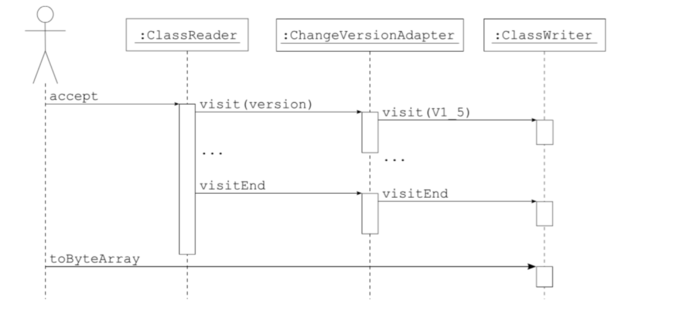
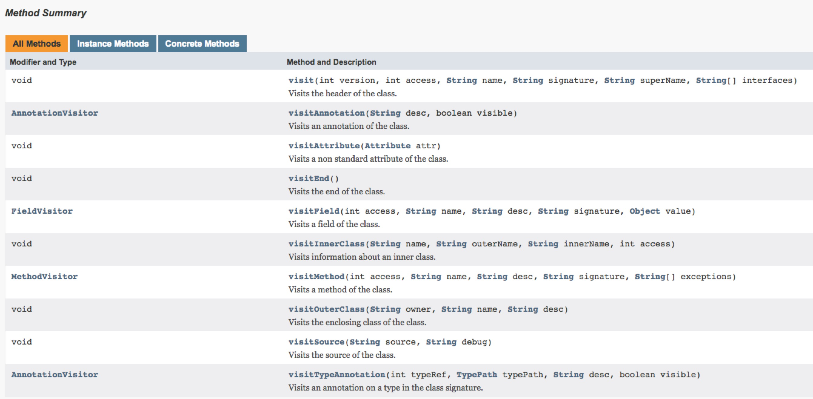

# 基于Gradle Transform 和 ASM 实现Android应用的AOP编程

### 前言
在这个大数据的时代，作为软件服务提供方会尽可能的去收集一些用户使用过程中的数据以便优化服务，Android平台作为目前用户量最大的一个载体为人们提供各种软件服务，因此在Android平台上的软件数据采集就显得尤为重要（在此我们先不讨论用户隐私和数据滥用的问题），但是一些传统的方式需要手动在代码中添加一些代码，当项目过大的情况下会发生遗漏，工作量大等情况发生，同时针对第三方提供的一些SDK服务我们无法添加代码的情况。幸好，在Android平台下我们可以借助一些其他的手段来完成此项工作，比如在编译期间扫描整个项目的class文件，在需要修改和添加的地方进行改动，此篇文章介绍了一种基于`gradle     transhform API`和字节码修改库`ASM`实现在Android中的AOP编程方式

### 认识Transform
先来看一下官方对于`Transform`的定义<br>
<br>


重点在于在 **能够处理dex之前的已经编译好的class文件**，**多个tansform之间执行无序**，**需要配合gradle插件使用**

那么回顾一下Android的编译过程

<br>
可以看见transform能发挥作用的地方就是在 `.class Files`这一步，它的每一次处理都是一个输入处理和输出的过程，并且输出地址不是由开发者任意指定的而是由输入内容、作用范围等因素由`TransformOutputProvider `提供的。


在代码中`Transform`是一个虚类
```java
public abstract class Transform {
	public Transform() {
   	}

    	public abstract String getName();

    	public abstract Set<ContentType> getInputTypes();

    	public Set<ContentType> getOutputTypes() {
        	return this.getInputTypes();
    	}

    	public abstract Set<? super Scope> getScopes();

    	public Set<? super Scope> getReferencedScopes() {
        	return ImmutableSet.of();
    	}

    	/** @deprecated */
    	@Deprecated
    	public Collection<File> getSecondaryFileInputs() {
        	return ImmutableList.of();
    	}

    	public Collection<SecondaryFile> getSecondaryFiles() {
        	return ImmutableList.of();
    	}

    	public Collection<File> getSecondaryFileOutputs() {
        	return ImmutableList.of();
    	}

    	public Collection<File> getSecondaryDirectoryOutputs() {
        	return ImmutableList.of();
    	}

    	public Map<String, Object> getParameterInputs() {
        	return ImmutableMap.of();
    	}

    	public abstract boolean isIncremental();

    	/** @deprecated */
    	@Deprecated
    	public void transform(Context context, Collection<TransformInput> 	inputs, Collection<TransformInput> referencedInputs, 	TransformOutputProvider outputProvider, boolean isIncremental) throws 	IOException, TransformException, InterruptedException {
    	}

    	public void transform(TransformInvocation transformInvocation) throws 	TransformException, InterruptedException, IOException {
        	this.transform(transformInvocation.getContext(), 	transformInvocation.getInputs(), transformInvocation.getReferencedInputs(), transformInvocation.getOutputProvider(), transformInvocation.isIncremental());
    	}

    	public boolean isCacheable() {
        	return false;
    	}
}
```
看到函数`transform`,我们还没有具体实现这个函数，这个函数就是具体如何处理输入和输出。`getScopes`函数定义了输入范围可以是整个项目所有类，也可以是自己项目中的类。


### 实现自定义Transform

我们在插件项目中(如何实现gradle插件请看另一篇[文章](https://github.com/carl1990/AndroidLearnBlog/tree/master/gralde%20%E6%8F%92%E4%BB%B6))集成Transform类实现transform方法
```groovy
    @Override
    void transform(TransformInvocation transformInvocation) throws TransformException, InterruptedException, IOException {
        this.transform(transformInvocation.getContext(), transformInvocation.getInputs(), transformInvocation.getReferencedInputs(), transformInvocation.getOutputProvider(), transformInvocation.isIncremental());
        //开始计算消耗的时间
        Logger.info("||=======================================================================================================")
        Logger.info("||                                                 开始计时                                               ")
        Logger.info("||=======================================================================================================")
        def startTime = System.currentTimeMillis()
        transformInvocation.getInputs().each {
            TransformInput input ->
                input.jarInputs.each {
                    JarInput jarInput ->
                        String destName = jarInput.file.name
                        /** 截取文件路径的md5值重命名输出文件,因为可能同名,会覆盖*/
                        def hexName = DigestUtils.md5Hex(jarInput.file.absolutePath).substring(0, 8)
                        if (destName.endsWith(".jar")) {
                            destName = destName.substring(0, destName.length() - 4)
                        }
                        /** 获得输出文件*/
                        File dest = transformInvocation.getOutputProvider().getContentLocation(destName + "_" + hexName, jarInput.contentTypes, jarInput.scopes, Format.JAR)
                        Logger.info("||-->开始遍历特定jar ${dest.absolutePath}")

                        def modifiedJar = modifyJarFile(jarInput.file, transformInvocation.context.getTemporaryDir())
                        Logger.info("||-->结束遍历特定jar ${dest.absolutePath}")
                        if (modifiedJar == null) {
                            modifiedJar = jarInput.file
                        }
                        FileUtils.copyFile(modifiedJar, dest)
                }

                input.directoryInputs.each {
                    DirectoryInput directoryInput ->
                        File dest = transformInvocation.getOutputProvider().getContentLocation(directoryInput.name, directoryInput.contentTypes, directoryInput.scopes, Format.DIRECTORY)
                        File dir = directoryInput.file
                        if (dir) {
                            HashMap<String, File> modifyMap = new HashMap<>()
                            dir.traverse(type: FileType.FILES, nameFilter: ~/.*\.class/) {
                                File classFile ->
                                    if (!name.endsWith("R.class")
                                            && !name.endsWith("BuildConfig.class")
                                            && !name.contains("R\$")) {
                                        File modified = modifyClassFile(dir, classFile, transformInvocation.context.getTemporaryDir())
                                        if (modified != null) {
                                            //key为相对路径
                                            modifyMap.put(classFile.absolutePath.replace(dir.absolutePath, ""), modified)
                                        }
                                    }

                            }
                            FileUtils.copyDirectory(directoryInput.file, dest)
                            modifyMap.entrySet().each {
                                Map.Entry<String, File> en ->
                                    File target = new File(dest.absolutePath + en.getKey())

                                    FileUtils.copyFile(en.getValue(), target)
                                    en.getValue().delete()

                            }
                        }
                }


        }
        //计算耗时
        def cost = (System.currentTimeMillis() - startTime) / 1000
        Logger.info("||=======================================================================================================")
        Logger.info("||                                       计时结束:费时${cost}秒                                           ")
        Logger.info("||=======================================================================================================")

    }
```    
 在这个方法中我们分别遍历了jar包中的class文件和目录中的class文件，并查找到我们想要修改的类，对他进行读写、修改操作，也就是上文提到的 输入-->处理-->输出操作，在此期间所有的输入线相关信息由`TransformInput`提供，输出相关信息由`TransformOutputProvider`提供。具体的修改操作我将会在下一章节中讲到。

### Transform的使用
开始的时候我们就讲到Transform需要配合gradle插件使用，其实使用起来很简单，只需要把它注册在Plugin中就好了，在自定义的Plugin中的apply方法中：
```groovy
def android = project.extensions.getByType(AppExtension)
MyTransform myTransform = new MyTransform()
android.registerTransform(myTransform)
```
   即可注册上该Transform
   
   
### ASM介绍

[ASM](https://asm.ow2.io/)是一款基于java字节码层面的代码分析和修改工具。无需提供源代码即可对应用嵌入所需debug代码，用于应用API性能分析。ASM可以直接产生二进制class文件，也可以在类被加入JVM之前动态修改类行为。其结构如下：<br>


* **Core** 为其他包提供基础的读、写、转化Java字节码和定义的API，并且可以生成Java字节码和实现大部分字节码的转换	
* **Tree**提供了Java字节码在内存中的表现
* Analysis为存储在tree包结构中的java方法字节码提供基本的数据流统计和类型检查算法
* **Commons**提供一些常用的简化字节码生成转化和适配器
* Util包含一些帮助类和简单的字节码修改，有利于在开发或者测试中使用
* XML提供一个适配器将XML和SAX-comliant转化成字节码结构，可以允许使用XSLT去定义字节码转化。

ASM的处理过程也是一个典型的生产者和消费者模式，这点比较契合Transform的转换输入输出模型。
其提供关键的几个类来实现字节码的访问和修改：

* **ClassReader**：该类用来解析编译过的class字节码文件。
* **ClassWriter**：该类用来重新构建编译后的类，比如说修改类名、属性以及方法，甚至可以生成新的类的字节码文件。
* **ClassVisitor**：主要负责 “拜访” 类成员信息。其中包括标记在类上的注解，类的构造方法，类的字段，类的方法，静态代码块。
* **AdviceAdapter**：实现了MethodVisitor接口，主要负责 “拜访” 方法的信息，用来进行具体的方法字节码操作。

其流程如下：





### 使用ASM修改Class

1. 读取相应的类文件
在上面Transform章节中我们通过遍历相应的class文件，然后对其进行读取转换为字节流

```java
private static File modifyClassFile(File dir, File classFile, File tempDir) {
        File modified = null
        try {
        	//路径转换将 xxx/xxx/xxx -> xxx.xxx.xxx  并且去掉后缀.class
            String className = com.carl.plugins.TextUtil.path2ClassName(classFile.absolutePath.replace(dir.absolutePath + File.separator, ""))
            byte[] sourceClassBytes = IOUtils.toByteArray(new FileInputStream(classFile))
            byte[] modifyClassBytes = CarlModify.modifyClasses(sourceClassBytes)
            if (modifyClassBytes) {
                modified = new File(tempDir, className.replace('.', '') + '.class')
                if (modified.exists()) {
                    modified.delete()
                }
                modified.createNewFile()
                new FileOutputStream(modified).write(modifyClassBytes)
            }
        } catch (Exception e) {
            e.printStackTrace()
        }
        return modified
}
    	
```
    	
2.使用ASM相应的类来处理该类的字节流文件

```java

static byte[] modifyClass(byte[] srcByteCode) {
        ClassWriter classWriter = new ClassWriter(ClassWriter.COMPUTE_MAXS);
        ClassVisitor classVisitor = new CarlClassVisitor(classWriter);
        ClassReader classReader = new ClassReader(srcByteCode);
        classReader.accept(classVisitor, ClassReader.EXPAND_FRAMES);
        return classWriter.toByteArray();
    }
```
    
 ClassWriter有`COMPUTE_MAXS：`让系统自动为我们计算栈和本地变量的大小 和`COMPUTE_FRAMES：`指定系统自动为我们计算栈帧的大小 两个模式。
  
  ClassReader有`SKIP_CODE` `SKIP_DEBUG` `SKIP_FRAMES` `EXPAND_FRAMES` 四种模式。
  
SKIP_CODE不访问方法实体，对于只需要获取class框架的场景非常适用 
 
SKIP_Debug不会访问debug信息了。

SKIP_FRAMES 跳过stack map frames

EXPAND_FRAMES 不再压缩frames

然后主要的修改的操作都在自定义的ClassVisitor方法中，ClassVisitor提供以下方法用来操作类的不同内容


我的实现中主要处理了visitMethod()方法

```java

    @Override
    public MethodVisitor visitMethod(int access, String name, String desc, String signature, String[] exceptions) {
        MethodVisitor methodVisitor = cv.visitMethod(access, name, desc, signature, exceptions);
        MethodVisitor adapter = null;

        if ((isHintClass && ASMUtil.isMatchingMethod(name, desc))) {
            //指定方法名，根据满足的类条件和方法名
            System.out.println("||-----------------开始修改方法:" + name + "--------------------------");
            try {
                adapter = ASMUtil.getMethodVisitor(mInterfaces, mClassName, superName, methodVisitor, access, name, desc);
            } catch (Exception e) {
                e.printStackTrace();
                adapter = null;
            }
        } else {
            System.out.println("||---------------------查看修改后方法:" + name + "-----------------------------");
            adapter = new CarlMethodVisitor(methodVisitor, access, name, desc);
        }
        if (adapter != null) {
            return adapter;
        }
        return methodVisitor;
    }
 ```
    
 其中首先过滤相应的类和方法：
 
 过滤类
 
 ```java
 
 public static boolean isMatchingClass(String className, String[] interfaces) {
        boolean isMeetClassCondition = isMatchingInterfaces(interfaces, "android/view/View$OnClickListener");
        //剔除掉以android开头的类，即系统类，以避免出现不可预测的bug
        if (className.startsWith("android")) {
            return false;
        }
        // 是否满足实现的接口
        if (isMeetClassCondition || className.contains("Fragment")) {
            isMeetClassCondition = true;
        }
        if (isMeetClassCondition || className.contains("Activity")) {
            isMeetClassCondition = true;
        }
        return isMeetClassCondition;
    }
``` 
    
    
  过滤方法
  ```java
    static boolean isMatchingMethod(String name, String desc) {
        if ((name.equals("onClick") && desc.equals("(Landroid/view/View;)V"))
            || (name.equals("onResume") && desc.equals("()V"))
            || (name.equals("onPause") && desc.equals("()V"))
            || (name.equals("setUserVisibleHint") && desc.equals("(Z)V"))
            || (name.equals("onHiddenChanged") && desc.equals("(Z)V"))
            ) {
            return true;
        } else {
            return false;
        }
    }
 ```
    
然后对方法进行修改，修改的地方AMS提供了一个`AdviceAdapter`类，其提供的方法有：


请重点注意onMethodEnter() 和 onMetheodExit() 方法。这两个方法见名知意，是在方法进入和方法退出的回调，我主要的修改的就是在这里进行的。

```java

static MethodVisitor getMethodVisitor(String[] interfaces, String className, String superName,
                                          MethodVisitor methodVisitor, int access, String name, String desc) {
        MethodVisitor adapter = null;

        if (name.equals("onClick") && isMatchingInterfaces(interfaces, "android/view/View$OnClickListener")) {
            System.out.println("||* visitMethod * onClick");
            adapter = new CarlMethodVisitor(methodVisitor, access, name, desc) {
                @Override
                protected void onMethodEnter() {
                    super.onMethodEnter();

                    // ALOAD 25 获取方法的第一个参数
                    methodVisitor.visitVarInsn(ALOAD, 1);
                    // INVOKESTATIC INVOKESTATIC
                    methodVisitor.visitMethodInsn(INVOKESTATIC, "com/carl/asmtest/tack/TrackHelper", "onClick", "(Landroid/view/View;)V", false);
                }
            };
            return adapter;
        }
  
```

首先更具方法名和该类所实现的接口判断是否进行处理，这里我处理的是点击事件方法，然后创建一个自定义的`AdviceAdapter`,在方法的退出事件，添加自己的代码。

`TrackHelper`的实现如下：

对于`"(Landroid/view/View;)V"`这个东西叫做方法的描述符，我们可以先编译该类，然后通过`javap -s `命令查看相应的方法的描述，之所以需要这个是为了确定方法的唯一性，因为java中可能存在重载方法。


这种方式在JNI中C调用Java方法需要的描述是一样的，是否C也是通过操作内存中的字节码来执行JAVA方法的呢？

这样呢，我们就在项目中的onclick(View view)方法调用结束的时候插入了TrackHelper.onClick(View view)这段代码。

### 结果验证
把该插架项目打包后，在demo APP中使用该插件，如何使用不再赘述。编译项目我们可以看见如下关键log

可以看见在我设定的目标类中和目标方法中做了相应的操作的。

PS:由于会遍历类和对类进行操作，这样做的后果之一就是会使项目的编译速度降低,对于我的测试项目遍历JAR和项目class分辨耗时如下：

遍历项目class


遍历jar


我在activity的onresume() 和 onPause() 以及点击事件中分别添加了相应的方法，运行起来测试项目，可以看到是我们预想的结果


好了，到这里我们就完成了借助Gradel transform 和 ASM 实现了android平台在编译期间修改Class的方式实现AOP编程，希望你能都利用它完成更多有意思的事情。

[demo](https://github.com/carl1990/ASMTest)地址