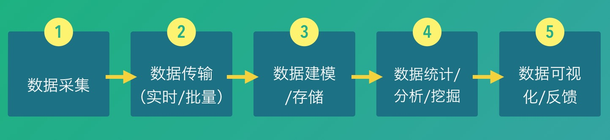
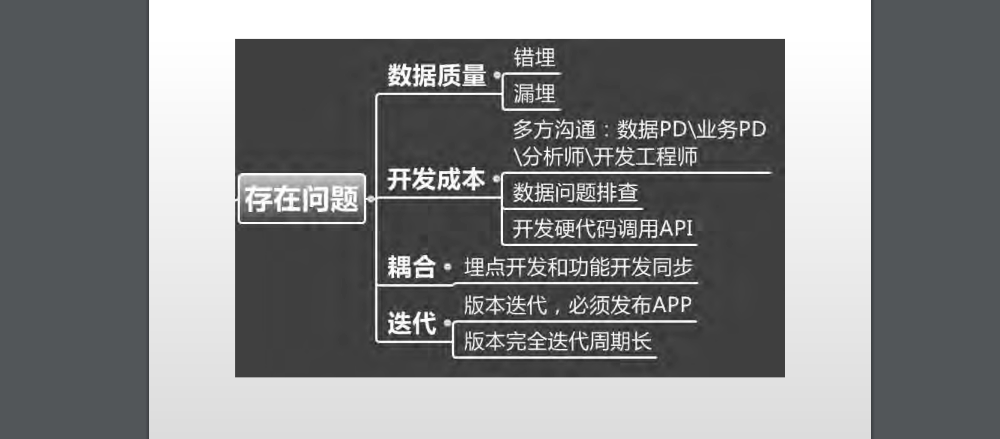
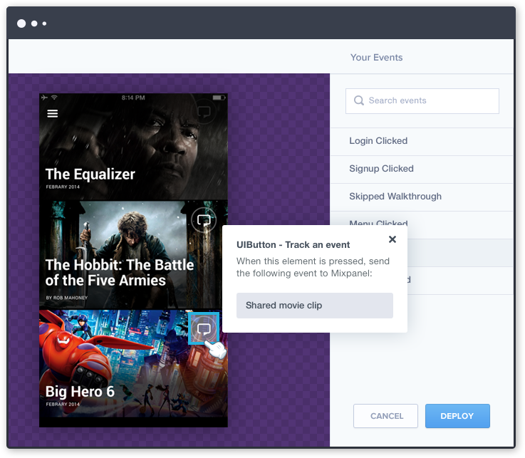

# 数据收集埋点及android无埋点方式统计原生和H5点击事件实现
## 前言
从移动端角度来说，我相信在同一家公司中，不同团队对于前端埋点需求都是不一样的。简单来说产品角度更加注重的是埋点所带来的大量用户行为数据，能否通过一定数据漏斗分析挖掘找到当前产品的问题，并能对当下产品模型制定一定改善计划或策略。指标当然也是完全迥异的，挖掘潜在需求、分解不同用户群日常习惯、提高用户留存、减少页面间流失率、分析当前用户群画像等。而从运营角度来说，找到与产品调性较为匹配的投放渠道、估算不同渠道之间拉取新增的实际成本、运营创意方向的选择与取舍，热点事件借势营销策略等。这些都是我们随时要面临的问题，都需要不断的判断与决策。而决策的依据是什么？-**数据** 
那么数据从何而来呢?当然是我们在前端的收集而来啦？一个典型的数据平台大概是这个样子的： 

所以数据采集的也是该系统的核心。数据采集是否丰富，采集的数据是否准确，采集是否及时，都直接影响整个数据平台的应用的效果。

## 前端埋点技术介绍

### 1. 代码埋点
代码埋点很早就出现了，而且目前来说应用的的比较多，像国内的 `百度统计` `腾讯MAT` `阿里的Umeng`目前提供的API都是这种方式的。 

它的技术原理也很简单，在APP或者界面初始化的时候，初始化第三方数据分析服务商的SDK，然后在某个事件发生时就调用SDK里面相应的数据发送接口发送数据。例如，我们想统计APP里面某个按钮的点击次数，则在APP的某个按钮被点击时，可以在这个按钮对应的 OnClick 函数里面调用SDK提供的数据发送接口来发送数据.

以`Umeng`为例

	public void onResume() {
    	super.onResume();
    	MobclickAgent.onResume(this);       //统计时长
	}
	
	public void onPause() {
    	super.onPause();
    	MobclickAgent.onPause(this);
	}

事件统计如下：

	MobclickAgent.onEvent(Context context, String eventId);
	
	
从上面这两个例子可以看出，代码埋点的优点是一方面使用者控制精准，可以非常精确地选择什么时候发送数据；同时使用者可以比较方便地设置自定义属性、自定义事件，传递比较丰富的数据到服务端。 
代码埋点上都面临一个问题-成本高。首先埋点地方过多，因为不同的版本验证问题不同不易于管理。每一个控件的埋点都需要添加相应的手工代码，不仅工作量大，而且限定了必须是技术人员才能完成.漏埋无法获取到数据

### 2. 可视化埋点
从前端埋点到可视化埋点其实是一个非常顺理成章的演进。既然埋点代价大，每一个埋点都需要写代码，那么，就参考 Visual Studio 等一系列现代 IDE 的做法，用可视化交互手段来代替写代码即可；既然每次埋点更新都需要等待APP的更新，那么，就参考现在很多手游的做法，把核心代码和配置、资源分开，在APP启动的时候通过网络更新配置和资源即可。 
正是出于这种自然而然的做法，在国外，以 [Mixpanel](https://github.com/mixpanel) 为首的数据分析服务商，都相继提供了可视化埋点的方案，Mixpanel将之称作为 codeless。而国内的 `TalkingData`、`诸葛IO` 等也都提供了类似的技术手段。

在Mixpanel官方事例中，从如上界面截图可以看到，当你点击底部电影选项右上角分享按钮时，在弹出的增加锚点窗口中，设置点击这个按钮将发送的是 “Shared movie clip” 事件。然后点击 Deploy 按钮，把这个配置下发到客户端。那么在嵌入了 Mixpanel 的 SDK 的这个 APP中 ，则自动会在 APP 启动时或者客户端定时获取的方式，更新后台设置的锚点统计配置。当配置完成在真实的用户使用时，点击这个分享按钮就会真正地发送 “Shared movie clip” 事件到后台，且实时可见。

**那这种方式是如何实现的呢？**

简单来说在客户端集成了Mixpanel Sdk之后，Sdk会定时(例如每秒)做一次截图。在截图的同时，Mixpanel会从 keyWindow 对象开始进行遍历它的所有subviews()集合，得到当前视图下所有 UIView、UIResponder 对象的层级关系。Mixpanel会根据截图和UI元素的可视化信息来重新进行页面渲染，并且根据控件的类型，来识别哪些控件是可以增加可埋点的，并且可以在后台操作。当使用者在后台的截屏画面上点击了某个可埋点的控件时，后台会根据使用者做一些事件关联方面的配置，并且将配置信息进行保存和部署到客户端。客户端在开启或定时获取后台锚点配置之后，则会根据新的锚点配置采集数据。整个过程部署都是实时的。

### 无埋点
与可视化埋点一样，“无埋点”这个方案也出来的比较早，[Heap](https://heapanalytics.com/)作为一个第三方数据分析服务商，在2013年就已经推出了“无埋点”这个技术方案。而如果不局限于第三方，`百度`在2009年就已经有了`点击猴子`这个技术，用无埋点的方案分析一个页面各个元素的点击情况；在2011年，百度质量部也推出了一项内部服务，用以录制安卓 App 的全部操作，并且进行回放，以便找出 App 崩溃的原因；而豌豆荚大约也在2013年左右，在自己的 App 内部，添加了对所有控件的操作情况的记录。第三方数据分析服务GrowingIO 在2015年，也推出了类似于 Heap 的服务。
 
从界面上看，和可视化埋点很像。而从实际的实现上看，二者的区别就是可视化埋点先通过界面配置哪些控件的操作数据需要收集；“无埋点”则是先尽可能收集所有的控件的操作数据，然后再通过界面配置哪些数据需要在系统里面进行分析。

“无埋点”相比可视化埋点的优点，一方面是解决了数据“回溯”的问题，例如，在某一天，突然想增加某个控件的点击的分析，如果是可视化埋点方案，则只能从这一时刻向后收集数据，而如果是“无埋点”，则从部署 SDK 的时候数据就一直都在收集了；另一方面，“无埋点”方案也可以自动获取很多启发性的信息，例如，“无埋点”可以告诉使用者这个界面上每个控件分别被点击的概率是多大，哪些控件值得做更进一步的分析等等。

万事皆有利弊无埋点方式的缺点就是不能灵活的自定义属性数据，数据收集和传输的压力（因为它会无差别收集所有界面的点击事件）

##android自动埋点统计实现方式
近日开发出的SDK采用了无埋点的统计点击事件的方式。原理主要根据android的`事件分发`和 `视图判断`，众所周知Activity中的UI布局是嵌套的，通过`findViewById(android.R.id.content)`可以拿到activity的根视图。android系统的点击事件的传递是由父视图向子视图传递，然后再传到具体的控件中。如果不了解android系统的事件分发机制可以先看一下[android 事件分发机制](http://blog.csdn.net/guolin_blog/article/details/9097463)。

好了，有了以上的知识准备开始上代码了，对外提供一个Activity,让接入的app的baseActivity继承自该activity

在activity中重写`dispatchTouchEvent(MotionEvent ev)`方法

	public boolean dispatchTouchEvent(MotionEvent ev) {
        if (ev.getAction() == MotionEvent.ACTION_UP) {
            View view = searchClickView(findViewById(android.R.id.content), ev);
            if (view != null && (view.hasOnClickListeners())) { // 此处必须判断是否设置了onClickListner
                *****记录对应的log******
            }
        }
        return super.dispatchTouchEvent(ev);
    }

做hit-test 查找当前当前点击事件发生在哪一个view区域内

	private boolean isInClickView(View view, MotionEvent event) {
        float clickX = event.getRawX();
        float clickY = event.getRawY();
        //如下的view表示Activity中的子View或者控件
        int[] location = new int[2];
        view.getLocationOnScreen(location);
        int x = location[0];
        int y = location[1];
        int width = view.getWidth();
        int height = view.getHeight();
        if ((clickX >= x && clickX <= (x + width)) &&
            (clickY >= y && clickY <= (y + height))) {
            return true;  //这个条件成立，则判断点击时间发生在这个view区域内
        }
        return false;
    }
  
遇到viewGroup递归遍历，同时只对可见（enable）的view 进行该处理   

	    private View searchClickView(View view, MotionEvent event) {
        View clickView = null;
        if (isInClickView(view, event) &&
            view.getVisibility() == View.VISIBLE) {  //这里一定要判断View是可见的
            if (view instanceof ViewGroup) {    //遇到一些Layout之类的ViewGroup，继续遍历它下面的子View
                ViewGroup group = (ViewGroup) view;
                for (int i = group.getChildCount() - 1; i >= 0; i--) {
                    View chilView = group.getChildAt(i);
                    clickView = searchClickView(chilView, event);
                    if (clickView != null) {
                        return clickView;
                    }
                }
            }
            clickView = view;
        }
        return clickView;
    }

这样我们就可以获取到每一个页面中的view的点击事件，实现自动埋点、无差别统计。虽然onClick()比较主流但是不排除有些地方我们会使用`onTouch()`的方式为view处理响应事件，这个上面的方式就统计不到了。为了支持ontouch的统计，就需要像`view.hasOnClickListeners()`一样去判断该view是否设置了onTouchListener,但android并没有提供这样的API只能自己想办法。
先看一下`setOnTouchListener()`

	public void setOnTouchListener(OnTouchListener l) {
        getListenerInfo().mOnTouchListener = l;
    }
    
最终信息保存在`ListenerInfo`中的`mOnTouchListener`意味着我们只要拿到ListenerInfo.mOnTouchListener看看它有没有值就好了
    static class ListenerInfo {
        /**
         * Listener used to dispatch focus change events.
         * This field should be made private, so it is hidden from the SDK.
         * {@hide}
         */
        protected OnFocusChangeListener mOnFocusChangeListener;

        /**
         * Listeners for layout change events.
         */
        private ArrayList<OnLayoutChangeListener> mOnLayoutChangeListeners;

        protected OnScrollChangeListener mOnScrollChangeListener;

        /**
         * Listeners for attach events.
         */
        private CopyOnWriteArrayList<OnAttachStateChangeListener> mOnAttachStateChangeListeners;

        /**
         * Listener used to dispatch click events.
         * This field should be made private, so it is hidden from the SDK.
         * {@hide}
         */
        public OnClickListener mOnClickListener;

        /**
         * Listener used to dispatch long click events.
         * This field should be made private, so it is hidden from the SDK.
         * {@hide}
         */
        protected OnLongClickListener mOnLongClickListener;

        /**
         * Listener used to build the context menu.
         * This field should be made private, so it is hidden from the SDK.
         * {@hide}
         */
        protected OnCreateContextMenuListener mOnCreateContextMenuListener;

        private OnKeyListener mOnKeyListener;

        private OnTouchListener mOnTouchListener;

        private OnHoverListener mOnHoverListener;

        private OnGenericMotionListener mOnGenericMotionListener;

        private OnDragListener mOnDragListener;

        private OnSystemUiVisibilityChangeListener mOnSystemUiVisibilityChangeListener;

        OnApplyWindowInsetsListener mOnApplyWindowInsetsListener;
    }
    
    
 这是一个View中的一个静态内部类，而mOnTouchListener是一个private的类成员变量。所以第一时间想到用反射去做这件事，集体代码如下：
 
 	    private boolean hasOnTouchListener(View view) {
        boolean result = false;
        Field listenerInfoField = null;
        try {
            listenerInfoField = Class.forName("android.view.View").getDeclaredField("mListenerInfo");
            if (listenerInfoField != null) {
                listenerInfoField.setAccessible(true);
            }
            Object myLiObject = null;
            myLiObject = listenerInfoField.get(view);

            // get the field mOnClickListener, that holds the listener and cast it to a listener
            Field listenerField = null;
            listenerField = Class.forName("android.view.View$ListenerInfo").getDeclaredField("mOnTouchListener");
            if (listenerField != null && myLiObject != null) {
                listenerField.setAccessible(true);
                View.OnTouchListener myListener = (View.OnTouchListener) listenerField.get(myLiObject);
                if (myListener != null) {
                    return true;
                }
            }
        } catch (NoSuchFieldException e) {
            e.printStackTrace();
        } catch (ClassNotFoundException e) {
            e.printStackTrace();
        } catch (IllegalAccessException e) {
            e.printStackTrace();
        }

        return result;
    }

最后在`dispatchTouchEvent`中多加一条判断：

	 @Override
    public boolean dispatchTouchEvent(MotionEvent ev) {
        if (ev.getAction() == MotionEvent.ACTION_UP) {
            View view = searchClickView(findViewById(android.R.id.content), ev);
            if (view != null && (view.hasOnClickListeners())|| hasOnTouchListener(view)) {
                *****记录对应的log******
            }
        }
        return super.dispatchTouchEvent(ev);
    }
    
** 这样我们就可以同时统计onClick 和 onTouch 事件，让统计数据更加全面。**

## android中实现H5页面的自动埋点
现在大多数的APP都是混合型的，H5是必不可少的。为了尽可能用统一规则来收集数据的同时不去影响H5团队的开发，不用他们去通过代码埋点，所以就希望数据的收集对H5是透明、无感的。经过研究通过注入JS的方式是可以做到。

实现一个customer的`webviewClient`重写它的`onPageFinished(WebView view, String url)`
在该方法中注入对应的JS代码。

	public class StatisticsWebviewClient extends WebViewClient {
    	private final static String LOADJS = "inject.js";

    	@Override
    	public void onPageFinished(WebView view, String url) {
        super.onPageFinished(view, url);
        Util.webViewLoadLocalJs(view, LOADJS);
    	}
	}
	
注入JS的方式如下：
	
    public static void webViewLoadLocalJs(WebView view, String path) {
        String jsContent = assetFile2Str(view.getContext(), path);
        view.loadUrl("javascript:" + jsContent);
    }

对应的JS代码如下：

	(function(){
    var scriptTag = "";
    $("body").append(scriptTag);
    console.log("++++++++++inject finish++++++");
	})();

实际注入的代码如下：

	document.body.addEventListener('click', function(e){
    var mergeObj = {
    title: document.title,
    cookie: document.cookie
    ********你想收集的数据
    };
    JSInterface.statisticsmethod(JSON.stringify(mergeObj))//这是android定义的统计方法
    });
    
    
  在对应的webView中添加如下实现：
  
  	addJavascriptInterface(new JSInterface(this.getContext()), 	"statisticsmethod"); // 与刚才注入的JS想对应
    setWebViewClient(new 自定义的webviewClient());
    
    
  JSInterface 的实现
  
 	public class JSInterface {
    	Context context;
    	public JSInterface(Context context){
        this.context = context;
    	}

    	@JavascriptInterface
    	public void statisticsmethod(String str) {
        	*****记录log
    	}
	}
	
	
这样也就实现了android中H5的自动埋点事件统计

## 总结
各种方案各有利弊选型和使用还需慎重衡量。各种方案、各种厂商推出的产品总有一款能够满足你的需求，实在不行就自己实现一套满足需求SDK。